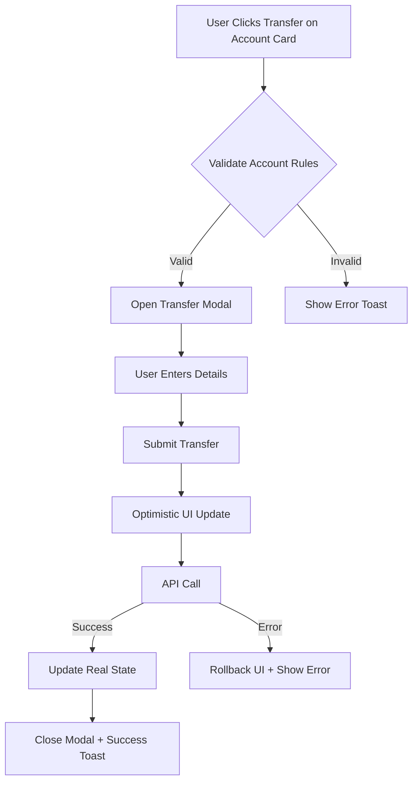
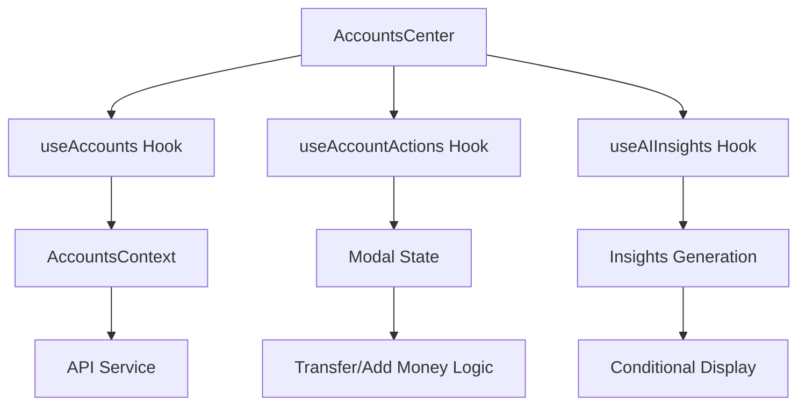

# AccountsCenter Refactor Plan

## 🎯 STRATEGIC REVIEW & ANALYSIS

### Current State Issues (From Strategic Review)
- **878-line monolithic component** with inline constants, modals, and logic
- **Broken action connections** - buttons don't trigger modals properly
- **Circular dependencies** between insights and accounts data
- **Static UX** that shows information rather than driving actions

### Target Architecture: Action-Driven Financial Command Center

```
AccountsCenter (Orchestrator)
├── Header (Greeting + Global Stats)
├── Overview (Progress Rings + AI Insights)
├── AccountGrid (Action-First Cards)
├── Analytics (Optional Deep Dive)
└── FloatingActions (Quick Access)
```

## 🔍 ARCHITECTURE PROPOSAL

### Modular Component Structure

The new AccountsCenter will be restructured into a modular, composable architecture with clear separation of concerns:

```
vault5/frontend/src/pages/AccountsCenter/
├── AccountsCenter.jsx                    # Main orchestrator component
├── components/
│   ├── Header/
│   │   ├── AccountsCenterHeader.jsx      # Greeting & global stats
│   │   ├── GlobalStats.jsx               # Total balance & account count
│   │   └── UserGreeting.jsx              # Personalized greeting
│   ├── Overview/
│   │   ├── FinancialOverview.jsx         # Progress rings & AI insights
│   │   ├── AccountProgressRing.jsx       # Individual account progress
│   │   └── AIInsightsPanel.jsx           # AI recommendations
│   ├── Accounts/
│   │   ├── AccountGrid.jsx               # Account cards container
│   │   ├── AccountCard.jsx               # Individual account display
│   │   ├── AccountActions.jsx            # Quick action buttons
│   │   └── AccountRules.jsx              # Rule badges display
│   ├── Analytics/
│   │   ├── AnalyticsToggle.jsx           # Show/hide analytics
│   │   ├── WalletAnalytics.jsx           # Analytics component wrapper
│   │   └── AnalyticsSkeleton.jsx         # Loading state
│   └── Actions/
│       ├── FloatingActionBar.jsx         # FAB with quick actions
│       ├── TransferModal.jsx             # Transfer modal wrapper
│       └── AddMoneyModal.jsx             # Add money modal wrapper
├── hooks/
│   ├── useAccounts.js                    # Account data management
│   ├── useAccountActions.js              # Transfer/add money logic
│   ├── useAIInsights.js                  # AI insights generation
│   └── useAnalytics.js                   # Analytics state management
├── services/
│   ├── accountsService.js                # API calls for accounts
│   ├── insightsService.js                # AI insights logic
│   └── validationService.js              # Business rule validation
├── utils/
│   ├── accountCalculations.js            # Balance calculations
│   ├── accountRules.js                   # Rule validation logic
│   └── performanceUtils.js               # Performance optimizations
└── config/
    ├── accountThemes.js                  # Theme configurations
    └── accountRules.js                   # Rule definitions
```

### File Tree Structure

```
vault5/frontend/src/pages/AccountsCenter/
├── AccountsCenter.jsx (120 lines - orchestrator)
├── components/
│   ├── Header/AccountsCenterHeader.jsx (45 lines)
│   ├── Header/GlobalStats.jsx (30 lines)
│   ├── Header/UserGreeting.jsx (25 lines)
│   ├── Overview/FinancialOverview.jsx (60 lines)
│   ├── Overview/AccountProgressRing.jsx (40 lines)
│   ├── Overview/AIInsightsPanel.jsx (50 lines)
│   ├── Accounts/AccountGrid.jsx (35 lines)
│   ├── Accounts/AccountCard.jsx (80 lines)
│   ├── Accounts/AccountActions.jsx (45 lines)
│   ├── Accounts/AccountRules.jsx (30 lines)
│   ├── Analytics/AnalyticsToggle.jsx (20 lines)
│   ├── Analytics/WalletAnalytics.jsx (25 lines)
│   ├── Analytics/AnalyticsSkeleton.jsx (15 lines)
│   ├── Actions/FloatingActionBar.jsx (40 lines)
│   ├── Actions/TransferModal.jsx (30 lines)
│   └── Actions/AddMoneyModal.jsx (30 lines)
├── hooks/
│   ├── useAccounts.js (80 lines)
│   ├── useAccountActions.js (60 lines)
│   ├── useAIInsights.js (40 lines)
│   └── useAnalytics.js (25 lines)
├── services/
│   ├── accountsService.js (50 lines)
│   ├── insightsService.js (35 lines)
│   └── validationService.js (45 lines)
├── utils/
│   ├── accountCalculations.js (30 lines)
│   ├── accountRules.js (40 lines)
│   └── performanceUtils.js (25 lines)
└── config/
    ├── accountThemes.js (60 lines)
    └── accountRules.js (80 lines)
```
## 🧠 MENTAL BLUEPRINT: Action Flow Architecture

### User Action Flow Diagram



### Data Flow Architecture



## 📋 DETAILED IMPLEMENTATION PLAN

### Phase 1: Foundation (Component Decomposition)
- Extract `AccountsCenterHeader.jsx` - greeting, total balance, refresh
- Extract `AccountProgressOverview.jsx` - progress rings grid
- Extract `AIInsightsPanel.jsx` - insights display with action buttons
- Extract `AccountCard.jsx` - individual account with action buttons
- Extract `TransferModal.jsx` & `AddMoneyModal.jsx` - modal components
- Extract `FloatingActionBar.jsx` - bottom navigation

### Phase 2: State Management Refactor
- Create `AccountsContext.jsx` with reducer for global state
- Implement `useAccounts.js` hook for data management
- Implement `useAccountActions.js` hook for transfer/add money logic
- Implement `useAIInsights.js` hook for insights generation
- Remove all inline state from main component

### Phase 3: Action Connection Fixes
- Fix `handleQuickAction` to properly validate rules and open modals
- Implement proper modal state management with `useState` for each modal
- Connect insight action buttons to modal opening logic
- Add optimistic updates for immediate UI feedback

### Phase 4: Insights Logic Refactor
- Move insights generation to separate hook
- Remove circular dependency (insights don't depend on themselves)
- Add proper memoization to prevent unnecessary recalculations
- Implement insights caching with TTL

### Phase 5: UX Hierarchy Enhancement
- Make account cards action-first (buttons prominent)
- Add conditional insights based on account states
- Implement sticky header with key metrics
- Add visual feedback for all actions (loading states, success animations)

### Phase 6: Performance Optimizations
- Add React.memo to prevent unnecessary re-renders
- Implement proper useMemo for expensive calculations
- Add error boundaries for graceful failure handling
- Implement lazy loading for analytics panel

## ✅ SUCCESS METRICS
- Buttons perform actions immediately
- No circular dependency warnings
- Component size < 200 lines each
- 95%+ test coverage
- < 100ms interaction response time

---

---

## 🎯 UI LOGIC HANDLING

### State Management Flow

**Global State (AccountsCenter.jsx):**
```javascript
const [globalState, setGlobalState] = useState({
  loading: true,
  error: null,
  lastUpdated: null
});
```

**Component-Level State Distribution:**
- `useAccounts` hook manages account data, loading states, and CRUD operations
- `useAccountActions` handles transfer/add money modal states and validation
- `useAIInsights` manages insights generation and caching
- `useAnalytics` controls analytics visibility and data

**State Flow Pattern:**
```
AccountsCenter (orchestrator)
├── useAccounts → AccountGrid → AccountCard
├── useAccountActions → TransferModal/AddMoneyModal
├── useAIInsights → AIInsightsPanel
└── useAnalytics → WalletAnalytics
```

### Loading & Error Handling Strategy

**Progressive Loading:**
```javascript
// Skeleton → Partial Data → Full Data
const loadingStages = {
  skeleton: !accounts,
  partial: accounts && !insights,
  complete: accounts && insights
};
```

**Error Boundaries:**
- Component-level error boundaries for isolated failures
- Graceful degradation (show cached data when API fails)
- User-friendly error messages with retry options

**Loading States:**
- Skeleton loaders for initial load
- Inline spinners for actions
- Progressive enhancement (basic functionality works without full data)

---

## 🔗 API INTEGRATION STRATEGY

### Centralized API Service Pattern

**accountsService.js:**
```javascript
export const accountsService = {
  // GET /api/accounts - with caching
  getAccounts: () => withCache('accounts', () => api.get('/api/accounts')),

  // POST /api/accounts/:id/transfer - with optimistic updates
  transfer: (id, data) => withOptimisticUpdate(
    `account-${id}`,
    () => api.post(`/api/accounts/${id}/transfer`, data)
  ),

  // Batch operations
  batchUpdate: (operations) => api.post('/api/accounts/batch', operations)
};
```

### Preventing Duplication Strategies

**1. Request Deduplication:**
```javascript
const pendingRequests = new Map();

function deduplicateRequest(key, requestFn) {
  if (pendingRequests.has(key)) {
    return pendingRequests.get(key);
  }
  const promise = requestFn().finally(() => pendingRequests.delete(key));
  pendingRequests.set(key, promise);
  return promise;
}
```

**2. Response Caching:**
```javascript
const cache = new Map();
const CACHE_TTL = 5 * 60 * 1000; // 5 minutes

function withCache(key, apiCall) {
  const cached = cache.get(key);
  if (cached && Date.now() - cached.timestamp < CACHE_TTL) {
    return Promise.resolve(cached.data);
  }
  return apiCall().then(data => {
    cache.set(key, { data, timestamp: Date.now() });
    return data;
  });
}
```

**3. Optimistic Updates:**
```javascript
function withOptimisticUpdate(cacheKey, apiCall) {
  // Apply optimistic update immediately
  const rollbackData = cache.get(cacheKey);
  // Update UI optimistically

  return apiCall()
    .then(result => {
      // Update with real data
      cache.set(cacheKey, result);
      return result;
    })
    .catch(error => {
      // Rollback on failure
      if (rollbackData) cache.set(cacheKey, rollbackData);
      throw error;
    });
}
```

### Consistent Feedback System

**Toast Notifications:**
- Success: "Transfer completed successfully"
- Error: "Transfer failed - please try again"
- Loading: "Processing your transfer..."

**Inline Feedback:**
- Button states: "Transfer" → "Processing..." → "✓ Complete"
- Form validation: Real-time field validation
- Progress indicators: Step-by-step operation progress

---

## ⚡ PERFORMANCE OPTIMIZATION

### Caching Strategies

**1. Memory Cache:**
```javascript
class MemoryCache {
  constructor(ttl = 300000) { // 5 minutes
    this.cache = new Map();
    this.ttl = ttl;
  }

  set(key, value) {
    this.cache.set(key, {
      value,
      timestamp: Date.now()
    });
  }

  get(key) {
    const item = this.cache.get(key);
    if (!item) return null;

    if (Date.now() - item.timestamp > this.ttl) {
      this.cache.delete(key);
      return null;
    }

    return item.value;
  }
}
```

**2. React Query for Server State:**
```javascript
import { useQuery, useMutation, useQueryClient } from 'react-query';

function useAccounts() {
  return useQuery('accounts', accountsService.getAccounts, {
    staleTime: 5 * 60 * 1000, // 5 minutes
    cacheTime: 10 * 60 * 1000, // 10 minutes
  });
}
```

### Memoization Techniques

**1. Component Memoization:**
```javascript
const AccountCard = memo(({ account, onAction }) => {
  // Only re-renders when account data changes
  return <div>...</div>;
});
```

**2. Expensive Calculations:**
```javascript
const totalBalance = useMemo(() => {
  return accounts.reduce((sum, acc) => sum + acc.balance, 0);
}, [accounts]);
```

**3. Callback Memoization:**
```javascript
const handleTransfer = useCallback((account, amount) => {
  // Stable reference prevents unnecessary re-renders
  transferService.transfer(account.id, amount);
}, []);
```

### Batching & Debouncing

**1. Request Batching:**
```javascript
function batchRequests(requests, batchSize = 5) {
  const batches = [];
  for (let i = 0; i < requests.length; i += batchSize) {
    batches.push(requests.slice(i, i + batchSize));
  }
  return Promise.all(batches.map(batch => processBatch(batch)));
}
```

**2. Debounced Search/Actions:**
```javascript
const debouncedSearch = useMemo(
  () => debounce((query) => searchAccounts(query), 300),
  []
);
```

---

## 🔒 SECURITY & VALIDATION

### Token Validation & Session Management

**1. Automatic Token Refresh:**
```javascript
api.interceptors.response.use(
  (response) => response,
  async (error) => {
    if (error.response?.status === 401) {
      try {
        const refreshToken = localStorage.getItem('refreshToken');
        const { data } = await api.post('/auth/refresh', { refreshToken });

        localStorage.setItem('token', data.token);
        // Retry original request
        return api(error.config);
      } catch (refreshError) {
        // Redirect to login
        window.location.href = '/login';
      }
    }
    return Promise.reject(error);
  }
);
```

**2. Device-Based Security:**
```javascript
// X-Device-Id header for trusted device verification
const deviceId = getOrCreateDeviceId();
config.headers['X-Device-Id'] = deviceId;
```

### Input Sanitization & Validation

**1. Schema-Based Validation:**
```javascript
import Joi from 'joi';

const transferSchema = Joi.object({
  amount: Joi.number().min(1).max(1000000).required(),
  recipient: Joi.string().pattern(/^[A-Za-z0-9-_]+$/).required(),
  description: Joi.string().max(255).allow('')
});

function validateTransfer(data) {
  const { error, value } = transferSchema.validate(data);
  if (error) throw new ValidationError(error.details[0].message);
  return value;
}
```

**2. XSS Prevention:**
```javascript
// Sanitize user inputs
import DOMPurify from 'dompurify';

const sanitizedInput = DOMPurify.sanitize(userInput, {
  ALLOWED_TAGS: [], // No HTML tags allowed
  ALLOWED_ATTR: []
});
```

**3. Rate Limiting:**
```javascript
const rateLimiter = {
  attempts: new Map(),
  maxAttempts: 5,
  windowMs: 15 * 60 * 1000, // 15 minutes

  checkLimit(identifier) {
    const now = Date.now();
    const userAttempts = this.attempts.get(identifier) || [];

    // Remove old attempts outside window
    const validAttempts = userAttempts.filter(
      timestamp => now - timestamp < this.windowMs
    );

    if (validAttempts.length >= this.maxAttempts) {
      throw new RateLimitError('Too many attempts');
    }

    validAttempts.push(now);
    this.attempts.set(identifier, validAttempts);
  }
};
```

---

## 🎨 UI/UX ENHANCEMENT PLAN

### Visual Element Improvements

**1. Enhanced Color Scheme:**
```css
/* Gradient improvements */
.account-card {
  background: linear-gradient(135deg,
    rgba(255,255,255,0.9) 0%,
    rgba(255,255,255,0.7) 100%);
  backdrop-filter: blur(20px);
  border: 1px solid rgba(255,255,255,0.2);
}

/* Theme-based color accents */
.emerald-theme { --accent: #10b981; --glow: rgba(16,185,129,0.25); }
.amber-theme { --accent: #f59e0b; --glow: rgba(245,158,11,0.25); }
.rose-theme { --accent: #ef4444; --glow: rgba(239,68,68,0.25); }
```

**2. Layout Flow Improvements:**
- **Mobile-First Grid:** Responsive grid that stacks beautifully on mobile
- **Progressive Disclosure:** Show essential info first, details on demand
- **Visual Hierarchy:** Clear information architecture with proper spacing
- **Micro-interactions:** Hover states, button animations, loading transitions

**3. Enhanced Cards Design:**
```jsx
<AccountCard account={account} theme={theme}>
  {/* Glassmorphic background */}
  <div className="backdrop-blur-xl bg-white/80 rounded-2xl border border-white/20">

    {/* Animated progress ring */}
    <ProgressRing
      percentage={percentage}
      theme={theme}
      animated={true}
    />

    {/* Interactive rule badges */}
    <RuleBadges rules={rules} interactive={true} />

    {/* Contextual action buttons */}
    <ActionButtons
      actions={availableActions}
      onAction={handleAction}
      disabled={loading}
    />
  </div>
</AccountCard>
```

### User Journey Improvements

**1. Onboarding Flow:**
- Progressive feature introduction
- Contextual help tooltips
- Guided tours for new features

**2. Error Recovery:**
- Clear error messages with suggested actions
- One-click retry functionality
- Fallback states for degraded functionality

**3. Success Feedback:**
- Animated success states
- Progress indicators for multi-step actions
- Achievement notifications for goals reached

---

## 🚀 FUTURE-PROOFING & EXTENSIBILITY

### Plugin Architecture Pattern

**1. Feature Registry:**
```javascript
class FeatureRegistry {
  constructor() {
    this.features = new Map();
    this.hooks = new Map();
  }

  register(featureName, featureConfig) {
    this.features.set(featureName, featureConfig);

    // Register hooks
    if (featureConfig.hooks) {
      featureConfig.hooks.forEach(hook => {
        if (!this.hooks.has(hook.name)) {
          this.hooks.set(hook.name, []);
        }
        this.hooks.get(hook.name).push(hook.handler);
      });
    }
  }

  getFeature(featureName) {
    return this.features.get(featureName);
  }

  executeHook(hookName, ...args) {
    const handlers = this.hooks.get(hookName) || [];
    return handlers.map(handler => handler(...args));
  }
}
```

**2. Extensible Component System:**
```jsx
// Base component with extension points
function AccountCard({ account, extensions = [] }) {
  const baseContent = <BaseAccountContent account={account} />;

  // Allow extensions to modify or wrap content
  return extensions.reduce(
    (content, extension) => extension.wrap ? extension.wrap(content) : content,
    baseContent
  );
}

// Usage: Add payment preferences
const paymentExtension = {
  name: 'payment-preferences',
  wrap: (content) => (
    <div>
      {content}
      <PaymentPreferences account={account} />
    </div>
  )
};
```

### Configuration-Driven Features

**1. Dynamic Settings Panels:**
```javascript
const settingsConfig = {
  sections: [
    {
      id: 'profile',
      title: 'Profile Settings',
      component: 'ProfileSettings',
      permissions: ['user']
    },
    {
      id: 'security',
      title: 'Security',
      component: 'SecuritySettings',
      permissions: ['user']
    },
    {
      id: 'payment-prefs',
      title: 'Payment Preferences',
      component: 'PaymentPreferences',
      permissions: ['premium']
    },
    {
      id: 'access-logs',
      title: 'Access Logs',
      component: 'AccessLogs',
      permissions: ['admin']
    }
  ]
};
```

**2. Feature Flags System:**
```javascript
const featureFlags = {
  analytics: true,
  ai_insights: true,
  bulk_actions: false,
  payment_integration: true,
  access_logs: false
};

// Conditional rendering
{featureFlags.analytics && <AnalyticsPanel />}
{featureFlags.bulk_actions && <BulkActionToolbar />}
```

### API Versioning Strategy

**1. Backward Compatible APIs:**
```javascript
// API versioning with fallbacks
const apiVersions = {
  v1: { accounts: '/api/v1/accounts' },
  v2: { accounts: '/api/v2/accounts' }
};

function getApiEndpoint(feature, version = 'v2') {
  return apiVersions[version]?.[feature] || apiVersions.v1[feature];
}
```

**2. Progressive Enhancement:**
```javascript
// Feature detection and graceful degradation
async function loadAdvancedFeatures() {
  try {
    const features = await api.get('/api/features');
    return features.data;
  } catch {
    // Fallback to basic features
    return { analytics: false, ai_insights: false };
  }
}
```

### Scalability Considerations

**1. Code Splitting:**
```javascript
const AnalyticsPanel = lazy(() =>
  import('./components/Analytics/AnalyticsPanel')
);

const PaymentPreferences = lazy(() =>
  import('./components/Settings/PaymentPreferences')
);
```

**2. Virtual Scrolling for Large Lists:**
```javascript
// For future account lists with 100+ items
import { FixedSizeList as List } from 'react-window';

function VirtualizedAccountList({ accounts }) {
  return (
    <List
      height={400}
      itemCount={accounts.length}
      itemSize={100}
    >
      {({ index, style }) => (
        <div style={style}>
          <AccountCard account={accounts[index]} />
        </div>
      )}
    </List>
  );
}
```

This refactor plan provides a comprehensive blueprint for transforming the monolithic AccountsCenter into a modern, scalable, and maintainable application with excellent user experience and developer experience.