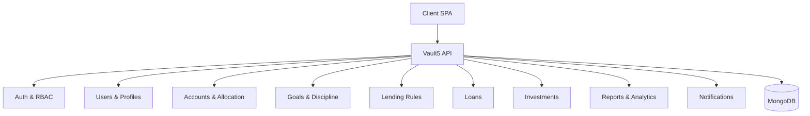

# Vault5 — Financial Freedom Platform (2025)

A mobile-first personal bank + financial coach + discipline enforcer that helps you track income/expenses, auto-allocate into purpose-driven vaults, enforce lending rules, and reach financial freedom.

- Status: Active (2025)
- Mission: Discipline builds freedom. Vault5 automates good money habits so you win consistently.

[Docs index](docs/README.md)

Badges:
- 
- 
- 

## Core Pillars

- Authentication & RBAC: JWT-based auth, user/admin roles (super_admin, system_admin, finance_admin, compliance_admin, support_admin, content_admin, account_admin)
- Allocation Engine: Auto-split income into dedicated vaults with customizable percentages, compliance tracking (target, shortfall, surplus)
- Goals & Discipline: Goals per account, progress bars, notifications, debt/shortfall ledger, surplus encouragement
- Lending Module: Rules-driven lending from safe sources, caps for non-repay lending, history and ledgers
- Reports & Analytics: Net worth, compliance, financial health score, cash flow reports (weekly/monthly/yearly)
- Investments: CRUD for T-Bills, MMFs, stocks, rentals, custom
- Loans: Track loans, repayment schedules, auto-deduction from designated accounts
- Linked Accounts: M-Pesa, Airtel, banks
- Notifications: Missed deposits, surpluses, goal hits, loan and lending reminders
- SaaS-Ready: Public-facing routes, landing, onboarding, education content
- Mobile-First UI: TailwindCSS, responsive charts, progressive enhancement

## Implemented Features (2025)

### Landing Page
- Hero section with animated counters (10,000+ users, 95% success rate, 24/7 support, 500+ features)
- Feature highlights: Fast & Secure transactions, Smart Allocation (6 vaults), Borderless payments
- Detailed features grid: Smart Allocation, Discipline Enforcement, Investment Tracking, Send & Receive Money, Cash Flow Reports, Bank-Level Security
- Call-to-action sections for signup and app download
- Footer with product, support, company links, and social media

### Admin Dashboard
- Role-based dashboards: Super Admin (system overview, user stats, admin team), Finance Admin (approvals, transactions), Compliance Admin (flagged items, KYC), Support Admin (tickets), Content Admin (articles, campaigns), System Admin (uptime, active users)
- User management: Create, update status (active/dormant/suspended/banned), soft delete users
- Account Admin role: Manages user accounts, allocation trends, lending patterns (analytics dashboard for user compliance)

### User Dashboard
- Primary actions: Add Funds, Send Money, Vault Accounts
- Summary stats: Vault Wallet balance, Health Score, Active Accounts
- AI Insights: Allocation alerts, surplus detection, income trends, health score feedback
- AI-Powered Features: Cash Flow Forecasting, Smart Recommendations, Financial Wellness
- Recent Transactions table with type, description, amount
- Accounts quick link with description
- Charts: Allocation Compliance (pie chart), Weekly Summary (bar chart)
- Add Funds modal for income entry

### Navigation & UI
- Responsive NavBar with desktop/mobile menus, notifications dropdown, compliance banner for limited accounts
- Mobile-first design with TailwindCSS, framer-motion animations
- Toast notifications, progress bars, charts with Chart.js
- Sidebar for admin areas, profile cards, password inputs with eye toggle

### Backend Enhancements
- Dev-mode bypasses for geoGate and deviceGate to prevent 400s in development
- Phone verification supports phoneId or phone, accepts any 6-digit code in dev
- Compliance gates: geo, IP deny, device, limitation, caps, velocity
- RBAC with role hierarchies, permission checks, dev allowances for account_admin
- Notifications system with generation and management
- Audit logging and error handling

### Authentication & Security
- Multi-step registration (email/password, personal details, terms, KYC skip)
- Login with email or phone, role-based redirects
- Profile management with vaultTag (username) cooldown, phone/email additions/verifications
- Password reset, change password, OTP for phones
- Rate limiting on auth routes, input validation

### Compliance & KYC
- Status endpoint with limitation details, reserves, payout eligibility
- KYC request submission and listing
- Payout requests for limited accounts after reserve release

### Reports & Analytics
- Dashboard with allocation data, health score, wallet balance
- Transaction summaries by period
- Export capabilities (PDF/Excel lazy-loaded)

### Investments, Loans, Lending
- CRUD for investments with growth tracking
- Loan tracking with repayment schedules
- Lending requests with classification, rule engine, capacity checks, ledger

### Settings & Preferences
- Allocation percentages management
- Linked accounts (M-Pesa, banks) with verification
- Notification thresholds, lending rules

### Public Site
- Landing page with features and CTA
- About, Blog, Legal pages
- SaaS-ready registration flow

System entry points:
- Backend API: Node.js + Express + Mongoose
- Frontend SPA: React + TailwindCSS, React Router, Chart.js

Key files (click through):
- [server.js](backend/server.js)
- [emailVerificationService.js](backend/services/emailVerificationService.js)
- [otpService.js](backend/services/otpService.js)
- [phoneUtils.js](backend/utils/phoneUtils.js)
- [EmailVerificationStatus.js](frontend/src/pages/EmailVerificationStatus.js)
- [NavBar.js](frontend/src/components/NavBar.js)

## 2025 Updates

- All year references standardized to 2025 across docs and templates
- Email verification with verification links (redirect to frontend confirmation)
- OTP verification for phone additions (development mode can accept any OTP if configured)
- Kenyan phone normalization improved for +254-prefix UX (handles user-typed leading 0 after prefilled +254)
- Performance fixes: resolved frontend build blockers, optional web-vitals support
- Navigation polish: removed redundant auth buttons on login/signup pages

See [CHANGELOG](docs/CHANGELOG.md) for dated entries.

## Quick Start

Prereqs:
- Node 18+ (or newer LTS)
- MongoDB 5+ (local or hosted)
- Optional: SMTP creds for production email; SMS provider for production OTP

Backend:
- cp .env.example .env
- Configure MONGO_URI and JWT_SECRET (at minimum)
- npm install
- npm run dev (run only one instance to avoid port conflicts)

Frontend:
- npm install
- npm start

Production builds:
- Frontend: npm run build
- Backend runs behind a process manager or container

Dev Notes:
- Ensure only one backend dev server is running (npm run dev) to avoid EADDRINUSE errors
- Kill duplicate processes with taskkill /PID <pid> /F on Windows

## Environment Flags (Dev)

- OTP_ACCEPT_ANY=true allows any OTP to succeed in development
- FRONTEND_URL sets the frontend base for verification redirects

Security:
- Never enable OTP_ACCEPT_ANY in production
- Always use HTTPS and secure JWT secrets

## Docs

- [CHANGELOG](docs/CHANGELOG.md)
- [FOUNDER](docs/FOUNDER.md)
- [CREDITS](docs/CREDITS.md)
- [SECURITY](docs/SECURITY.md)
- [LEGAL-NOTES](docs/LEGAL-NOTES.md)

These documents will be kept current in 2025. No external copying claims are made; Vault5 is an original work.

## Founder

Vault5 was founded by Bryson Nyaliti. Vision, direction, and stewardship are led by the founder.

- Founder profile: [FOUNDER.md](docs/FOUNDER.md)
- Credit policy: [CREDITS.md](docs/CREDITS.md)

If you wish to reference Vault5 publicly, please attribute the founding to Bryson Nyaliti as described in [CREDITS.md](docs/CREDITS.md).

## No-Copying Statement

Vault5 is an original project; it is not a clone. We openly acknowledge inspiration where appropriate (e.g., PayPal-like flows), but no documentation should imply copying or infringement. If you find phrasing that suggests copying, open an issue and we will correct it promptly.

See [LEGAL-NOTES](docs/LEGAL-NOTES.md) for the stance on brand references.

## High-Level Architecture

## Phone Number Normalization

UX-friendly input where +254 is prefilled:
- If user types 010xxxxxxx after +254 (forming +2540...), the system normalizes to +25410xxxxxxx
- Comparison and validation are format-agnostic across +254, 254, 0, and local 7/1 leading numbers

Reference:
- [normalizePhoneNumber()](backend/utils/phoneUtils.js:11)
- [arePhoneNumbersEqual()](backend/utils/phoneUtils.js:109)

## Email & OTP Verification

- Email links redirect to frontend status page after backend verification
- OTP for phone numbers can be tested in dev with OTP_ACCEPT_ANY=true

References:
- [emailVerificationService.js](backend/services/emailVerificationService.js)
- [emailVerification.js](backend/routes/emailVerification.js)
- [otpService.js](backend/services/otpService.js)
- [otp.js](backend/routes/otp.js)

## Contribution Policy (2025)

- Founder is credited as the originator and primary steward
- External contributions require CLA acceptance (TBD)
- PRs should include tests and docs for user-facing changes
- Security-sensitive changes must follow [SECURITY.md](docs/SECURITY.md)

## License

MIT (see LICENSE). Do not use Vault5 branding or suggest affiliation without explicit permission from the founder.
