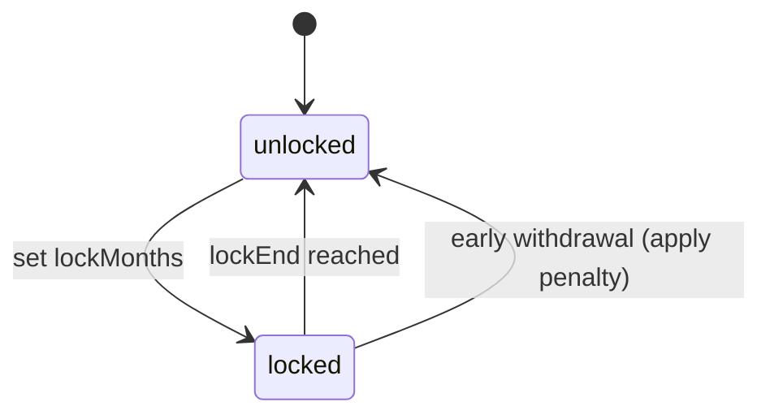
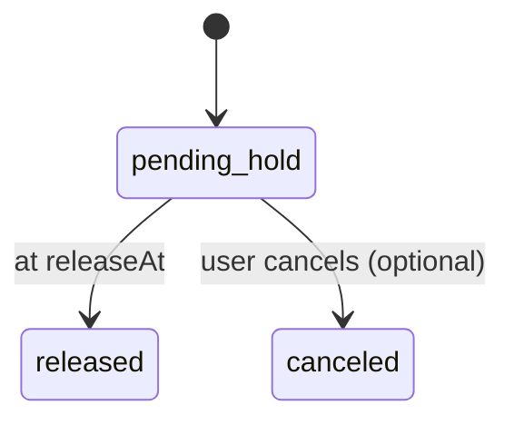

# Vault5 Accounts Rules and Discipline Engine

Scope
- Transform Vault5 into a transactional wallet (PayPal/M-Pesa style) with disciplined savings.
- Five accounts: Daily 50, Emergency 10, Investments 20, Long-Term 10, Fun 10.
- Remove Charity from allocations and UX. Investments remains as a savings bucket with rules (not the investments feature module).

Accounts and Default Rules

1) Daily (50)
- Purpose: Everyday spend; flexible like a wallet.
- Rules:
  - No restrictions by default.
  - AI Overspend Alert: If daily spend exceeds 20 percent of Daily balance in a 24h window, push alert banner and notification.
- Enforcement:
  - Monitor aggregate outflow from Daily over rolling 24h window.
  - AI event: overspend_warn with context.
- Files to enforce (planned): [transfersController.js](vault5/backend/controllers/transfersController.js:1), [payoutsController.js](vault5/backend/controllers/payoutsController.js:1)

2) Fun (10)
- Purpose: Guilt-free spend; reward discipline.
- Rules:
  - Unlimited spending (allowed for daily enjoyment).
  - No internal transfer out rule: Fun → other internal accounts is blocked.
  - Month-end Sweep: Unused Fun balance at month-end is swept to Long-Term.
- Enforcement:
  - Transfers: Block Fun → internal accounts; allow Fun → external payouts and P2P.
  - Cron job on last day of month (23:59 local) to sweep Fun → Long-Term.
- Files to enforce (planned): [transfersController.js](vault5/backend/controllers/transfersController.js:1), [jobs/monthEndSweep.js](vault5/backend/jobs/monthEndSweep.js:1)

3) Emergency (10)
- Purpose: Only for genuine emergencies.
- Rules:
  - External-only: Only payouts to bank/M-Pesa; no Fun/Daily/internal transfers.
  - 24-hour delay: Payouts queue with 24h hold before release.
  - Max 2 withdrawals/month.
  - AI Confirmation Prompt: Explain reason; surface history; require explicit confirmation.
- Enforcement:
  - Route-level checks to disallow internal transfer from Emergency.
  - Payouts: create payout with status pending_hold, releaseAt=now+24h. A scheduler job triggers releases.
  - Counter for monthly emergency withdrawals enforced via aggregation on PaymentIntent/Payouts.
- Files to enforce (planned): [payoutsController.js](vault5/backend/controllers/payoutsController.js:1), [jobs/payoutRelease.js](vault5/backend/jobs/payoutRelease.js:1)

4) Long-Term (10)
- Purpose: Milestones and goals.
- Rules:
  - Optional lock-in: User selects lock horizon 3/6/12 months.
  - Early withdrawal penalty: 3 percent fee if locked and withdrawn early.
  - Rewards: If untouched through full lock-in, reward points/bonus.
- Enforcement:
  - Account rule state recorded with lock metadata (lockStart, lockMonths, lockEnd).
  - Withdrawal/payout attempts check lock; if before lockEnd, apply 3 percent fee.
  - Reward job detects lock completion with no outflows and applies bonus.
- Files to enforce (planned): [accountsRules.js](vault5/backend/services/accountsRules.js:1), [jobs/longTermRewards.js](vault5/backend/jobs/longTermRewards.js:1)

5) Investments (20) savings bucket
- Purpose: Accumulate towards investing; not live trading.
- Rules:
  - 90-day lock by default from last deposit time; rolling or fixed (initially fixed from last activity).
  - Min withdrawal: 50 KES.
  - External-only payouts; no internal transfers.
- Enforcement:
  - Track lastDepositAt; enforce 90-day diff at withdrawal.
  - Enforce amount >= 50 KES.
  - Disallow internal transfers from Investments bucket.
- Files to enforce (planned): [payoutsController.js](vault5/backend/controllers/payoutsController.js:1), [accountsRules.js](vault5/backend/services/accountsRules.js:1)

Cross-Account Rules
- Savings → Daily fee: 1 percent fee applied when moving from Emergency/Long-Term/Investments to Daily. Daily → Savings is free.
- P2P: permitted from Daily and Fun; from Savings accounts either blocked or routed via fee/lock logic (default: block from Emergency/Investments; allow from Long-Term only if not locked or after lock end + fee if configured).
- Compliance: All transfers/payouts pass geo/ip/device/limitation, caps, and velocity gates:
  - [compliance.js](vault5/backend/middleware/compliance.js:1)
- AI Coach:
  - Overspend alerts (Daily).
  - Nudges on Long-Term withdrawal attempts before lock end.
  - Optional prompt on Emergency reason; saved in metadata for future classification.

Data Model Adjustments
- Account document (extend fields in [Account.js](vault5/backend/models/Account.js:1)):
  - type: enum Daily Emergency LongTerm Fun Investments
  - rules: object
    - fun: { noInternalOut: true }
    - emergency: { externalOnly: true, delayHours: 24, maxMonthlyWithdrawals: 2, aiConfirm: true }
    - longTerm: { lockMonths: 0|3|6|12, lockedAt: Date, penaltyPct: 0.03 }
    - investments: { lockDays: 90, minWithdrawal: 50, externalOnly: true, lastDepositAt: Date }
  - fees: { savingsToDailyPct: 0.01 }
- Transfer/Payout intent (extend [PaymentIntent.js](vault5/backend/models/PaymentIntent.js:1)):
  - kind: deposit | internal | p2p | payout
  - sourceAccountId, destAccountId
  - counterparty: { type: user|external, phone, email, bankRef }
  - delayReleaseAt (Date) for Emergency holds
  - feeAmount (Number), penaltyAmount (Number), netAmount (Number)

Endpoints (see TRANSFERS_PAYOUTS.md)
- POST /api/transfers/internal
- POST /api/transfers/p2p
- POST /api/payouts/mpesa
- POST /api/payouts/bank

Scheduled Jobs
- Month-End Fun Sweep: Move Fun balance to Long-Term. Partial or total sweep; initial behavior: sweep all Fun.
- Payout Release: Release Emergency delayed payouts at releaseAt; reject if new holds imposed.
- Long-Term Rewards: Award bonus points when lock term completed without outflows.

State Machines (Mermaid)

Long-Term Lock

Emergency Payout Delay

Fun Month-End Sweep

Configuration/Toggles
- All rules are server-side toggles under admin settings for future refinement. Defaults as above.
- Per-user overrides considered later.

Migration Notes
- Remove Charity account: reallocate its balances to Long-Term by default (or prompt user choice later).
- Update percentage splits to new five accounts for all users.
- For users missing a Fun or Investments account (new schema), create with correct flags.

Testing Scenarios
- Daily overspend triggers alert when threshold crossed.
- Fun internal transfer attempt blocked.
- Emergency third payout in month blocked; previous payouts delayed then released.
- Long-Term early withdrawal applies 3 percent penalty; after lock end no penalty, reward applied if untouched.
- Investments withdrawal before 90 days blocked; min 50 KES enforced.
- Savings → Daily transfer applies 1 percent fee; Daily → Savings free.

References
- Middleware gates: [compliance.js](vault5/backend/middleware/compliance.js:1)
- Allocation engine (integrates deposits): [accountsController.allocateIncome()](vault5/backend/controllers/accountsController.js:6)
- Payment intents controller: [paymentsController.js](vault5/backend/controllers/paymentsController.js:1)