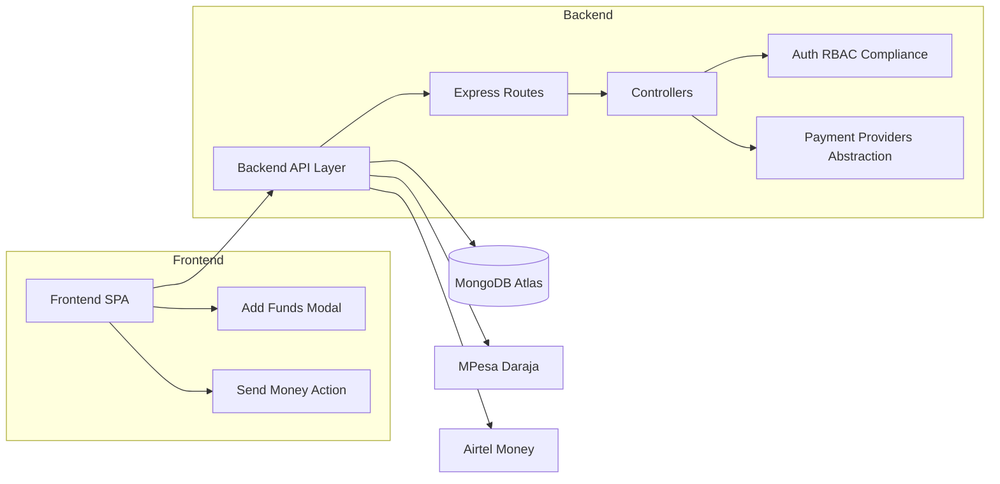
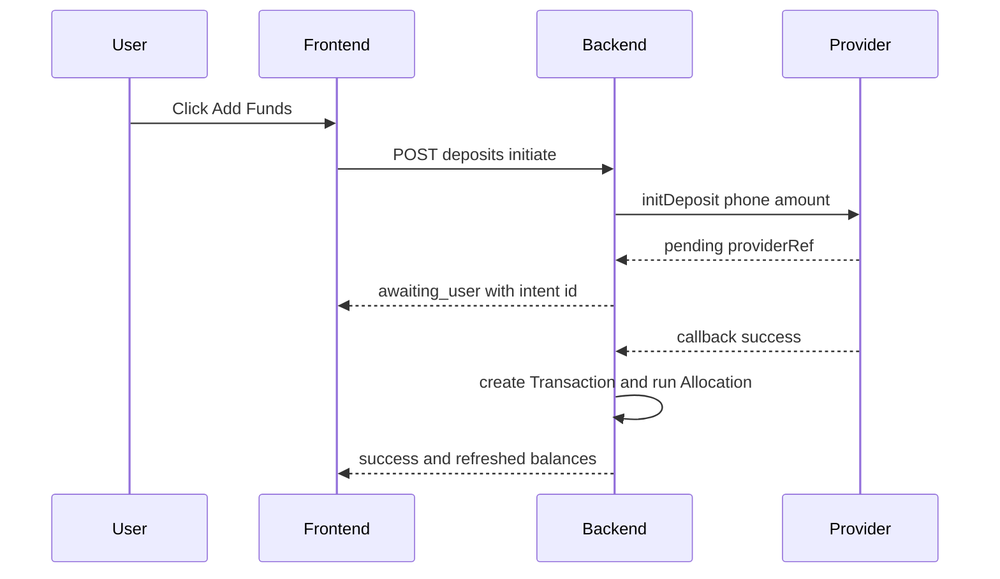
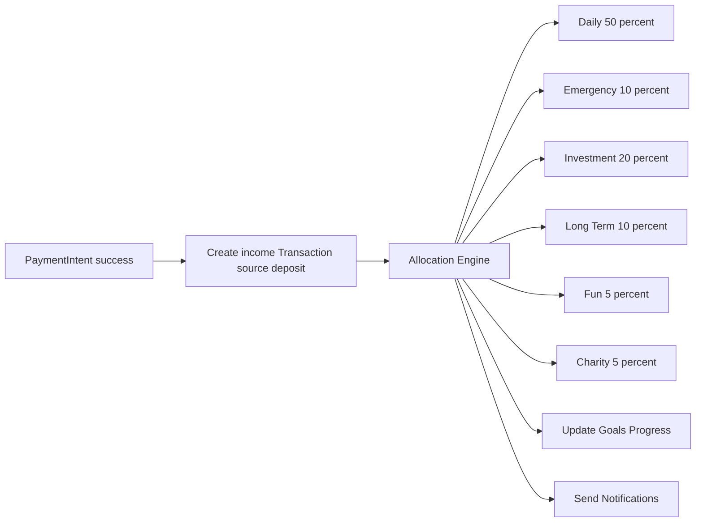

# Vault5 System Architecture

Purpose
- Describe end-to-end architecture for Vault5 including upcoming payments integration.
- Provide blueprints for implementation and future scale out.

Top Level Components
- Frontend React SPA
  - Pages: [Dashboard.js](vault5/frontend/src/pages/Dashboard.js), [Banking.js](vault5/frontend/src/pages/Banking.js), [Lending.js](vault5/frontend/src/pages/Lending.js)
  - Services: [api.js](vault5/frontend/src/services/api.js)
  - UI additions planned: Add Funds modal and Send Money button on dashboard
- Backend Node Express
  - Routes hub: [routes/index.js](vault5/backend/routes/index.js)
  - Core routes: [auth.js](vault5/backend/routes/auth.js), [accounts.js](vault5/backend/routes/accounts.js), [transactions.js](vault5/backend/routes/transactions.js)
  - Compliance gates: [compliance.js](vault5/backend/middleware/compliance.js), exported via [index.js](vault5/backend/middleware/index.js)
  - Controllers: [transactionsController.js](vault5/backend/controllers/transactionsController.js), [accountsController.js](vault5/backend/controllers/accountsController.js)
  - Payments module to be added: routes, controller, providers
- Database MongoDB Atlas
  - Models: [User.js](vault5/backend/models/User.js), [Account.js](vault5/backend/models/Account.js), [Transaction.js](vault5/backend/models/Transaction.js), [Compliance.js](vault5/backend/models/Compliance.js)
  - New model planned: [PaymentIntent.js](vault5/backend/models/PaymentIntent.js)
- External Providers
  - M-Pesa Daraja API, Airtel Money API
  - Bank transfer integrations in future
- Admin Consoles
  - Compliance, Users, Finance: [AdminCompliance.js](vault5/frontend/src/pages/AdminCompliance.js), [AdminUsers.js](vault5/frontend/src/pages/AdminUsers.js), [AdminFinance.js](vault5/frontend/src/pages/AdminFinance.js)

Mermaid: System Overview

Mermaid: Payments Flow End to End

Mermaid: Allocation After Deposit

Security and Compliance
- Apply compliance gates on payment endpoints
  - [limitationGateOutgoing](vault5/backend/middleware/compliance.js:140) allows income under limitation
  - [capsGate](vault5/backend/middleware/compliance.js:178) and [velocityGate](vault5/backend/middleware/compliance.js:229) enforce safe limits
- Secrets via environment variables and optional AWS secrets loader [secretsLoader.js](vault5/backend/utils/secretsLoader.js)

Scalability and Microservices Path
- Current: Single Express app with Mongoose
- Migration path in [microservices-migration-plan.md](vault5/microservices-migration-plan.md)
- Payments provider abstraction enables swapping provider backends without UI changes

Artifacts To Be Implemented
- Payments backend
  - [paymentsController.js](vault5/backend/controllers/paymentsController.js)
  - [payments.js](vault5/backend/routes/payments.js)
  - [PaymentIntent.js](vault5/backend/models/PaymentIntent.js)
  - [services/providers/mpesa.js](vault5/backend/services/providers/mpesa.js)
  - [services/providers/airtel.js](vault5/backend/services/providers/airtel.js)
  - [services/providers/bank.js](vault5/backend/services/providers/bank.js)
- Frontend UI
  - [AddFundsModal.js](vault5/frontend/src/components/AddFundsModal.js)
  - Buttons in [Dashboard.js](vault5/frontend/src/pages/Dashboard.js)
  - API hooks in [api.js](vault5/frontend/src/services/api.js)