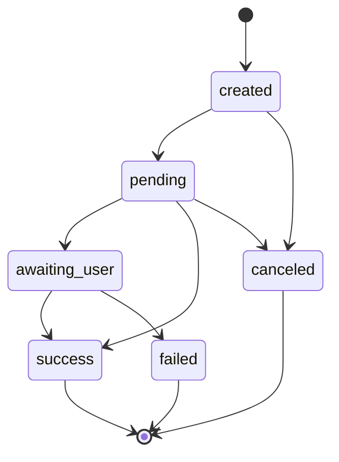

# Payments Data Model and Integration Plan

Purpose
- Define data structures and relationships to support Add Funds (deposits) and Send Money (payouts).
- Ensure allocation engine integration, reconciliation, idempotency, and auditability.
- Remain provider-agnostic with pluggable providers (M-Pesa, Airtel, Bank) and simulation for development.

Scope
- New PaymentIntent model
- Transaction augmentation for deposit source metadata
- Allocation integration path and idempotency
- Indexes, constraints, and status machine

PaymentIntent Model
- Collection: payment_intents
- Ownership: user-level object representing a single monetary flow
- Type: deposit or payout
- Provider: mpesa, airtel, bank, or simulation in dev

Fields
- user: ObjectId ref User
- type: String enum [deposit, payout]
- amount: Number > 0
- currency: String default KES
- targetAccount: String nullable when type is payout; for deposits, one of six accounts or wallet
- provider: String enum [mpesa, airtel, bank, simulation]
- phone: String MSISDN, required for mpesa or airtel
- status: String enum [created, pending, awaiting_user, success, failed, canceled, expired]
- providerRef: String external reference such as CheckoutRequestID or TransactionID; nullable initially
- providerMeta: Mixed, full payloads from provider callbacks and requests
- error: String optional human-readable error
- createdAt: Date default now
- updatedAt: Date auto-update

Indexes
- user_1_createdAt_-1
- providerRef_1 unique sparse (idempotency across callbacks)
- status_1_createdAt_-1 (dashboards, reconciliations)
- type_1_provider_1_createdAt_-1 (reporting filters)

Status Machine
- created -> pending (init started)
- pending -> awaiting_user (STK push sent; waiting for user input)
- awaiting_user -> success (callback or confirm)
- awaiting_user -> failed (rejected, timeout, insufficient funds)
- pending -> success (bank manual confirm)
- Any -> canceled (user canceled)
- Any -> expired (system timeout)
- success is terminal for payments, but allocation applies post-success

Mermaid State Diagram


Transaction Integration
- On success of a deposit PaymentIntent:
  - Create a Transaction record with type income, source deposit, provider metadata, and link to PaymentIntent.
  - Trigger allocation engine to split amount across six accounts using user’s configured percentages.
  - Update account balances and goals progress.
  - Emit notifications and audit logs.

Transaction Augmentation
- In [Transaction.js](vault5/backend/models/Transaction.js:1) ensure fields (or add them if missing):
  - source: String enum [deposit, manual, payout, transfer, allocation, interest, other]
  - provider: String nullable [mpesa, airtel, bank, simulation]
  - paymentIntentId: ObjectId ref PaymentIntent
  - status: String enum [created, completed, failed, reversed] default completed for successful deposit mapping
  - metadata: Mixed to store breakdowns or provider artifacts
- In [transactionsController.createTransaction()](vault5/backend/controllers/transactionsController.js:1) maintain a clear path for internal system-originated income transactions created by the payments flow (not from user-initiated manual entries).

Allocation Integration
- Flow after PaymentIntent success:
  1) Create Transaction type income with amount and source deposit.
  2) Run allocation service to distribute amounts per account configuration.
     - Either create child transactions per account or a single master record with breakdown.
  3) Update [accountsController](vault5/backend/controllers/accountsController.js:1) balances atomically to ensure idempotency.
  4) Persist allocation results into PaymentIntent.providerMeta.allocation for auditing.

Idempotency Strategy
- Enforce unique index on providerRef to prevent double processing of callbacks.
- Use a processing flag or compare-and-set pattern:
  - On callback: findOneAndUpdate by id or providerRef where status in [awaiting_user, pending] and set to success with allocation result; if status already success, return 200 OK without duplicating allocation.
- Maintain a processedAt timestamp in providerMeta when allocation was applied.

Reconciliation and Status Checks
- Provide GET /api/payments/transactions/:id/status to fetch the live status.
- Add background job or on-demand endpoint to re-check external provider status if stuck in pending/awaiting_user for too long.
- Maintain an audit trail via [AuditLog.js](vault5/backend/models/AuditLog.js:1) for each state transition.

Sample Schema (Mongoose)
- Will be implemented in code mode as [PaymentIntent.js](vault5/backend/models/PaymentIntent.js:1)

```js
const PaymentIntentSchema = new mongoose.Schema({
  user: { type: mongoose.Schema.Types.ObjectId, ref: 'User', index: true, required: true },
  type: { type: String, enum: ['deposit', 'payout'], required: true },
  amount: { type: Number, min: 1, required: true },
  currency: { type: String, default: 'KES' },
  targetAccount: { type: String, default: 'wallet' },
  provider: { type: String, enum: ['mpesa', 'airtel', 'bank', 'simulation'], required: true },
  phone: { type: String },
  status: { type: String, enum: ['created', 'pending', 'awaiting_user', 'success', 'failed', 'canceled', 'expired'], default: 'created', index: true },
  providerRef: { type: String, unique: true, sparse: true },
  providerMeta: { type: Object },
  error: { type: String },
}, { timestamps: true });

PaymentIntentSchema.index({ user: 1, createdAt: -1 });
PaymentIntentSchema.index({ type: 1, provider: 1, createdAt: -1 });
```

Relationships
- user 1..n payment_intents
- payment_intent 1..1 transaction (for deposits) or 1..n transactions if modeling per-account splits; prefer master Transaction linking back to PaymentIntent.

Provider Abstraction
- Interface in [providers/mpesa.js](vault5/backend/services/providers/mpesa.js:1) and peers
  - initDeposit(payload) -> { providerRef, status, meta }
  - confirmDeposit(ref) -> { status, meta }
  - initPayout(payload) -> { providerRef, status, meta }
  - checkStatus(ref) -> { status, meta }
- Simulation provider behaves the same but uses internal timers and manual confirm endpoint.

Auditing
- Log all status transitions with action payment_intent.transition in [utils/audit.js](vault5/backend/utils/audit.js:1).
- Include actor (system, webhook, user) and previous vs next state.

Errors and Edge Cases
- User cancels: mark canceled, no allocation.
- Timeout: mark expired; allow retry via new PaymentIntent (no reuse of providerRef).
- Insufficient funds or PIN rejection: failed with error details retained in providerMeta and error field.
- Late webhook after manual confirm: idempotent no-op except for reconciliation metadata.

Security and Compliance Hooks
- Apply [limitationGateOutgoing](vault5/backend/middleware/compliance.js:140) on deposit endpoints to allow income but block outgoing actions.
- Apply [capsGate](vault5/backend/middleware/compliance.js:178) and [velocityGate](vault5/backend/middleware/compliance.js:229) to enforce safe amounts and frequency.
- Webhook authenticity validation in production via IP allowlist or signature verification; simulation accepts all.

Open Implementation Items
- Create model file [PaymentIntent.js](vault5/backend/models/PaymentIntent.js:1).
- Add routes [payments.js](vault5/backend/routes/payments.js:1) and controller [paymentsController.js](vault5/backend/controllers/paymentsController.js:1).
- Implement simulation provider [services/providers/simulation.js](vault5/backend/services/providers/simulation.js:1) and wire to mpesa.js in sandbox mode if keys absent.
- Extend [transactionsController.createTransaction()](vault5/backend/controllers/transactionsController.js:1) or add a dedicated allocation service for programmatic deposits.

This document defines what will be implemented in Code mode to support Add Funds, provider callbacks, and allocation flow.