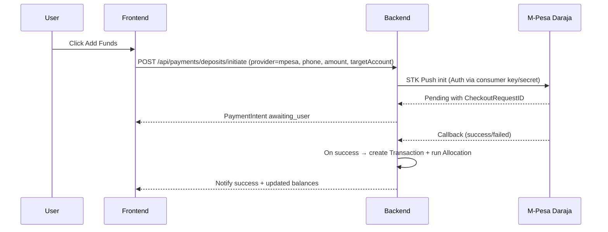

# M-Pesa Daraja Integration Guide (Vault5)

Purpose
- Provide a clear, secure path to integrate M-Pesa (Daraja) for deposits and payouts.
- Support sandbox-first, production readiness later (after Safaricom audit).
- Define environment variables, callback URLs, and operational checklists.

Status
- Development uses simulation with identical flows to Daraja.
- Sandbox integration will be wired into:
  - [paymentsController.js](vault5/backend/controllers/paymentsController.js)
  - [payments.js](vault5/backend/routes/payments.js)
  - [providers/mpesa.js](vault5/backend/services/providers/mpesa.js)
  - [PaymentIntent.js](vault5/backend/models/PaymentIntent.js)

Costs and Accounts
- Daraja API: Free to access (no subscription fee).
- Money flow incurs normal M-Pesa charges:
  - C2B (customer deposits to Vault5 Paybill/Till) fees apply to payer/business depending on configuration.
  - B2C (Vault5 payouts to users) fees charged to business wallet.
- You’ll need a business Paybill or Till number for production (applied via Safaricom Business).

Prerequisites
- Safaricom developer account for Daraja: https://developer.safaricom.co.ke
- For production:
  - Registered business entity and documents (ID, Cert of Incorporation/BN, KRA PIN, CR12/Partnership Deed as applicable).
  - Paybill/Till issued (Shortcode).
  - Public domain with SSL for callbacks (HTTPS).
  - Privacy policy and terms pages live in app (Vault5 has [Legal.js](vault5/frontend/src/pages/Legal.js), [Terms.js](vault5/frontend/src/pages/Terms.js), [Privacy.js](vault5/frontend/src/pages/Privacy.js)).

Step-by-Step: Register and Configure Daraja

1) Create Developer Account (Free)
- Visit portal and create an account.
- Login and create a new “App” to obtain:
  - Consumer Key
  - Consumer Secret
- Do not commit keys to version control. Store in environment variables.

2) Sandbox Access (Start Here)
- Sandbox provides test credentials and endpoints. No real money moves.
- You can use the known sandbox MSISDN for STK Push simulations:
  - 254708374149 (documented widely in Daraja examples)
- In Vault5 .env (backend), set:
  - MPESA_ENV=sandbox

3) Production Access (Later)
- After sandbox works end-to-end:
  - Apply for production.
  - Safaricom conducts an audit (functional test, security, callback reachability).
  - Provide your public callback URLs (HTTPS).
  - Set MPESA_ENV=production and switch to live credentials.

Core Daraja Features We Will Use

- STK Push (Lipa Na M-Pesa Online) – C2B Deposits
  - User taps Add Funds → Backend initiates STK Push with phone + amount.
  - User receives prompt on phone to enter PIN.
  - Daraja sends callback to our Confirmation URL.
  - Vault5 marks PaymentIntent as success/failed and triggers allocation.

- B2C (Business to Customer) – Withdrawals / Loan Disbursements
  - Vault5 initiates payout to user MSISDN.
  - Callback indicates success or failure.
  - Balance updates and ledger entries are recorded.

- Transaction Status & Reversal (optional future)
  - Status queries used for reconciliation.
  - Reversal can be implemented for exception flows.

Environment Variables (Backend)

Set in your backend environment (do not commit secrets):

- Required (Sandbox and Production)
  - MPESA_ENV=sandbox or production
  - MPESA_CONSUMER_KEY=your_consumer_key
  - MPESA_CONSUMER_SECRET=your_consumer_secret

- STK Push (C2B) specifics
  - MPESA_SHORTCODE=your_paybill_or_till_number
  - MPESA_PASSKEY=lipa_na_mpesa_online_passkey
  - MPESA_C2B_CALLBACK_URL=https://your-domain.com/api/payments/providers/mpesa/callback
  - MPESA_C2B_VALIDATION_URL=https://your-domain.com/api/payments/providers/mpesa/validation (optional)
  - MPESA_C2B_CONFIRMATION_URL=https://your-domain.com/api/payments/providers/mpesa/confirmation

- B2C specifics (when implementing B2C payouts)
  - MPESA_B2C_SHORTCODE=your_short_code
  - MPESA_INITIATOR_NAME=initiator_username
  - MPESA_INITIATOR_PASSWORD=initiator_password_or_security_credential
  - MPESA_B2C_RESULT_URL=https://your-domain.com/api/payments/providers/mpesa/b2c/result
  - MPESA_B2C_TIMEOUT_URL=https://your-domain.com/api/payments/providers/mpesa/b2c/timeout

Notes:
- In sandbox, some of the above are mocked; focus first on STK Push.
- For production, MPESA_INITIATOR_PASSWORD becomes SecurityCredential (encrypted via Safaricom cert). We will document this in provider code comments in [providers/mpesa.js](vault5/backend/services/providers/mpesa.js).

Callback URLs (What We Will Implement)
- Deposits (STK Push) callbacks:
  - POST /api/payments/providers/mpesa/callback
  - POST /api/payments/providers/mpesa/validation (optional)
  - POST /api/payments/providers/mpesa/confirmation
- Payouts (B2C):
  - POST /api/payments/providers/mpesa/b2c/result
  - POST /api/payments/providers/mpesa/b2c/timeout

These endpoints will be added in:
- [payments.js](vault5/backend/routes/payments.js)
- Handlers in [paymentsController.js](vault5/backend/controllers/paymentsController.js)

Vault5 Payment Flow Overview

- Deposit: User → Add Funds Modal → provider=mpesa → phone + amount
- Backend creates PaymentIntent (status: awaiting_user) and initiates STK Push (sandbox or real)
- Callback received → success or failure
- On success:
  - Create Transaction income entry and trigger allocation to the 6 accounts using existing logic in [transactionsController.js](vault5/backend/controllers/transactionsController.js)
  - Update goals/progress and send notifications
- On failure:
  - Mark PaymentIntent failed with error info

Mermaid: STK Push Deposit Flow

Sandbox Testing Plan

- Use MPESA_ENV=sandbox and sandbox app credentials.
- Test MSISDN (commonly used): 254708374149
- Simulate user approval: Daraja returns success via callback.
- If sandbox callback is not reachable locally:
  - Use a tunnel (ngrok) to expose local server to the internet with HTTPS:
    - https://{subdomain}.ngrok.io/api/payments/providers/mpesa/callback
  - Configure MPESA_C2B_CALLBACK_URL to this public tunnel.
  - Alternatively, use manual confirmation endpoint in dev: POST /api/payments/deposits/confirm

Production Go-Live Checklist

- Business Requirements
  - Business Paybill/Till acquired and verified
  - Corporate KYC completed with Safaricom
- Technical Requirements
  - Public HTTPS domain (TLS) for callbacks
  - Stable hosting for backend (Render/Railway/EC2)
  - Secure secrets storage (not in repo)
  - Webhook IP allowlist and/or signature verification
  - Privacy and Terms hosted and linked
- Audit & Approval
  - Provide callback URLs
  - Provide user flows (screenshots) of Add Funds, successful/failed payments
  - Demonstrate logs and reconciliation capability
- Post-Go-Live
  - Monitor webhook error rates and retries
  - Reconciliation jobs for pending intents
  - Alerting for failures

Airtel Money Notes (Parallel)
- Similar environment variable scheme:
  - AIRTEL_ENV=sandbox or production
  - AIRTEL_CLIENT_ID, AIRTEL_CLIENT_SECRET
  - AIRTEL_CALLBACK_URL=https://your-domain.com/api/payments/providers/airtel/callback
- Deposit and payout flows mirror M-Pesa abstractions.
- We will implement a simulated Airtel provider in [providers/airtel.js](vault5/backend/services/providers/airtel.js).

Security Considerations

- Secrets: Managed via environment variables; never commit to Git.
- Webhook security:
  - In production, restrict by source IPs (if published by provider) and validate signature headers if available.
  - Record full payload (providerMeta) for audit/replay.
- Rate limiting on payment endpoints with [rateLimit.js](vault5/backend/middleware/rateLimit.js).
- Compliance gates:
  - Deposits should pass [limitationGateOutgoing](vault5/backend/middleware/compliance.js:140) to allow income even when limited.
  - Caps/velocity gates applied to protect users from misuse.

FAQ
- Is Daraja API paid?
  - No subscription fee. You will bear transaction fees on actual money movements.
- Can I test without a public domain?
  - Yes, use ngrok to expose local callback for sandbox testing, or use the manual confirm simulation endpoint.
- Do I need a Paybill/Till for sandbox?
  - Sandbox provides test short codes but eventual production requires your own business shortcode.
- How long does production approval take?
  - Varies. Usually days to a couple of weeks depending on completeness of your submission.

Action Items for Vault5
- Create provider abstraction and PaymentIntent model.
- Implement endpoints listed above with simulation first.
- Add Add Funds modal on dashboard with provider selection.
- Integrate allocation on success and update balances.
- Prepare for sandbox testing with ngrok.
- When ready, apply for production and pass audit.

References
- Daraja Portal: https://developer.safaricom.co.ke
- Lipa Na M-Pesa Online (STK Push): Official docs in the portal