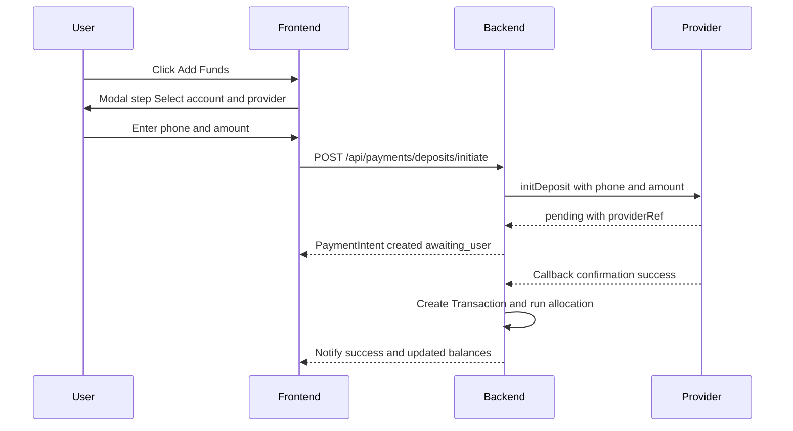
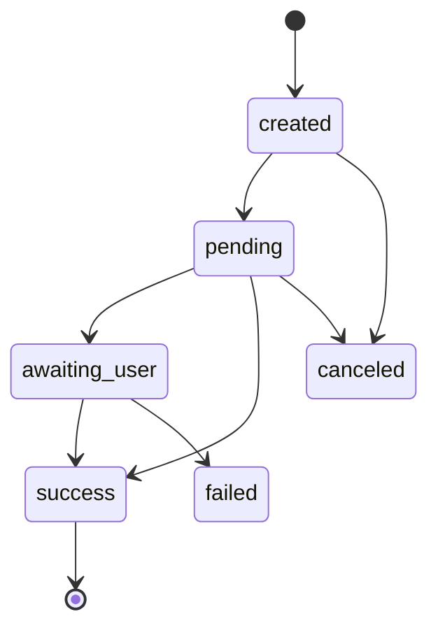

# Payments Architecture for Vault5

Purpose
- Enable Add Funds and Send Money with provider abstraction
- Support M-Pesa STK Push, Airtel Money, Bank transfer
- Provide full simulation in development until production APIs are approved

Scope
- Backend routes and services for payments
- State machine for PaymentIntent
- Integration with allocation engine on successful deposit
- Frontend modal UX for Add Funds workflow
- Webhook and manual confirmation flows

High Level Design
- Provider-agnostic interface
- PaymentIntent document tracks lifecycle for deposits and payouts
- Callback handlers update state and trigger allocations
- Admin visibility for payment events and reconciliation

Provider Abstraction
- Implement a common interface PaymentProvider with methods
  - initDeposit(payload) -> returns providerRef, checkout state
  - confirmDeposit(providerRef) -> returns final status
  - initPayout(payload) -> returns providerRef, status
  - checkStatus(providerRef) -> returns latest status
- Providers:
  - MpesaProvider simulated in dev, real in prod
  - AirtelProvider simulated in dev
  - BankTransferProvider simulated with manual confirmation
- Files to introduce in code mode:
  - [paymentsController.js](vault5/backend/controllers/paymentsController.js)
  - [payments.js](vault5/backend/routes/payments.js)
  - [PaymentIntent.js](vault5/backend/models/PaymentIntent.js)
  - [providers/mpesa.js](vault5/backend/services/providers/mpesa.js)
  - [providers/airtel.js](vault5/backend/services/providers/airtel.js)
  - [providers/bank.js](vault5/backend/services/providers/bank.js)

Data Model
- PaymentIntent fields
  - user: ObjectId
  - type: deposit or payout
  - amount: Number
  - currency: String default KES
  - targetAccount: String one of six vaults or main wallet
  - provider: String mpesa or airtel or bank
  - phone: String optional for STK
  - status: created, pending, awaiting_user, success, failed, canceled, expired
  - providerRef: String reference from provider
  - providerMeta: Mixed response payloads
  - error: String optional
  - createdAt, updatedAt
- Transaction integration
  - On success create a Transaction type income with amount and source deposit
  - Trigger allocation engine in [transactionsController.createTransaction()](vault5/backend/controllers/transactionsController.js:1) via a dedicated service to split into accounts

State Machine
- created -> pending when initiate returns
- pending -> awaiting_user for STK push
- awaiting_user -> success via webhook or manual confirm
- awaiting_user -> failed if rejected or timeout
- pending -> success for bank after manual confirm
- success -> allocation_applied virtual state after split
- Any -> canceled by user action

Mermaid Sequence Diagram

Endpoints
- POST /api/payments/deposits/initiate
  - body: provider, amount, targetAccount, phone
  - returns: PaymentIntent summary with status pending or awaiting_user
- POST /api/payments/deposits/confirm
  - body: id or providerRef
  - dev only to simulate confirmation if no webhook
- POST /api/payments/providers/mpesa/callback
  - provider webhook for STK push result
- POST /api/payments/providers/airtel/callback
  - provider webhook
- GET /api/payments/transactions/:id/status
  - returns current state
- GET /api/payments/recent
  - list last 20 intents

Frontend UX Add Funds
- Two primary buttons on Dashboard
  - Add Funds
  - Send Money
- AddFundsModal steps
  1. Choose target account
  2. Choose provider mpesa or airtel or bank
  3. Enter phone and amount
  4. Confirm summary
  5. Waiting screen with instructions and live status
- On success show allocation breakdown and updated balances
- Files to update in code mode:
  - [Dashboard.js](vault5/frontend/src/pages/Dashboard.js)
  - [Banking.js](vault5/frontend/src/pages/Banking.js)
  - [AddFundsModal.js](vault5/frontend/src/components/AddFundsModal.js)
  - [api.js](vault5/frontend/src/services/api.js)

Simulation Mode
- Enabled when MPESA_MODE=sandbox and AIRTEL_MODE=sandbox
- STK push is simulated with delayed success after 5 to 10 seconds
- Manual confirm endpoint available to force state change
- Webhook endpoints accept test payloads persisted to PaymentIntent.providerMeta

Security and Compliance
- Validate amount greater than zero and within tier caps via [capsGate](vault5/backend/middleware/compliance.js:178)
- Apply [limitationGateOutgoing](vault5/backend/middleware/compliance.js:140) allowing income only
- Verify webhook authenticity in production with IP allowlist and signatures
- Secrets stored in environment variables

Allocation Integration
- On success of deposit
  - Credit user wallet main ledger
  - Run allocation engine to split based on configured percentages
  - Create per account Transaction entries or a master with breakdown
  - Update goals progress and send notifications
- Reconciliation
  - If webhook arrives late ensure idempotent processing using providerRef

Errors and Retries
- Handle user canceled, insufficient balance, pin timeout
- Expose retry action in UI to reinitiate STK
- Background job retries status checks for pending intents

Auditing and Reporting
- Log all transitions to [AuditLog.js](vault5/backend/models/AuditLog.js)
- Reports include deposits inflow by provider and success rate

Open Questions
- Multi currency handling future phase
- Bank providers list and fee policies
- Wallet top ups vs direct to account

Developer Notes
- Start with the simulation provider and wire full flow end to end
- After passing manual QA, plug Daraja sandbox keys and test callbacks
- Only then request production access

UI Copy Suggestions
- Waiting screen shows instructions
  - M-Pesa prompt sent to your phone
  - Enter PIN to approve the payment
  - Do not close this window

Mermaid Flow State

Appendix Field Names
- PaymentIntent fields as listed above
- Example providerMeta keys
  - merchantRequestID
  - checkoutRequestID
  - resultCode
  - resultDesc

References
- Safaricom Daraja docs https://developer.safaricom.co.ke/apis
- Airtel Money API docs public portal

Implementation Plan Snapshot
- Backend
  - Add routes and controller
  - Implement simulation provider
  - Create model and migrations if any
- Frontend
  - Add modal and service calls
  - Polling or SSE for status updates
- Testing
  - Unit tests with mocked provider
  - E2E happy and error paths