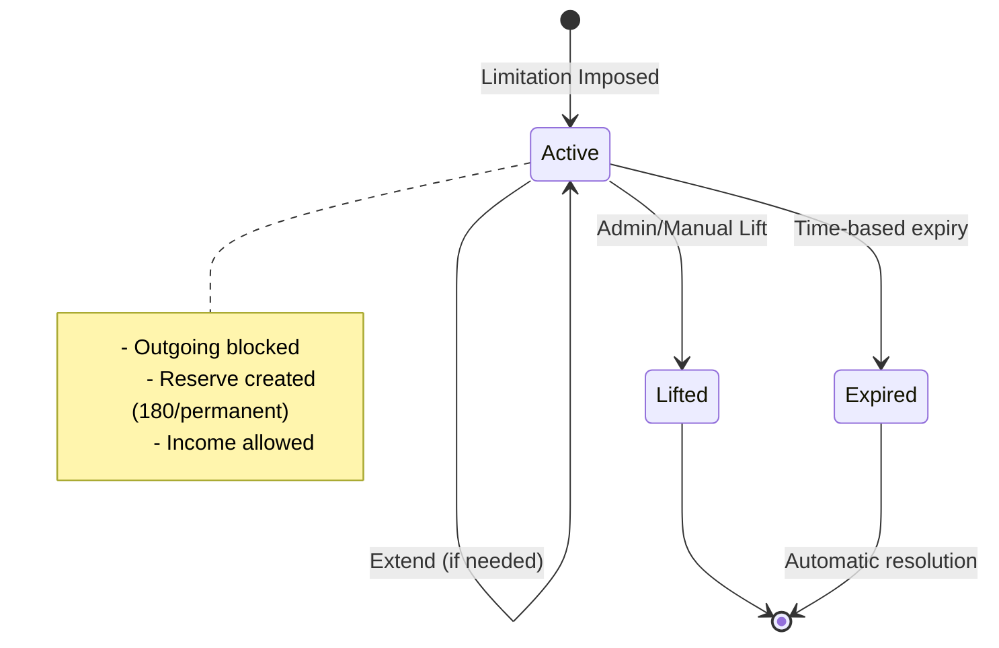
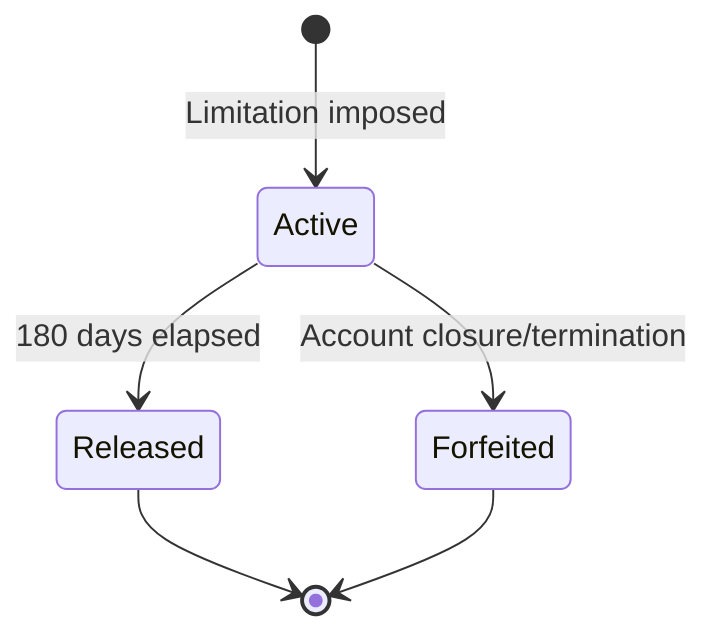
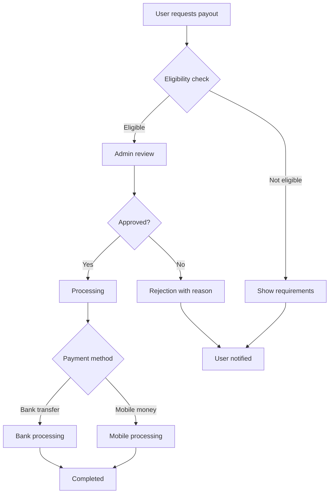

# Vault5 Compliance Policies & Limitations

## Overview

Vault5 implements a comprehensive compliance system inspired by PayPal's account limitations and reserve policies. This document outlines the policies, limitations, reserve logic, and payout procedures designed to protect users and ensure regulatory compliance.

## Account Limitations

### Limitation Types

Vault5 supports three types of account limitations:

#### 1. Temporary 30-Day Limitation
- **Duration**: 30 days from imposition
- **Trigger**: Minor policy violations or suspicious activity
- **Effects**:
  - Blocks outgoing money movements (transfers, withdrawals, payments)
  - Allows income deposits
  - Allows KYC document uploads
  - Allows support ticket creation
- **Resolution**: Automatic lift after 30 days or manual admin intervention

#### 2. Temporary 180-Day Limitation
- **Duration**: 180 days from imposition
- **Trigger**: Moderate violations requiring fund protection
- **Effects**:
  - Blocks outgoing money movements
  - Allows income deposits
  - Creates reserve hold on wallet balance
  - Allows KYC document uploads
- **Resolution**: Automatic lift after 180 days with payout eligibility

#### 3. Permanent Limitation
- **Duration**: Indefinite until manual admin lift
- **Trigger**: Severe violations or confirmed fraud
- **Effects**:
  - Blocks all outgoing money movements
  - Creates reserve hold on wallet balance
  - Allows income deposits (held in reserve)
  - Allows KYC document uploads
- **Resolution**: Manual admin review and approval required

### Limitation Lifecycle



## Reserve Hold System

### Reserve Creation

When a temporary_180 or permanent limitation is imposed:

1. **Snapshot Creation**: Current wallet balance is recorded
2. **Hold Period**: 180 days from limitation imposition
3. **Interest**: No interest accrual during hold period
4. **Release**: Automatic release after 180 days

### Reserve States



### Reserve Calculations

```javascript
// Reserve amount = wallet balance at limitation time
const reserveAmount = walletBalance;

// Release date = limitation date + 180 days
const releaseDate = limitationDate + (180 * 24 * 60 * 60 * 1000);

// Payout eligibility = current date >= release date
const payoutEligible = currentDate >= releaseDate;
```

## Payout Procedures

### Eligibility Requirements

To request payout after reserve period:

1. **Time Requirement**: 180 days must have elapsed since limitation
2. **KYC Verification**: Must have completed KYC (Tier1 or higher)
3. **Bank Verification**: Must have verified bank account details
4. **Active Account**: Account must be in good standing
5. **No Active Limitations**: No current limitations blocking payouts

### Payout Process



### Payout Methods

#### Bank Transfer
- **Requirements**: Verified bank account details
- **Processing Time**: 1-3 business days
- **Fees**: Bank transfer fees apply
- **Limits**: Per transaction and daily limits apply

#### Mobile Money
- **Requirements**: Verified mobile number
- **Processing Time**: Instant to 24 hours
- **Fees**: Mobile money transaction fees
- **Limits**: Provider-specific limits

### Payout Limits

| KYC Tier | Daily Limit | Monthly Limit | Transaction Limit |
|----------|-------------|----------------|-------------------|
| Tier0 | KES 10,000 | KES 25,000 | KES 5,000 |
| Tier1 | KES 50,000 | KES 200,000 | KES 25,000 |
| Tier2 | KES 200,000 | KES 1,000,000 | KES 100,000 |

## Geographic & Access Policies

### Geo-Allowlist

Vault5 restricts access based on geographic location:

- **Default Policy**: Kenya (KE) only
- **Configuration**: Admin-configurable via `/api/admin/compliance/policies/geo`
- **Effect**: Non-allowed countries receive "Service not available" error
- **Logging**: Geo-blocks are logged for compliance review

### IP Denylist

- **CIDR Support**: Supports both /32 (exact IP) and /24 (subnet) blocks
- **Reason Tracking**: Each block includes reason and admin who added it
- **Automatic Cleanup**: Expired blocks can be automatically removed
- **Audit Trail**: All IP block changes are logged

### Device Policies

- **Cookie Requirements**: Users must accept cookies
- **Headless Detection**: Automated browser sessions are blocked
- **Signal Validation**: Minimum device signals required for trust scoring
- **Bot Protection**: Advanced bot detection and blocking

## Transaction Gates

### Pre-Transaction Checks

Every transaction goes through multiple validation gates:

```javascript
async function validateTransaction(userId, amount, type) {
    // 1. Authentication check
    if (!isAuthenticated(userId)) throw new Error('Not authenticated');

    // 2. Geographic check
    if (!isAllowedCountry(user.country)) throw new Error('Geo blocked');

    // 3. IP check
    if (isIpBlocked(user.lastIp)) throw new Error('IP blocked');

    // 4. Device check
    if (!hasValidDevice(user.deviceFingerprint)) throw new Error('Device blocked');

    // 5. Limitation check
    if (hasActiveLimitation(userId)) throw new Error('Account limited');

    // 6. KYC tier limits
    if (!isWithinTierLimits(user.kycLevel, amount)) throw new Error('Tier limit exceeded');

    // 7. Velocity check
    if (exceedsVelocityLimit(userId, amount, window)) throw new Error('Velocity limit exceeded');

    // 8. Balance check
    if (!hasSufficientBalance(userId, amount)) throw new Error('Insufficient funds');

    return true;
}
```

### Gate Priority

Gates are checked in order of computational cost and security impact:

1. **Authentication** (fastest, highest priority)
2. **Geographic** (fast, regulatory)
3. **IP/Device** (medium, security)
4. **Limitation** (fast, compliance)
5. **Tier Limits** (fast, business)
6. **Velocity** (database query, performance)
7. **Balance** (database query, final check)

## Risk Management

### Risk Events

Vault5 tracks various risk events for analytics and automated responses:

| Event Type | Severity | Auto-Response |
|------------|----------|---------------|
| `login_geo_block` | High | Block access |
| `ip_block` | High | Block access |
| `device_block` | Medium | Require re-auth |
| `cap_hit` | Low | Log only |
| `velocity_hit` | Medium | Temporary slow-down |
| `limitation_imposed` | High | Reserve creation |
| `kyc_rejection` | Medium | Additional verification |

### Risk Scoring

```javascript
function calculateRiskScore(events) {
    const weights = {
        'login_geo_block': 80,
        'ip_block': 90,
        'device_block': 70,
        'cap_hit': 20,
        'velocity_hit': 40,
        'limitation_imposed': 60
    };

    return events.reduce((score, event) => {
        return score + (weights[event.kind] || 0);
    }, 0);
}
```

### Automated Responses

Based on risk scores:
- **0-30**: No action
- **31-60**: Additional logging
- **61-80**: Require additional verification
- **81-100**: Automatic limitation consideration

## Admin Procedures

### Imposing Limitations

1. **Investigation**: Review user activity and risk events
2. **Evidence Gathering**: Document violation details
3. **Limitation Type Selection**: Choose appropriate limitation type
4. **Reserve Calculation**: For 180/permanent, calculate reserve amount
5. **Notification**: Inform user of limitation and appeal process
6. **Audit Logging**: Record all actions with reasons

### Lifting Limitations

1. **Review Request**: User submits appeal or time-based expiry
2. **Investigation**: Verify resolution of underlying issues
3. **Risk Assessment**: Evaluate current risk profile
4. **Decision**: Approve or deny lift request
5. **Reserve Release**: For 180-day limits, release held funds
6. **Notification**: Inform user of decision

### Payout Processing

1. **Eligibility Verification**: Confirm 180-day period and KYC
2. **Amount Validation**: Verify requested amount against reserves
3. **Bank Verification**: Confirm destination account details
4. **Processing**: Initiate payment through appropriate channel
5. **Confirmation**: Update payout status and notify user
6. **Audit**: Log all payout actions

## User Experience

### Limitation Notification

When a limitation is imposed, users receive:

- **Clear Explanation**: Reason for limitation
- **Duration Information**: How long it will last
- **Appeal Process**: How to request early lift
- **Allowed Actions**: What they can still do
- **Reserve Information**: If applicable, reserve details

### Payout Request Flow

1. **Eligibility Check**: System shows payout readiness
2. **Bank Setup**: Guide user through bank verification
3. **Amount Selection**: Choose amount within limits
4. **Confirmation**: Review and confirm payout details
5. **Processing**: Real-time status updates
6. **Completion**: Confirmation and receipt

### Compliance Center

Users can access their compliance status through the Compliance Center:

- **Current Status**: Active limitations and countdowns
- **Reserve Details**: Held amounts and release dates
- **KYC Progress**: Current tier and upgrade options
- **Payout History**: Previous payout requests and status
- **Appeal Forms**: Submit requests for limitation lifts

## Regulatory Compliance

### Data Retention

- **Transaction Data**: 7 years (regulatory requirement)
- **Audit Logs**: 7 years
- **KYC Documents**: 5 years after account closure
- **Limitation Records**: 7 years

### Reporting

Vault5 generates regular compliance reports:

- **Monthly**: Transaction summaries and limitation activities
- **Quarterly**: Risk assessment and policy effectiveness
- **Annual**: Comprehensive compliance review

### Audit Trail

All compliance actions are logged with:

- **Timestamp**: Exact date and time
- **Actor**: Admin user who performed action
- **Reason**: Detailed explanation
- **Evidence**: Supporting data and references
- **Outcome**: Result of the action

## Configuration

### Environment Variables

```bash
# Compliance settings
AUTH_REQUIRE_EMAIL_VERIFICATION=false  # Set to true in production
COMPLIANCE_AUTO_LIFT=true            # Auto-lift expired limitations
RESERVE_RELEASE_DAYS=180              # Days for reserve hold

# Risk thresholds
RISK_SCORE_THRESHOLD=60               # Score for additional verification
VELOCITY_DAILY_LIMIT=100000          # Daily transaction velocity limit
VELOCITY_WEEKLY_LIMIT=500000         # Weekly transaction velocity limit
```

### Policy Defaults

- **Geo Policy**: Allowlist with KE default
- **Device Policy**: Cookies required, headless forbidden
- **Tier Limits**: As specified in Limits.md
- **Reserve Period**: 180 days for fund protection

## Monitoring & Alerts

### Admin Alerts

- **High-Risk Users**: Automatic alerts for high-risk profiles
- **Bulk Limitations**: Alerts when multiple users limited simultaneously
- **Policy Changes**: Notifications of policy updates
- **Payout Anomalies**: Unusual payout patterns

### System Health

- **Gate Performance**: Monitor response times of compliance gates
- **False Positives**: Track incorrect blocks for policy tuning
- **User Impact**: Monitor user experience during limitations
- **Regulatory Reporting**: Automated report generation

## Future Enhancements

### Planned Features

1. **Machine Learning Risk Scoring**: AI-powered risk assessment
2. **Dynamic Limits**: Real-time limit adjustments based on behavior
3. **Multi-Currency Reserves**: Support for multiple currencies
4. **Instant Payouts**: Faster payout processing
5. **Appeal Automation**: AI-assisted appeal processing

### Integration Points

- **Bank APIs**: Direct bank verification
- **Credit Bureaus**: Enhanced KYC verification
- **Fraud Networks**: Cross-platform fraud detection
- **Regulatory Systems**: Direct regulatory reporting

---

This document provides the foundation for Vault5's compliance and risk management system. All policies are designed to balance user experience with regulatory requirements and security best practices.