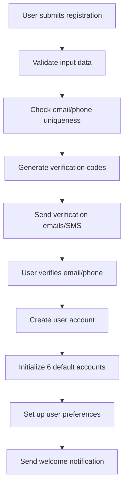
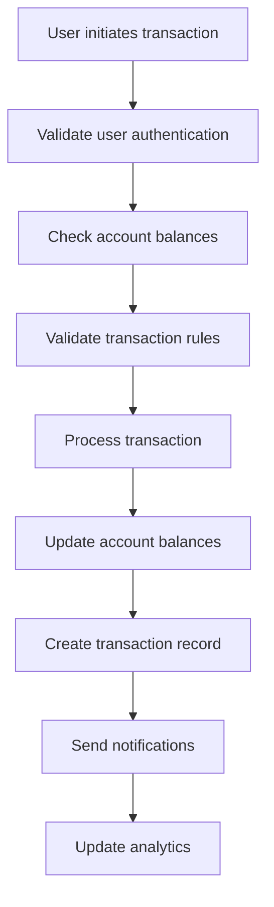
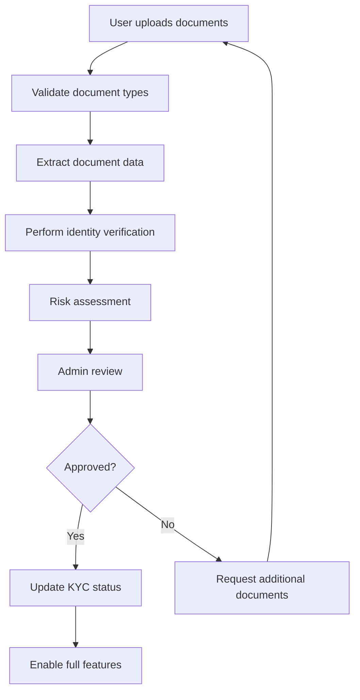
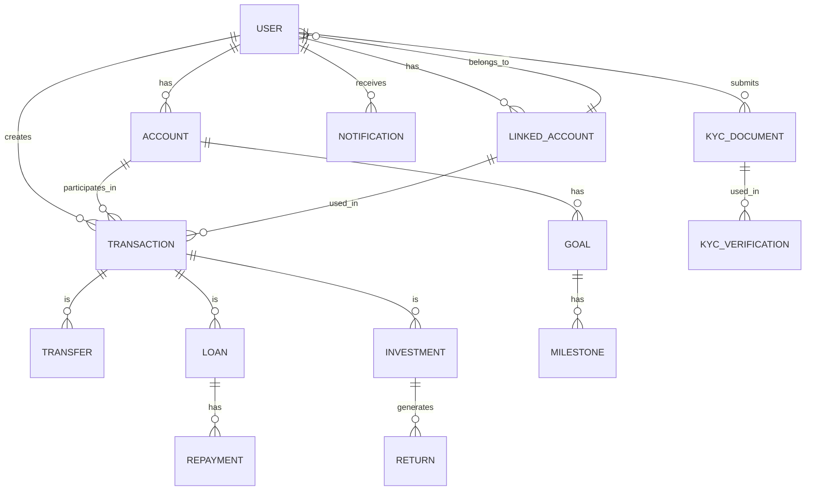

# System Design Document (SDD)

## Vault5 - Financial Freedom Platform

**Version:** 1.0
**Date:** September 2024
**Author:** Vault5 Development Team

---

## Table of Contents

1. [Introduction](#introduction)
2. [System Architecture](#system-architecture)
3. [Database Design](#database-design)
4. [API Design](#api-design)
5. [Security Architecture](#security-architecture)
6. [User Interface Design](#user-interface-design)
7. [Integration Design](#integration-design)
8. [Deployment Architecture](#deployment-architecture)
9. [Performance Considerations](#performance-considerations)
10. [Scalability Design](#scalability-design)
11. [Error Handling](#error-handling)
12. [Testing Strategy](#testing-strategy)
13. [Appendix](#appendix)

---

## Introduction

### Purpose
This System Design Document (SDD) provides a comprehensive technical specification for the Vault5 Financial Freedom Platform. It serves as the blueprint for implementation, detailing the system architecture, database design, API specifications, security measures, and deployment strategy.

### Scope
This document covers the complete technical design of Vault5, including:
- System architecture and component interactions
- Database schema and data models
- API design and endpoint specifications
- Security architecture and implementation
- User interface design patterns
- Third-party integrations
- Deployment and scaling strategies

### Audience
- Software Developers and Engineers
- System Architects
- Database Administrators
- DevOps Engineers
- Quality Assurance Engineers
- Technical Project Managers

### Document Structure
This document follows a modular approach, with each section focusing on a specific aspect of the system design. Cross-references are provided where components interact across different sections.

---

## System Architecture

### 2.1 High-Level Architecture

#### 2.1.1 System Overview
Vault5 follows a microservices-based architecture with the following components:

```
┌─────────────────┐    ┌─────────────────┐    ┌─────────────────┐
│   Web Frontend  │    │  Mobile App     │    │   Admin Panel   │
│   (React)       │    │  (React Native) │    │   (React)       │
└─────────┬───────┘    └─────────┬───────┘    └─────────┬───────┘
          │                      │                      │
          └──────────┬───────────┼──────────┬───────────┘
                     │          │          │
                ┌────▼────┬─────▼────┬─────▼────┐
                │         │          │          │
                │  API    │ Auth     │ File     │
                │ Gateway │ Service  │ Service  │
                │         │          │          │
                └────┬────┴────┬─────┴────┬─────┘
                     │         │          │
                ┌────▼────┬────▼────┬─────▼────┐
                │         │         │          │
                │ User    │ Trans-  │ Notifi-  │
                │ Service │ action  │ cation   │
                │         │ Service │ Service  │
                └────┬────┴────┬────┴────┬─────┘
                     │         │         │
                ┌────▼────┬────▼────┬────▼────┐
                │         │         │         │
                │  Redis  │ MongoDB │ AWS S3  │
                │ Cache   │         │ Files   │
                └─────────┴─────────┴─────────┘
```

#### 2.1.2 Component Description

**Frontend Layer:**
- **Web Application:** React-based single-page application
- **Mobile Application:** React Native cross-platform app
- **Admin Panel:** Specialized interface for system administration

**API Layer:**
- **API Gateway:** Nginx reverse proxy with rate limiting
- **Authentication Service:** JWT token management and validation
- **File Service:** Document upload and management

**Business Logic Layer:**
- **User Service:** User management and profile operations
- **Transaction Service:** Financial transaction processing
- **Notification Service:** Email, SMS, and push notifications

**Data Layer:**
- **MongoDB:** Primary database for application data
- **Redis:** Caching layer and session storage
- **AWS S3:** File storage for documents and media

### 2.2 Technology Stack

#### 2.2.1 Frontend Technologies
```javascript
// Core Framework
React 18.2.0
React Router 6.4.0
Redux Toolkit 1.9.0

// UI Components
TailwindCSS 3.3.0
Headless UI 1.7.0
Heroicons 2.0.0

// Charts & Visualization
Chart.js 4.3.0
D3.js 7.8.0
React Chart.js 2 4.3.0

// Forms & Validation
React Hook Form 7.43.0
Yup 1.2.0
Formik 2.4.0

// HTTP Client
Axios 1.4.0
React Query 4.29.0

// Development Tools
TypeScript 5.0.0
ESLint 8.40.0
Prettier 2.8.0
```

#### 2.2.2 Backend Technologies
```javascript
// Runtime Environment
Node.js 18.17.0
Express.js 4.18.0
TypeScript 5.0.0

// Database
MongoDB 6.0.0
Mongoose 7.3.0
Redis 4.6.0

// Authentication & Security
JWT 9.0.0
bcrypt 5.1.0
express-rate-limit 6.7.0

// Validation & Documentation
Joi 17.9.0
Swagger 4.0.0
OpenAPI 3.0.0

// File Processing
Multer 1.4.5
Sharp 0.32.0
PDFKit 0.13.0

// Communication
Nodemailer 6.9.0
Twilio SDK 4.11.0
Socket.io 4.7.0

// Development Tools
Jest 29.5.0
Supertest 6.3.0
Winston 3.8.0
```

#### 2.2.3 Infrastructure
```yaml
# Cloud Platform
AWS:
  - EC2 (Application Servers)
  - RDS (Database)
  - ElastiCache (Redis)
  - S3 (File Storage)
  - CloudFront (CDN)
  - Route 53 (DNS)
  - WAF (Security)

# Containerization
Docker 24.0.0
Docker Compose 2.20.0

# Monitoring & Logging
Datadog (APM)
Sentry (Error Tracking)
ELK Stack (Logging)

# CI/CD
GitHub Actions
AWS CodeDeploy
```

### 2.3 Data Flow Architecture

#### 2.3.1 User Registration Flow


#### 2.3.2 Transaction Processing Flow


#### 2.3.3 KYC Verification Flow


---

## Database Design

### 3.1 Conceptual Data Model

#### 3.1.1 Entity Relationship Diagram


#### 3.1.2 Key Entities

**User Entity:**
- Core user information and authentication
- Multiple linked accounts support
- KYC status and verification levels
- Role-based access control

**Account Entity:**
- Six-account allocation system
- Balance tracking and status
- Goal setting and progress
- Transaction history

**Transaction Entity:**
- Financial transaction records
- Multi-currency support
- Categorization and tagging
- Audit trail

### 3.2 Physical Database Schema

#### 3.2.1 User Collection
```javascript
// users collection
{
  _id: ObjectId,
  // Primary authentication
  primaryEmail: {
    type: String,
    required: true,
    unique: true,
    lowercase: true,
    trim: true
  },
  primaryPhone: {
    type: String,
    required: true,
    unique: true
  },

  // Linked accounts (up to 3 additional)
  linkedAccounts: [{
    type: {
      type: String,
      enum: ['email', 'phone'],
      required: true
    },
    value: {
      type: String,
      required: true
    },
    isVerified: {
      type: Boolean,
      default: false
    },
    verificationToken: String,
    verificationExpires: Date,
    addedAt: {
      type: Date,
      default: Date.now
    }
  }],

  // Authentication
  password: {
    type: String,
    required: true,
    minlength: 8
  },
  role: {
    type: String,
    enum: ['user', 'admin', 'compliance_admin', 'super_admin'],
    default: 'user'
  },

  // KYC Information
  kycStatus: {
    type: String,
    enum: ['not_submitted', 'pending', 'under_review', 'approved', 'rejected'],
    default: 'not_submitted'
  },
  kycLevel: {
    type: String,
    enum: ['tier_0', 'tier_1', 'tier_2'],
    default: 'tier_0'
  },

  // Profile Information
  firstName: String,
  lastName: String,
  dateOfBirth: Date,
  nationality: String,
  address: {
    street: String,
    city: String,
    state: String,
    postalCode: String,
    country: String
  },

  // Preferences
  preferences: {
    language: {
      type: String,
      default: 'en'
    },
    currency: {
      type: String,
      default: 'KES'
    },
    notifications: {
      email: { type: Boolean, default: true },
      sms: { type: Boolean, default: true },
      push: { type: Boolean, default: true }
    }
  },

  // Account relationships
  accounts: [{
    type: ObjectId,
    ref: 'Account'
  }],

  // Timestamps
  createdAt: { type: Date, default: Date.now },
  updatedAt: { type: Date, default: Date.now },
  lastLoginAt: Date,

  // Indexes
  // Compound index for email/phone lookup
  // Index on role for admin queries
  // Index on kycStatus for compliance queries
}
```

#### 3.2.2 Account Collection
```javascript
// accounts collection
{
  _id: ObjectId,
  user: {
    type: ObjectId,
    ref: 'User',
    required: true
  },
  type: {
    type: String,
    enum: ['Daily', 'Emergency', 'Investment', 'LongTerm', 'Fun', 'Charity'],
    required: true
  },
  name: {
    type: String,
    required: true
  },
  percentage: {
    type: Number,
    required: true,
    min: 0,
    max: 100
  },
  balance: {
    type: Number,
    default: 0,
    min: 0
  },
  currency: {
    type: String,
    default: 'KES'
  },

  // Goals and targets
  target: {
    amount: Number,
    deadline: Date,
    description: String
  },

  // Status and compliance
  status: {
    type: String,
    enum: ['red', 'green', 'blue'], // shortfall, on-target, surplus
    default: 'green'
  },
  compliance: {
    requiredDeposit: Number,
    actualDeposit: Number,
    shortfall: Number,
    surplus: Number,
    lastUpdated: Date
  },

  // Metadata
  isActive: {
    type: Boolean,
    default: true
  },
  description: String,

  // Relationships
  transactions: [{
    type: ObjectId,
    ref: 'Transaction'
  }],

  // Timestamps
  createdAt: { type: Date, default: Date.now },
  updatedAt: { type: Date, default: Date.now },

  // Indexes
  // Compound index on user and type
  // Index on status for dashboard queries
  // Index on balance for sorting
}
```

#### 3.2.3 Transaction Collection
```javascript
// transactions collection
{
  _id: ObjectId,
  user: {
    type: ObjectId,
    ref: 'User',
    required: true
  },

  // Transaction details
  type: {
    type: String,
    enum: ['income', 'expense', 'transfer', 'loan', 'investment', 'lending'],
    required: true
  },
  amount: {
    type: Number,
    required: true,
    min: 0
  },
  currency: {
    type: String,
    default: 'KES'
  },

  // Description and categorization
  description: {
    type: String,
    required: true,
    maxlength: 500
  },
  category: {
    type: String,
    enum: ['salary', 'business', 'investment', 'gift', 'expense', 'transfer', 'loan', 'other'],
    required: true
  },
  tags: [String],

  // Account information
  fromAccount: {
    type: ObjectId,
    ref: 'Account'
  },
  toAccount: {
    type: ObjectId,
    ref: 'Account'
  },

  // Transfer details (for P2P transfers)
  transferDetails: {
    recipient: {
      name: String,
      email: String,
      phone: String,
      userId: ObjectId // Reference to recipient user
    },
    isExternal: {
      type: Boolean,
      default: false
    },
    externalDetails: {
      bankName: String,
      accountNumber: String,
      routingNumber: String
    }
  },

  // Lending details (for lending transactions)
  lendingDetails: {
    borrower: {
      name: String,
      relationship: String,
      contact: String
    },
    loanType: {
      type: String,
      enum: ['emergency', 'non_emergency', 'business', 'personal']
    },
    repaymentTerms: {
      amount: Number,
      dueDate: Date,
      frequency: String // weekly, monthly, etc.
    },
    status: {
      type: String,
      enum: ['outstanding', 'repaid', 'written_off', 'overdue']
    }
  },

  // Investment details (for investment transactions)
  investmentDetails: {
    assetType: {
      type: String,
      enum: ['stock', 'bond', 'crypto', 'real_estate', 'tbill', 'mmf', 'other']
    },
    assetName: String,
    quantity: Number,
    unitPrice: Number,
    currentValue: Number,
    maturityDate: Date,
    returns: {
      dividends: Number,
      capitalGains: Number
    }
  },

  // Loan details (for loan transactions)
  loanDetails: {
    loanType: {
      type: String,
      enum: ['personal', 'business', 'mortgage', 'car', 'education']
    },
    principal: Number,
    interestRate: Number,
    term: Number, // in months
    monthlyPayment: Number,
    remainingBalance: Number,
    nextPaymentDate: Date,
    lender: {
      name: String,
      type: String // bank, individual, etc.
    }
  },

  // Status and processing
  status: {
    type: String,
    enum: ['pending', 'processing', 'completed', 'failed', 'cancelled'],
    default: 'pending'
  },
  processingDetails: {
    paymentMethod: String,
    referenceNumber: String,
    gatewayResponse: Object,
    processedAt: Date
  },

  // Attachments and receipts
  attachments: [{
    filename: String,
    originalName: String,
    mimeType: String,
    size: Number,
    url: String,
    uploadedAt: Date
  }],

  // Audit trail
  createdBy: {
    type: ObjectId,
    ref: 'User'
  },
  updatedBy: {
    type: ObjectId,
    ref: 'User'
  },

  // Timestamps
  createdAt: { type: Date, default: Date.now },
  updatedAt: { type: Date, default: Date.now },

  // Indexes
  // Compound index on user and type
  // Index on status for processing queries
  // Index on createdAt for time-based queries
  // Index on amount for financial reporting
}
```

### 3.3 Database Indexing Strategy

#### 3.3.1 Performance Indexes
```javascript
// User collection indexes
db.users.createIndex({ primaryEmail: 1 }, { unique: true })
db.users.createIndex({ primaryPhone: 1 }, { unique: true })
db.users.createIndex({ role: 1, kycStatus: 1 })
db.users.createIndex({ createdAt: -1 })
db.users.createIndex({ lastLoginAt: -1 })

// Account collection indexes
db.accounts.createIndex({ user: 1, type: 1 }, { unique: true })
db.accounts.createIndex({ status: 1, updatedAt: -1 })
db.accounts.createIndex({ balance: -1 })
db.accounts.createIndex({ user: 1, isActive: 1 })

// Transaction collection indexes
db.transactions.createIndex({ user: 1, type: 1, createdAt: -1 })
db.transactions.createIndex({ status: 1, createdAt: -1 })
db.transactions.createIndex({ 'transferDetails.recipient.userId': 1 })
db.transactions.createIndex({ amount: -1 })
db.transactions.createIndex({ createdAt: -1 })
db.transactions.createIndex({ category: 1, createdAt: -1 })

// Linked accounts for fast lookup
db.users.createIndex({ 'linkedAccounts.value': 1, 'linkedAccounts.type': 1 })
```

#### 3.3.2 Text Search Indexes
```javascript
// Text search on transaction descriptions
db.transactions.createIndex({
  description: 'text',
  'transferDetails.recipient.name': 'text',
  'lendingDetails.borrower.name': 'text'
})

// Text search on user names for transfers
db.users.createIndex({
  firstName: 'text',
  lastName: 'text',
  'linkedAccounts.value': 'text'
})
```

### 3.4 Data Migration Strategy

#### 3.4.1 Migration Files Structure
```
migrations/
├── 001_initial_schema.js
├── 002_add_linked_accounts.js
├── 003_add_kyc_fields.js
├── 004_add_transaction_categories.js
├── 005_add_investment_tracking.js
└── 006_performance_indexes.js
```

#### 3.4.2 Migration Template
```javascript
// migrations/XXX_migration_name.js
module.exports = {
  async up(db, client) {
    // Migration logic here
    await db.collection('users').updateMany(
      { kycStatus: { $exists: false } },
      { $set: { kycStatus: 'not_submitted' } }
    );
  },

  async down(db, client) {
    // Rollback logic here
    await db.collection('users').updateMany(
      { kycStatus: 'not_submitted' },
      { $unset: { kycStatus: 1 } }
    );
  }
};
```

---

## API Design

### 4.1 REST API Specification

#### 4.1.1 Authentication Endpoints
```javascript
// POST /api/auth/register
{
  "primaryEmail": "user@example.com",
  "primaryPhone": "+254700000000",
  "password": "SecurePass123!",
  "firstName": "John",
  "lastName": "Doe",
  "dateOfBirth": "1990-01-01",
  "nationality": "Kenyan"
}

// POST /api/auth/login
{
  "identifier": "user@example.com", // email or phone
  "password": "SecurePass123!"
}

// Response
{
  "success": true,
  "data": {
    "user": {
      "id": "user_id",
      "primaryEmail": "user@example.com",
      "firstName": "John",
      "lastName": "Doe",
      "role": "user",
      "kycStatus": "approved",
      "kycLevel": "tier_2"
    },
    "tokens": {
      "accessToken": "jwt_access_token",
      "refreshToken": "jwt_refresh_token"
    },
    "accounts": [
      {
        "id": "account_id",
        "type": "Daily",
        "balance": 50000,
        "percentage": 50
      }
      // ... other accounts
    ]
  }
}
```

#### 4.1.2 Account Management Endpoints
```javascript
// GET /api/accounts
// Returns all user accounts with balances and status

// POST /api/accounts/transfer
{
  "fromAccountId": "daily_account_id",
  "toAccountId": "emergency_account_id",
  "amount": 10000,
  "description": "Emergency fund contribution"
}

// GET /api/accounts/:id/transactions
// Returns transactions for specific account
```

#### 4.1.3 Transaction Endpoints
```javascript
// POST /api/transactions
{
  "type": "income",
  "amount": 50000,
  "description": "Monthly salary",
  "category": "salary",
  "toAccountId": "daily_account_id",
  "tags": ["work", "monthly"]
}

// POST /api/transactions/transfer
{
  "amount": 5000,
  "description": "Lunch money",
  "recipient": {
    "identifier": "jane@example.com", // email or phone
    "name": "Jane Doe"
  },
  "fromAccountId": "daily_account_id"
}

// GET /api/transactions?type=income&limit=20&offset=0
// Returns paginated transactions with filtering
```

#### 4.1.4 Admin Endpoints
```javascript
// GET /api/admin/users?kycStatus=pending&page=1&limit=20
// Returns users for KYC review

// POST /api/admin/kyc/:userId/approve
{
  "kycLevel": "tier_2",
  "approvedDocuments": ["passport", "utility_bill"],
  "notes": "All documents verified successfully"
}

// GET /api/admin/analytics/overview
// Returns system-wide analytics
```

### 4.2 GraphQL API (Future Implementation)

#### 4.2.1 Schema Definition
```graphql
type User {
  id: ID!
  primaryEmail: String!
  firstName: String!
  lastName: String!
  accounts: [Account!]!
  kycStatus: KYCStatus!
  kycLevel: KYCLevel!
}

type Account {
  id: ID!
  type: AccountType!
  balance: Float!
  status: AccountStatus!
  percentage: Float!
  transactions(limit: Int, offset: Int): [Transaction!]!
}

type Transaction {
  id: ID!
  type: TransactionType!
  amount: Float!
  description: String!
  category: String!
  createdAt: DateTime!
}

type Query {
  user(id: ID!): User
  accounts: [Account!]!
  transactions(
    type: TransactionType
    limit: Int
    offset: Int
  ): [Transaction!]!
}

type Mutation {
  createTransaction(
    type: TransactionType!
    amount: Float!
    description: String!
    toAccountId: ID!
  ): Transaction!

  transferMoney(
    amount: Float!
    recipientIdentifier: String!
    fromAccountId: ID!
  ): Transaction!
}
```

### 4.3 WebSocket API

#### 4.3.1 Real-time Events
```javascript
// Connection establishment
const socket = io('https://api.vault5.com', {
  auth: {
    token: 'jwt_access_token'
  }
});

// Event listeners
socket.on('transaction:created', (data) => {
  console.log('New transaction:', data);
  // Update UI in real-time
});

socket.on('account:updated', (data) => {
  console.log('Account updated:', data);
  // Refresh account balances
});

socket.on('notification:new', (data) => {
  console.log('New notification:', data);
  // Show notification to user
});

// Emit events
socket.emit('transaction:create', transactionData);
```

#### 4.3.2 Event Types
- `transaction:created` - New transaction processed
- `transaction:updated` - Transaction status changed
- `account:updated` - Account balance or status changed
- `notification:new` - New notification for user
- `kyc:status_changed` - KYC status updated
- `transfer:received` - User received money transfer

### 4.4 API Rate Limiting

#### 4.4.1 Rate Limit Configuration
```javascript
// Express rate limiting middleware
const createRateLimit = require('express-rate-limit');

// General API rate limit
const generalLimiter = createRateLimit({
  windowMs: 15 * 60 * 1000, // 15 minutes
  max: 1000, // limit each IP to 1000 requests per windowMs
  message: 'Too many requests from this IP, please try again later.',
  standardHeaders: true,
  legacyHeaders: false,
});

// Authentication endpoints (more restrictive)
const authLimiter = createRateLimit({
  windowMs: 15 * 60 * 1000,
  max: 5, // 5 login attempts per 15 minutes
  message: 'Too many authentication attempts, please try again later.',
  skipSuccessfulRequests: true,
});

// Transaction endpoints (based on KYC level)
const transactionLimiter = createRateLimit({
  windowMs: 60 * 1000, // 1 minute
  max: (req, res) => {
    // Tier 1: 10 transactions per minute
    // Tier 2: 50 transactions per minute
    return req.user.kycLevel === 'tier_2' ? 50 : 10;
  },
  message: 'Transaction rate limit exceeded.',
});
```

### 4.5 API Documentation

#### 4.5.1 OpenAPI/Swagger Specification
```yaml
openapi: 3.0.3
info:
  title: Vault5 API
  description: Financial Freedom Platform API
  version: 1.0.0
  contact:
    name: API Support
    email: api@vault5.com

servers:
  - url: https://api.vault5.com/v1
    description: Production server
  - url: https://staging-api.vault5.com/v1
    description: Staging server

security:
  - bearerAuth: []

paths:
  /auth/login:
    post:
      summary: User login
      requestBody:
        required: true
        content:
          application/json:
            schema:
              type: object
              required:
                - identifier
                - password
              properties:
                identifier:
                  type: string
                  description: Email or phone number
                password:
                  type: string
                  format: password
      responses:
        '200':
          description: Successful login
          content:
            application/json:
              schema:
                $ref: '#/components/schemas/LoginResponse'
        '401':
          description: Invalid credentials
        '429':
          description: Too many requests

components:
  schemas:
    LoginResponse:
      type: object
      properties:
        success:
          type: boolean
        data:
          type: object
          properties:
            user:
              $ref: '#/components/schemas/User'
            tokens:
              $ref: '#/components/schemas/Tokens'
    User:
      type: object
      properties:
        id:
          type: string
        primaryEmail:
          type: string
        firstName:
          type: string
        lastName:
          type: string
        role:
          type: string
          enum: [user, admin, compliance_admin, super_admin]
        kycStatus:
          type: string
          enum: [not_submitted, pending, under_review, approved, rejected]
```

---

## Security Architecture

### 5.1 Authentication System

#### 5.1.1 JWT Token Structure
```javascript
// Access Token Payload
{
  "sub": "user_id",
  "email": "user@example.com",
  "role": "user",
  "kycLevel": "tier_2",
  "iat": 1693526400,
  "exp": 1693530000, // 1 hour
  "iss": "vault5-api",
  "aud": "vault5-client"
}

// Refresh Token Payload
{
  "sub": "user_id",
  "type": "refresh",
  "iat": 1693526400,
  "exp": 1696118400, // 30 days
  "iss": "vault5-api",
  "aud": "vault5-client"
}
```

#### 5.1.2 Multi-Factor Authentication
```javascript
// MFA verification flow
const mfaService = {
  // Send verification code
  async sendCode(user, method) {
    const code = generateSecureCode(); // 6-digit code
    const expires = new Date(Date.now() + 10 * 60 * 1000); // 10 minutes

    if (method === 'sms') {
      await smsService.send(user.primaryPhone, `Your Vault5 code: ${code}`);
    } else if (method === 'email') {
      await emailService.send(user.primaryEmail, 'Vault5 Verification Code', `Your code: ${code}`);
    }

    // Store in Redis with expiration
    await redis.setex(`mfa:${user.id}:${method}`, 600, code);
  },

  // Verify code
  async verifyCode(user, method, code) {
    const storedCode = await redis.get(`mfa:${user.id}:${method}`);

    if (!storedCode || storedCode !== code) {
      throw new Error('Invalid verification code');
    }

    // Delete used code
    await redis.del(`mfa:${user.id}:${method}`);

    return true;
  }
};
```

### 5.2 Authorization System

#### 5.2.1 Role-Based Access Control
```javascript
// RBAC middleware
const rbacMiddleware = (requiredRoles) => {
  return (req, res, next) => {
    const userRole = req.user.role;
    const userKycLevel = req.user.kycLevel;

    // Check role permissions
    if (!requiredRoles.includes(userRole)) {
      return res.status(403).json({
        error: 'Insufficient permissions'
      });
    }

    // Check KYC level for financial operations
    if (['transfer', 'loan', 'investment'].includes(req.route.path.split('/')[2])) {
      if (userKycLevel === 'tier_0') {
        return res.status(403).json({
          error: 'KYC verification required for this operation'
        });
      }
    }

    next();
  };
};

// Usage in routes
app.post('/api/transactions/transfer',
  authenticate,
  rbacMiddleware(['user']),
  transactionController.transfer
);

app.get('/api/admin/users',
  authenticate,
  rbacMiddleware(['admin', 'compliance_admin', 'super_admin']),
  adminController.getUsers
);
```

#### 5.2.2 Resource-Based Permissions
```javascript
// Resource-based authorization
const authorizeResource = (resource, action) => {
  return (req, res, next) => {
    const userId = req.user.id;
    const resourceId = req.params.id;

    // Users can only access their own resources
    if (resource === 'account' || resource === 'transaction') {
      if (req[resource].user.toString() !== userId) {
        return res.status(403).json({
          error: 'Access denied to this resource'
        });
      }
    }

    // Admins can access any resource
    if (['admin', 'compliance_admin', 'super_admin'].includes(req.user.role)) {
      return next();
    }

    next();
  };
};
```

### 5.3 Data Protection

#### 5.3.1 Encryption at Rest
```javascript
// Database field encryption
const encryptField = (value, secret) => {
  const algorithm = 'aes-256-gcm';
  const iv = crypto.randomBytes(16);
  const cipher = crypto.createCipher(algorithm, secret);

  let encrypted = cipher.update(value, 'utf8', 'hex');
  encrypted += cipher.final('hex');

  const authTag = cipher.getAuthTag();

  return {
    iv: iv.toString('hex'),
    encryptedData: encrypted,
    authTag: authTag.toString('hex')
  };
};

// Decrypt field
const decryptField = (encryptedData, secret) => {
  const algorithm = 'aes-256-gcm';
  const decipher = crypto.createDecipher(algorithm, secret);

  decipher.setAuthTag(Buffer.from(encryptedData.authTag, 'hex'));
  decipher.setIV(Buffer.from(encryptedData.iv, 'hex'));

  let decrypted = decipher.update(encryptedData.encryptedData, 'hex', 'utf8');
  decrypted += decipher.final('utf8');

  return decrypted;
};

// Usage in Mongoose schema
const sensitiveSchema = new mongoose.Schema({
  socialSecurityNumber: {
    type: String,
    set: function(value) {
      return encryptField(value, process.env.ENCRYPTION_SECRET);
    },
    get: function(value) {
      return decryptField(value, process.env.ENCRYPTION_SECRET);
    }
  }
});
```

#### 5.3.2 Input Validation and Sanitization
```javascript
// Joi validation schemas
const userRegistrationSchema = Joi.object({
  primaryEmail: Joi.string()
    .email()
    .lowercase()
    .required()
    .messages({
      'string.email': 'Please provide a valid email address',
      'any.required': 'Email address is required'
    }),

  primaryPhone: Joi.string()
    .pattern(/^(\+254|254|0)[17]\d{8}$/)
    .required()
    .messages({
      'string.pattern.base': 'Please provide a valid Kenyan phone number',
      'any.required': 'Phone number is required'
    }),

  password: Joi.string()
    .min(8)
    .max(128)
    .pattern(new RegExp('^(?=.*[a-z])(?=.*[A-Z])(?=.*\\d)(?=.*[@$!%*?&])[A-Za-z\\d@$!%*?&]'))
    .required()
    .messages({
      'string.min': 'Password must be at least 8 characters long',
      'string.pattern.base': 'Password must contain at least one uppercase letter, one lowercase letter, one number, and one special character'
    }),

  firstName: Joi.string()
    .min(2)
    .max(50)
    .pattern(/^[a-zA-Z\s]+$/)
    .required(),

  lastName: Joi.string()
    .min(2)
    .max(50)
    .pattern(/^[a-zA-Z\s]+$/)
    .required()
});

// Sanitization middleware
const sanitizeInput = (req, res, next) => {
  const sanitizeString = (str) => {
    return str.replace(/[<>\"'&]/g, '');
  };

  if (req.body) {
    Object.keys(req.body).forEach(key => {
      if (typeof req.body[key] === 'string') {
        req.body[key] = sanitizeString(req.body[key]);
      }
    });
  }

  next();
};
```

### 5.4 Network Security

#### 5.4.1 HTTPS and SSL/TLS
```javascript
// SSL/TLS configuration
const sslOptions = {
  key: fs.readFileSync('/path/to/private-key.pem'),
  cert: fs.readFileSync('/path/to/certificate.pem'),
  ca: fs.readFileSync('/path/to/ca-bundle.pem'),
  // Security options
  secureProtocol: 'TLSv1_2_method',
  ciphers: 'ECDHE-RSA-AES128-GCM-SHA256:!RC4:!MD5:!DSS',
  honorCipherOrder: true,
  secureOptions: crypto.constants.SSL_OP_NO_SSLv3 |
                 crypto.constants.SSL_OP_NO_TLSv1 |
                 crypto.constants.SSL_OP_NO_TLSv1_1
};

// HTTPS server
const httpsServer = https.createServer(sslOptions, app);
```

#### 5.4.2 Web Application Firewall
```javascript
// WAF rules configuration
const wafRules = [
  {
    name: 'SQL Injection Protection',
    pattern: /(\b(union|select|insert|update|delete|drop|create|alter)\b)/i,
    action: 'block'
  },
  {
    name: 'XSS Protection',
    pattern: /(<script|javascript:|on\w+\s*=)/i,
    action: 'block'
  },
  {
    name: 'Path Traversal Protection',
    pattern: /(\.\.|\/etc\/|\/bin\/|\/usr\/)/i,
    action: 'block'
  },
  {
    name: 'Rate Limiting',
    pattern: null, // Based on request frequency
    action: 'rate_limit'
  }
];

// WAF middleware
const wafMiddleware = (req, res, next) => {
  const userAgent = req.get('User-Agent') || '';
  const referer = req.get('Referer') || '';
  const url = req.url;

  for (const rule of wafRules) {
    if (rule.pattern && rule.pattern.test(url)) {
      logger.warn('WAF rule triggered', {
        rule: rule.name,
        ip: req.ip,
        url: url,
        userAgent: userAgent
      });

      if (rule.action === 'block') {
        return res.status(403).json({ error: 'Request blocked by security policy' });
      }
    }
  }

  next();
};
```

---

## User Interface Design

### 6.1 Design System

#### 6.1.1 Color Palette
```javascript
// Primary colors
const colors = {
  primary: {
    50: '#eff6ff',
    100: '#dbeafe',
    500: '#3b82f6',
    600: '#2563eb',
    700: '#1d4ed8',
    900: '#1e3a8a'
  },

  // Account type colors
  accounts: {
    daily: '#10b981',      // Green
    emergency: '#f59e0b',  // Orange
    investment: '#8b5cf6', // Purple
    longTerm: '#06b6d4',   // Cyan
    fun: '#f97316',        // Orange
    charity: '#ec4899'     // Pink
  },

  // Status colors
  status: {
    red: '#ef4444',    // Shortfall
    green: '#10b981',  // On target
    blue: '#3b82f6'    // Surplus
  },

  // Neutral colors
  neutral: {
    50: '#f9fafb',
    100: '#f3f4f6',
    500: '#6b7280',
    900: '#111827'
  }
};
```

#### 6.1.2 Typography
```javascript
// Font families
const fonts = {
  primary: ['Inter', 'system-ui', 'sans-serif'],
  mono: ['JetBrains Mono', 'Fira Code', 'monospace']
};

// Font sizes
const fontSizes = {
  xs: '0.75rem',    // 12px
  sm: '0.875rem',   // 14px
  base: '1rem',     // 16px
  lg: '1.125rem',   // 18px
  xl: '1.25rem',    // 20px
  '2xl': '1.5rem',  // 24px
  '3xl': '1.875rem', // 30px
  '4xl': '2.25rem', // 36px
};

// Font weights
const fontWeights = {
  normal: 400,
  medium: 500,
  semibold: 600,
  bold: 700
};
```

#### 6.1.3 Spacing System
```javascript
// Spacing scale (in rem)
const spacing = {
  0: '0',
  1: '0.25rem',   // 4px
  2: '0.5rem',    // 8px
  3: '0.75rem',   // 12px
  4: '1rem',      // 16px
  5: '1.25rem',   // 20px
  6: '1.5rem',    // 24px
  8: '2rem',      // 32px
  10: '2.5rem',   // 40px
  12: '3rem',     // 48px
  16: '4rem',     // 64px
  20: '5rem',     // 80px
  24: '6rem',     // 96px
};
```

### 6.2 Component Library

#### 6.2.1 Button Component
```jsx
// Button variants
const Button = ({
  variant = 'primary',
  size = 'md',
  children,
  disabled = false,
  loading = false,
  ...props
}) => {
  const baseClasses = 'inline-flex items-center justify-center font-medium rounded-lg transition-colors focus:outline-none focus:ring-2 focus:ring-offset-2';

  const variants = {
    primary: 'bg-blue-600 text-white hover:bg-blue-700 focus:ring-blue-500',
    secondary: 'bg-gray-200 text-gray-900 hover:bg-gray-300 focus:ring-gray-500',
    danger: 'bg-red-600 text-white hover:bg-red-700 focus:ring-red-500',
    success: 'bg-green-600 text-white hover:bg-green-700 focus:ring-green-500'
  };

  const sizes = {
    sm: 'px-3 py-2 text-sm',
    md: 'px-4 py-2 text-base',
    lg: 'px-6 py-3 text-lg'
  };

  return (
    <button
      className={`${baseClasses} ${variants[variant]} ${sizes[size]}`}
      disabled={disabled || loading}
      {...props}
    >
      {loading && <Spinner size="sm" className="mr-2" />}
      {children}
    </button>
  );
};
```

#### 6.2.2 Card Component
```jsx
// EMI-style card component
const EMICard = ({
  title,
  amount,
  status = 'green',
  progress,
  goal,
  children,
  className = ''
}) => {
  const statusColors = {
    red: 'border-red-200 bg-red-50',
    green: 'border-green-200 bg-green-50',
    blue: 'border-blue-200 bg-blue-50'
  };

  const statusTextColors = {
    red: 'text-red-700',
    green: 'text-green-700',
    blue: 'text-blue-700'
  };

  return (
    <div className={`rounded-xl border-2 p-6 ${statusColors[status]} ${className}`}>
      <div className="flex items-center justify-between mb-4">
        <h3 className="text-lg font-semibold text-gray-900">{title}</h3>
        <div className={`px-3 py-1 rounded-full text-sm font-medium ${statusTextColors[status]}`}>
          {status === 'red' && 'Shortfall'}
          {status === 'green' && 'On Target'}
          {status === 'blue' && 'Surplus'}
        </div>
      </div>

      <div className="text-3xl font-bold text-gray-900 mb-2">
        KES {amount.toLocaleString()}
      </div>

      {goal && (
        <div className="mb-4">
          <div className="flex justify-between text-sm text-gray-600 mb-1">
            <span>Progress to Goal</span>
            <span>{Math.round(progress)}%</span>
          </div>
          <div className="w-full bg-gray-200 rounded-full h-2">
            <div
              className="bg-blue-600 h-2 rounded-full transition-all duration-300"
              style={{ width: `${Math.min(progress, 100)}%` }}
            />
          </div>
        </div>
      )}

      {children}
    </div>
  );
};
```

#### 6.2.3 Transaction List Component
```jsx
// Transaction list with infinite scroll
const TransactionList = ({ transactions, loading, onLoadMore }) => {
  const [page, setPage] = useState(1);

  const handleLoadMore = () => {
    setPage(prev => prev + 1);
    onLoadMore(page + 1);
  };

  return (
    <div className="space-y-4">
      {transactions.map((transaction) => (
        <div
          key={transaction.id}
          className="flex items-center justify-between p-4 bg-white rounded-lg border hover:shadow-md transition-shadow"
        >
          <div className="flex items-center space-x-4">
            <div className={`p-2 rounded-full ${
              transaction.type === 'income' ? 'bg-green-100 text-green-600' :
              transaction.type === 'expense' ? 'bg-red-100 text-red-600' :
              'bg-blue-100 text-blue-600'
            }`}>
              <TransactionIcon type={transaction.type} />
            </div>

            <div>
              <p className="font-medium text-gray-900">{transaction.description}</p>
              <p className="text-sm text-gray-500">
                {formatDate(transaction.createdAt)} • {transaction.category}
              </p>
            </div>
          </div>

          <div className="text-right">
            <p className={`font-semibold ${
              transaction.type === 'income' ? 'text-green-600' :
              transaction.type === 'expense' ? 'text-red-600' :
              'text-blue-600'
            }`}>
              {transaction.type === 'income' ? '+' : '-'}KES {transaction.amount.toLocaleString()}
            </p>
            <p className="text-sm text-gray-500">{transaction.fromAccount.name}</p>
          </div>
        </div>
      ))}

      {loading && (
        <div className="flex justify-center py-8">
          <Spinner size="lg" />
        </div>
      )}

      {!loading && onLoadMore && (
        <button
          onClick={handleLoadMore}
          className="w-full py-3 text-blue-600 hover:text-blue-700 font-medium"
        >
          Load More Transactions
        </button>
      )}
    </div>
  );
};
```

### 6.3 Responsive Design

#### 6.3.1 Mobile-First Approach
```css
/* Mobile-first base styles */
.dashboard {
  padding: 1rem;
  display: grid;
  gap: 1rem;
  grid-template-columns: 1fr;
}

/* Tablet styles */
@media (min-width: 768px) {
  .dashboard {
    padding: 1.5rem;
    grid-template-columns: repeat(2, 1fr);
  }
}

/* Desktop styles */
@media (min-width: 1024px) {
  .dashboard {
    padding: 2rem;
    grid-template-columns: repeat(3, 1fr);
  }
}

/* Large desktop */
@media (min-width: 1280px) {
  .dashboard {
    grid-template-columns: repeat(4, 1fr);
  }
}
```

#### 6.3.2 Touch-Friendly Interface
```jsx
// Touch-friendly button sizes
const TouchButton = ({ children, onClick, ...props }) => (
  <button
    onClick={onClick}
    className="min-h-[44px] min-w-[44px] p-3 active:scale-95 transition-transform"
    {...props}
  >
    {children}
  </button>
);

// Swipe gestures for transaction list
const SwipeableTransaction = ({ transaction, onSwipeLeft, onSwipeRight }) => {
  const [startX, setStartX] = useState(0);
  const [currentX, setCurrentX] = useState(0);

  const handleTouchStart = (e) => {
    setStartX(e.touches[0].clientX);
  };

  const handleTouchMove = (e) => {
    setCurrentX(e.touches[0].clientX);
  };

  const handleTouchEnd = () => {
    const diffX = currentX - startX;

    if (Math.abs(diffX) > 50) { // Minimum swipe distance
      if (diffX > 0) {
        onSwipeRight && onSwipeRight(transaction);
      } else {
        onSwipeLeft && onSwipeLeft(transaction);
      }
    }

    setStartX(0);
    setCurrentX(0);
  };

  return (
    <div
      onTouchStart={handleTouchStart}
      onTouchMove={handleTouchMove}
      onTouchEnd={handleTouchEnd}
      className="touch-pan-y"
    >
      {/* Transaction content */}
    </div>
  );
};
```

### 6.4 Accessibility Features

#### 6.4.1 ARIA Labels and Roles
```jsx
// Accessible form components
const AccessibleForm = ({ children, onSubmit, title }) => (
  <form
    onSubmit={onSubmit}
    role="form"
    aria-labelledby="form-title"
  >
    <h2 id="form-title" className="sr-only">{title}</h2>
    {children}
  </form>
);

const AccessibleInput = ({
  label,
  error,
  required = false,
  ...props
}) => {
  const inputId = `input-${Math.random().toString(36).substr(2, 9)}`;

  return (
    <div className="space-y-1">
      <label
        htmlFor={inputId}
        className="block text-sm font-medium text-gray-700"
      >
        {label}
        {required && <span className="text-red-500 ml-1">*</span>}
      </label>

      <input
        id={inputId}
        aria-required={required}
        aria-invalid={!!error}
        aria-describedby={error ? `${inputId}-error` : undefined}
        className={`w-full px-3 py-2 border rounded-md focus:outline-none focus:ring-2 focus:ring-blue-500 ${
          error ? 'border-red-500' : 'border-gray-300'
        }`}
        {...props}
      />

      {error && (
        <p
          id={`${inputId}-error`}
          className="text-sm text-red-600"
          role="alert"
        >
          {error}
        </p>
      )}
    </div>
  );
};
```

#### 6.4.2 Keyboard Navigation
```jsx
// Keyboard navigation for custom components
const KeyboardNavigableList = ({ items, onSelect, selectedIndex = 0 }) => {
  const [focusedIndex, setFocusedIndex] = useState(selectedIndex);

  const handleKeyDown = (e) => {
    switch (e.key) {
      case 'ArrowDown':
        e.preventDefault();
        setFocusedIndex(prev => Math.min(prev + 1, items.length - 1));
        break;

      case 'ArrowUp':
        e.preventDefault();
        setFocusedIndex(prev => Math.max(prev - 1, 0));
        break;

      case 'Enter':
      case ' ':
        e.preventDefault();
        onSelect(items[focusedIndex]);
        break;

      case 'Home':
        e.preventDefault();
        setFocusedIndex(0);
        break;

      case 'End':
        e.preventDefault();
        setFocusedIndex(items.length - 1);
        break;
    }
  };

  return (
    <ul
      role="listbox"
      onKeyDown={handleKeyDown}
      className="space-y-2"
    >
      {items.map((item, index) => (
        <li
          key={item.id}
          role="option"
          aria-selected={index === focusedIndex}
          className={`p-3 rounded-lg cursor-pointer transition-colors ${
            index === focusedIndex
              ? 'bg-blue-100 border-2 border-blue-500'
              : 'bg-white border-2 border-transparent hover:bg-gray-50'
          }`}
          onClick={() => onSelect(item)}
        >
          {item.name}
        </li>
      ))}
    </ul>
  );
};
```

---

## Integration Design

### 7.1 Third-Party Services

#### 7.1.1 Payment Gateway Integration
```javascript
// M-Pesa integration service
class MpesaService {
  constructor() {
    this.baseURL = process.env.MPESA_BASE_URL;
    this.shortcode = process.env.MPESA_SHORTCODE;
    this.consumerKey = process.env.MPESA_CONSUMER_KEY;
    this.consumerSecret = process.env.MPESA_CONSUMER_SECRET;
  }

  // Generate access token
  async getAccessToken() {
    const auth = Buffer.from(
      `${this.consumerKey}:${this.consumerSecret}`
    ).toString('base64');

    const response = await axios.get(
      `${this.baseURL}/oauth/v1/generate?grant_type=client_credentials`,
      {
        headers: {
          Authorization: `Basic ${auth}`,
        },
      }
    );

    return response.data.access_token;
  }

  // STK Push for deposits
  async initiateSTKPush(phone, amount, accountReference) {
    const token = await this.getAccessToken();
    const timestamp = new Date().toISOString().replace(/[^0-9]/g, '').slice(0, -3);
    const password = Buffer.from(
      `${this.shortcode}${process.env.MPESA_PASSKEY}${timestamp}`
    ).toString('base64');

    const stkPushData = {
      BusinessShortCode: this.shortcode,
      Password: password,
      Timestamp: timestamp,
      TransactionType: 'CustomerPayBillOnline',
      Amount: amount,
      PartyA: phone,
      PartyB: this.shortcode,
      PhoneNumber: phone,
      CallBackURL: `${process.env.BASE_URL}/api/payments/mpesa/callback`,
      AccountReference: accountReference,
      TransactionDesc: 'Vault5 Account Deposit'
    };

    const response = await axios.post(
      `${this.baseURL}/mpesa/stkpush/v1/processrequest`,
      stkPushData,
      {
        headers: {
          Authorization: `Bearer ${token}`,
        },
      }
    );

    return {
      merchantRequestId: response.data.MerchantRequestID,
      checkoutRequestId: response.data.CheckoutRequestID,
      responseCode: response.data.ResponseCode
    };
  }

  // Process callback
  async processCallback(callbackData) {
    const { MerchantRequestID, CheckoutRequestID, ResultCode, CallbackMetadata } = callbackData;

    if (ResultCode === 0) {
      // Payment successful
      const transaction = await Transaction.findOne({
        'processingDetails.referenceNumber': CheckoutRequestID
      });

      if (transaction) {
        transaction.status = 'completed';
        transaction.processingDetails.processedAt = new Date();
        await transaction.save();

        // Update account balance
        await updateAccountBalance(transaction.user, transaction.toAccount, transaction.amount);

        // Send success notification
        await notificationService.send(transaction.user, {
          type: 'payment_success',
          title: 'Deposit Successful',
          message: `KES ${transaction.amount} has been deposited to your ${transaction.toAccount.name} account.`
        });
      }
    }
  }
}
```

#### 7.1.2 SMS Service Integration
```javascript
// SMS service for notifications and OTP
class SMSService {
  constructor() {
    this.apiKey = process.env.SMS_API_KEY;
    this.senderId = process.env.SMS_SENDER_ID;
    this.baseURL = process.env.SMS_BASE_URL;
  }

  // Send SMS
  async send(phone, message) {
    try {
      const response = await axios.post(this.baseURL, {
        api_key: this.apiKey,
        sender_id: this.senderId,
        phone: phone,
        message: message
      });

      // Log SMS for compliance
      await SMSLog.create({
        phone,
        message,
        messageId: response.data.message_id,
        status: 'sent',
        sentAt: new Date()
      });

      return response.data;
    } catch (error) {
      // Log failed SMS
      await SMSLog.create({
        phone,
        message,
        status: 'failed',
        error: error.message,
        sentAt: new Date()
      });

      throw error;
    }
  }

  // Send OTP
  async sendOTP(phone, otp) {
    const message = `Your Vault5 verification code is: ${otp}. This code will expire in 10 minutes. Do not share this code with anyone.`;

    return await this.send(phone, message);
  }

  // Send transaction notification
  async sendTransactionNotification(phone, transaction) {
    const message = `Vault5: ${transaction.type === 'income' ? '+' : '-'}${transaction.currency} ${transaction.amount} - ${transaction.description}`;

    return await this.send(phone, message);
  }
}
```

#### 7.1.3 Email Service Integration
```javascript
// Email service for notifications and reports
class EmailService {
  constructor() {
    this.transporter = nodemailer.createTransporter({
      host: process.env.SMTP_HOST,
      port: process.env.SMTP_PORT,
      secure: true,
      auth: {
        user: process.env.SMTP_USER,
        pass: process.env.SMTP_PASS
      }
    });
  }

  // Send email
  async send(to, subject, html, attachments = []) {
    try {
      const mailOptions = {
        from: `"Vault5" <${process.env.FROM_EMAIL}>`,
        to,
        subject,
        html,
        attachments
      };

      const result = await this.transporter.sendMail(mailOptions);

      // Log email for compliance
      await EmailLog.create({
        to,
        subject,
        messageId: result.messageId,
        status: 'sent',
        sentAt: new Date()
      });

      return result;
    } catch (error) {
      // Log failed email
      await EmailLog.create({
        to,
        subject,
        status: 'failed',
        error: error.message,
        sentAt: new Date()
      });

      throw error;
    }
  }

  // Send welcome email
  async sendWelcomeEmail(user) {
    const html = `
      <div style="font-family: Arial, sans-serif; max-width: 600px; margin: 0 auto;">
        <h1 style="color: #3b82f6;">Welcome to Vault5!</h1>
        <p>Hi ${user.firstName},</p>
        <p>Welcome to Vault5, your personal financial freedom platform. You've taken the first step towards financial discipline and wealth building.</p>
        <p>Your account has been set up with 6 dedicated accounts:</p>
        <ul>
          <li><strong>Daily (50%):</strong> For everyday expenses</li>
          <li><strong>Emergency (10%):</strong> For unexpected situations</li>
          <li><strong>Investment (20%):</strong> For wealth building</li>
          <li><strong>Long-term Goals (10%):</strong> For major purchases</li>
          <li><strong>Fun (5%):</strong> For entertainment and leisure</li>
          <li><strong>Charity (5%):</strong> For giving back</li>
        </ul>
        <p>Get started by adding your first income entry!</p>
        <a href="${process.env.FRONTEND_URL}/dashboard" style="background-color: #3b82f6; color: white; padding: 12px 24px; text-decoration: none; border-radius: 6px;">Go to Dashboard</a>
      </div>
    `;

    return await this.send(user.primaryEmail, 'Welcome to Vault5!', html);
  }

  // Send monthly report
  async sendMonthlyReport(user, reportData) {
    const html = `
      <div style="font-family: Arial, sans-serif; max-width: 600px; margin: 0 auto;">
        <h1 style="color: #3b82f6;">Your Monthly Financial Report</h1>
        <p>Hi ${user.firstName},</p>
        <p>Here's your financial summary for ${reportData.month}:</p>
        <div style="background-color: #f8f9fa; padding: 20px; border-radius: 8px; margin: 20px 0;">
          <h3>Total Income: KES ${reportData.totalIncome.toLocaleString()}</h3>
          <h3>Total Expenses: KES ${reportData.totalExpenses.toLocaleString()}</h3>
          <h3>Net Savings: KES ${reportData.netSavings.toLocaleString()}</h3>
        </div>
        <p>Keep up the great work on your financial journey!</p>
      </div>
    `;

    return await this.send(user.primaryEmail, 'Monthly Financial Report', html);
  }
}
```

### 7.2 API Integration Patterns

#### 7.2.1 Retry Mechanism
```javascript
// Retry service for external API calls
class RetryService {
  constructor(maxRetries = 3, baseDelay = 1000) {
    this.maxRetries = maxRetries;
    this.baseDelay = baseDelay;
  }

  async execute(operation, context = '') {
    let lastError;

    for (let attempt = 1; attempt <= this.maxRetries; attempt++) {
      try {
        return await operation();
      } catch (error) {
        lastError = error;

        // Don't retry on certain errors
        if (this.isNonRetryableError(error)) {
          throw error;
        }

        // Exponential backoff
        if (attempt < this.maxRetries) {
          const delay = this.baseDelay * Math.pow(2, attempt - 1);
          await this.sleep(delay);
        }

        logger.warn(`Retry attempt ${attempt} failed for ${context}`, {
          error: error.message,
          attempt,
          maxRetries: this.maxRetries
        });
      }
    }

    throw lastError;
  }

  isNonRetryableError(error) {
    // Don't retry authentication errors, validation errors, etc.
    const nonRetryableCodes = [400, 401, 403, 422];
    return nonRetryableCodes.includes(error.status);
  }

  sleep(ms) {
    return new Promise(resolve => setTimeout(resolve, ms));
  }
}

// Usage
const retryService = new RetryService();

const result = await retryService.execute(
  async () => {
    return await mpesaService.initiateSTKPush(phone, amount, reference);
  },
  'M-Pesa STK Push'
);
```

#### 7.2.2 Circuit Breaker Pattern
```javascript
// Circuit breaker for external services
class CircuitBreaker {
  constructor(threshold = 5, timeout = 60000) {
    this.threshold = threshold; // Number of failures before opening
    this.timeout = timeout; // Time before trying again
    this.failureCount = 0;
    this.lastFailureTime = null;
    this.state = 'CLOSED'; // CLOSED, OPEN, HALF_OPEN
  }

  async execute(operation, serviceName) {
    if (this.state === 'OPEN') {
      if (Date.now() - this.lastFailureTime < this.timeout) {
        throw new Error(`${serviceName} service is currently unavailable`);
      } else {
        this.state = 'HALF_OPEN';
      }
    }

    try {
      const result = await operation();
      this.onSuccess();
      return result;
    } catch (error) {
      this.onFailure();
      throw error;
    }
  }

  onSuccess() {
    this.failureCount = 0;
    this.state = 'CLOSED';
  }

  onFailure() {
    this.failureCount++;
    this.lastFailureTime = Date.now();

    if (this.failureCount >= this.threshold) {
      this.state = 'OPEN';
      logger.error(`Circuit breaker opened for ${this.serviceName}`, {
        failureCount: this.failureCount,
        threshold: this.threshold
      });
    }
  }
}

// Usage
const mpesaCircuitBreaker = new CircuitBreaker(5, 60000); // 5 failures, 1 minute timeout

const result = await mpesaCircuitBreaker.execute(
  async () => {
    return await mpesaService.initiateSTKPush(phone, amount, reference);
  },
  'M-Pesa'
);
```

---

## Deployment Architecture

### 8.1 Infrastructure Setup

#### 8.1.1 AWS Architecture
```yaml
# CloudFormation template for infrastructure
AWSTemplateFormatVersion: '2010-09-09'
Description: 'Vault5 Infrastructure Stack'

Parameters:
  Environment:
    Type: String
    Default: dev
    AllowedValues: [dev, staging, prod]

Resources:
  # VPC Configuration
  VPC:
    Type: AWS::EC2::VPC
    Properties:
      CidrBlock: 10.0.0.0/16
      EnableDnsSupport: true
      EnableDnsHostnames: true

  # Application Load Balancer
  LoadBalancer:
    Type: AWS::ElasticLoadBalancingV2::LoadBalancer
    Properties:
      Scheme: internet-facing
      Type: application
      SecurityGroups:
        - !Ref LoadBalancerSecurityGroup
      Subnets: !Ref PublicSubnets

  # ECS Cluster for containerized deployment
  ECSCluster:
    Type: AWS::ECS::Cluster
    Properties:
      ClusterName: !Sub '${Environment}-vault5-cluster'

  # RDS Database
  Database:
    Type: AWS::RDS::DBInstance
    Properties:
      DBInstanceClass: db.t3.medium
      Engine: mysql
      EngineVersion: 8.0
      AllocatedStorage: 20
      StorageEncrypted: true
      MultiAZ: true
      VPCSecurityGroups:
        - !Ref DatabaseSecurityGroup

  # Redis Cluster
  RedisCluster:
    Type: AWS::ElastiCache::ReplicationGroup
    Properties:
      ReplicationGroupDescription: Vault5 Redis Cluster
      NumCacheClusters: 2
      CacheNodeType: cache.t3.micro
      Engine: redis
      EngineVersion: 6.2
      MultiAZEnabled: true
      TransitEncryptionEnabled: true

  # S3 Bucket for file storage
  FileStorageBucket:
    Type: AWS::S3::Bucket
    Properties:
      BucketName: !Sub '${Environment}-vault5-files'
      VersioningConfiguration:
        Status: Enabled
      Encryption:
        ServerSideEncryptionConfiguration:
          - ServerSideEncryptionByDefault:
              SSEAlgorithm: AES256
```

#### 8.1.2 Docker Configuration
```dockerfile
# Multi-stage build for production
FROM node:18-alpine AS base

# Install dependencies only when needed
FROM base AS deps
RUN apk add --no-cache libc6-compat
WORKDIR /app

# Copy package files
COPY package.json package-lock.json* ./
RUN npm ci --only=production

# Build the application
FROM base AS builder
WORKDIR /app
COPY --from=deps /app/node_modules ./node_modules
COPY . .

# Build the application
RUN npm run build

# Production image
FROM base AS runner
WORKDIR /app

ENV NODE_ENV production

# Create non-root user
RUN addgroup --system --gid 1001 nodejs
RUN adduser --system --uid 1001 vault5

COPY --from=builder /app/public ./public
COPY --from=builder --chown=vault5:nodejs /app/.next/standalone ./
COPY --from=builder --chown=vault5:nodejs /app/.next/static ./.next/static

USER vault5

EXPOSE 3000

ENV PORT 3000

CMD ["node", "server.js"]
```

#### 8.1.3 Kubernetes Deployment (Future)
```yaml
# Kubernetes deployment manifest
apiVersion: apps/v1
kind: Deployment
metadata:
  name: vault5-api
  labels:
    app: vault5
    component: api
spec:
  replicas: 3
  selector:
    matchLabels:
      app: vault5
      component: api
  template:
    metadata:
      labels:
        app: vault5
        component: api
    spec:
      containers:
      - name: api
        image: vault5/api:latest
        ports:
        - containerPort: 3000
        env:
        - name: NODE_ENV
          value: production
        - name: DATABASE_URL
          valueFrom:
            secretKeyRef:
              name: vault5-secrets
              key: database-url
        resources:
          requests:
            memory: "256Mi"
            cpu: "250m"
          limits:
            memory: "512Mi"
            cpu: "500m"
        livenessProbe:
          httpGet:
            path: /health
            port: 3000
          initialDelaySeconds: 30
          periodSeconds: 10
        readinessProbe:
          httpGet:
            path: /ready
            port: 3000
          initialDelaySeconds: 5
          periodSeconds: 5
```

### 8.2 CI/CD Pipeline

#### 8.2.1 GitHub Actions Workflow
```yaml
# .github/workflows/deploy.yml
name: Deploy to Production

on:
  push:
    branches: [ main ]
  pull_request:
    branches: [ main ]

jobs:
  test:
    runs-on: ubuntu-latest
    steps:
    - uses: actions/checkout@v3
    - uses: actions/setup-node@v3
      with:
        node-version: '18'
        cache: 'npm'
    - run: npm ci
    - run: npm run test
    - run: npm run build

  security-scan:
    runs-on: ubuntu-latest
    steps:
    - uses: actions/checkout@v3
    - uses: github/super-linter/slim@v4
      env:
        DEFAULT_BRANCH: main
        GITHUB_TOKEN: ${{ secrets.GITHUB_TOKEN }}

  deploy:
    needs: [test, security-scan]
    runs-on: ubuntu-latest
    if: github.ref == 'refs/heads/main'
    steps:
    - uses: actions/checkout@v3
    - uses: aws-actions/configure-aws-credentials@v2
      with:
        aws-access-key-id: ${{ secrets.AWS_ACCESS_KEY_ID }}
        aws-secret-access-key: ${{ secrets.AWS_SECRET_ACCESS_KEY }}
        aws-region: us-east-1
    - run: aws ecs update-service --cluster vault5-cluster --service vault5-api --force-new-deployment
```

#### 8.2.2 Database Migration Pipeline
```yaml
# Database migration job
- name: Run Database Migrations
  run: |
    npm run migrate:latest
  env:
    DATABASE_URL: ${{ secrets.DATABASE_URL }}

- name: Verify Migration
  run: |
    npm run migrate:status
```

### 8.3 Monitoring and Logging

#### 8.3.1 Application Monitoring
```javascript
// Winston logger configuration
const logger = winston.createLogger({
  level: process.env.LOG_LEVEL || 'info',
  format: winston.format.combine(
    winston.format.timestamp(),
    winston.format.errors({ stack: true }),
    winston.format.json()
  ),
  defaultMeta: { service: 'vault5-api' },
  transports: [
    new winston.transports.File({
      filename: 'logs/error.log',
      level: 'error'
    }),
    new winston.transports.File({
      filename: 'logs/combined.log'
    }),
  ],
});

// Add console transport in development
if (process.env.NODE_ENV !== 'production') {
  logger.add(new winston.transports.Console({
    format: winston.format.simple()
  }));
}

// Request logging middleware
const requestLogger = (req, res, next) => {
  const start = Date.now();

  res.on('finish', () => {
    const duration = Date.now() - start;
    logger.info('HTTP Request', {
      method: req.method,
      url: req.url,
      status: res.statusCode,
      duration: `${duration}ms`,
      ip: req.ip,
      userAgent: req.get('User-Agent')
    });
  });

  next();
};
```

#### 8.3.2 Performance Monitoring
```javascript
// Performance monitoring middleware
const performanceMonitor = (req, res, next) => {
  const start = process.hrtime.bigint();

  res.on('finish', () => {
    const end = process.hrtime.bigint();
    const duration = Number(end - start) / 1_000_000; // Convert to milliseconds

    // Track slow queries
    if (duration > 1000) { // 1 second threshold
      logger.warn('Slow request detected', {
        method: req.method,
        url: req.url,
        duration: `${duration}ms`,
        user: req.user?.id || 'anonymous'
      });
    }

    // Update metrics
    const metrics = {
      request_count: 1,
      response_time: duration,
      status_code: res.statusCode
    };

    // Send to monitoring service
    monitoringService.recordMetrics('http_request', metrics);
  });

  next();
};
```

#### 8.3.3 Error Tracking
```javascript
// Global error handler
const errorHandler = (err, req, res, next) => {
  // Log error details
  logger.error('Unhandled error', {
    error: err.message,
    stack: err.stack,
    url: req.url,
    method: req.method,
    ip: req.ip,
    user: req.user?.id || 'anonymous'
  });

  // Send to error tracking service
  Sentry.captureException(err, {
    tags: {
      url: req.url,
      method: req.method,
      user: req.user?.id
    }
  });

  // Return user-friendly error
  res.status(500).json({
    error: 'Internal server error',
    requestId: req.requestId
  });
};

// Async error wrapper
const asyncHandler = (fn) => (req, res, next) => {
  Promise.resolve(fn(req, res, next)).catch(next);
};
```

---

## Performance Considerations

### 9.1 Database Optimization

#### 9.1.1 Query Optimization
```javascript
// Optimized queries with proper indexing
const getUserAccountsWithTransactions = async (userId) => {
  const accounts = await Account.aggregate([
    {
      $match: { user: ObjectId(userId) }
    },
    {
      $lookup: {
        from: 'transactions',
        localField: '_id',
        foreignField: 'fromAccount',
        as: 'outgoingTransactions'
      }
    },
    {
      $lookup: {
        from: 'transactions',
        localField: '_id',
        foreignField: 'toAccount',
        as: 'incomingTransactions'
      }
    },
    {
      $addFields: {
        totalOutgoing: {
          $sum: '$outgoingTransactions.amount'
        },
        totalIncoming: {
          $sum: '$incomingTransactions.amount'
        }
      }
    },
    {
      $project: {
        outgoingTransactions: 0,
        incomingTransactions: 0
      }
    }
  ]);

  return accounts;
};
```

#### 9.1.2 Caching Strategy
```javascript
// Redis caching for frequently accessed data
class CacheService {
  constructor(redisClient) {
    this.redis = redisClient;
  }

  async get(key) {
    const data = await this.redis.get(key);
    return data ? JSON.parse(data) : null;
  }

  async set(key, value, ttl = 3600) {
    await this.redis.setex(key, ttl, JSON.stringify(value));
  }

  async delete(key) {
    await this.redis.del(key);
  }

  // Cache user accounts
  async getUserAccounts(userId) {
    const cacheKey = `user:${userId}:accounts`;
    let accounts = await this.get(cacheKey);

    if (!accounts) {
      accounts = await Account.find({ user: userId }).lean();
      await this.set(cacheKey, accounts, 300); // 5 minutes
    }

    return accounts;
  }

  // Invalidate cache on updates
  async invalidateUserCache(userId) {
    const pattern = `user:${userId}:*`;
    const keys = await this.redis.keys(pattern);
    if (keys.length > 0) {
      await this.redis.del(keys);
    }
  }
}
```

### 9.2 Frontend Performance

#### 9.2.1 Code Splitting
```javascript
// Dynamic imports for route-based code splitting
const Dashboard = lazy(() => import('./pages/Dashboard'));
const Transactions = lazy(() => import('./pages/Transactions'));
const Reports = lazy(() => import('./pages/Reports'));

// Route configuration with lazy loading
const routes = [
  {
    path: '/dashboard',
    component: Dashboard,
    title: 'Dashboard'
  },
  {
    path: '/transactions',
    component: Transactions,
    title: 'Transactions'
  },
  {
    path: '/reports',
    component: Reports,
    title: 'Reports'
  }
];
```

#### 9.2.2 Image Optimization
```jsx
// Optimized image component
const OptimizedImage = ({
  src,
  alt,
  width,
  height,
  className = '',
  priority = false
}) => {
  const [isLoaded, setIsLoaded] = useState(false);
  const [hasError, setHasError] = useState(false);

  return (
    <div className={`relative ${className}`}>
      {!hasError && (
         setIsLoaded(true)}
          onError={() => setHasError(true)}
          className={`transition-opacity duration-300 ${
            isLoaded ? 'opacity-100' : 'opacity-0'
          }`}
        />
      )}

      {hasError && (
        <div className="bg-gray-200 flex items-center justify-center text-gray-500">
          <span>Image not available</span>
        </div>
      )}
    </div>
  );
};
```

### 9.3 API Performance

#### 9.3.1 Response Compression
```javascript
// Compression middleware
const compression = require('compression');

// Enable gzip compression
app.use(compression({
  level: 6, // Compression level 1-9
  threshold: 1024, // Only compress responses larger than 1KB
  filter: (req, res) => {
    if (req.headers['x-no-compression']) {
      return false;
    }
    return compression.filter(req, res);
  }
}));
```

#### 9.3.2 Database Connection Pooling
```javascript
// MongoDB connection with pooling
const mongoose = require('mongoose');

const connectDB = async () => {
  try {
    const conn = await mongoose.connect(process.env.MONGODB_URI, {
      // Connection pool settings
      maxPoolSize: 10, // Maximum number of connections
      minPoolSize: 2,  // Minimum number of connections
      maxIdleTimeMS: 30000, // Close connections after 30 seconds of inactivity
      serverSelectionTimeoutMS: 5000, // Keep trying to send operations for 5 seconds
      socketTimeoutMS: 45000, // Close sockets after 45 seconds of inactivity
      bufferCommands: false, // Disable mongoose buffering
      bufferMaxEntries: 0, // Disable mongoose buffering
    });

    console.log(`MongoDB Connected: ${conn.connection.host}`);

    // Handle connection events
    mongoose.connection.on('error', (err) => {
      console.error('MongoDB connection error:', err);
    });

    mongoose.connection.on('disconnected', () => {
      console.log('MongoDB disconnected');
    });

  } catch (error) {
    console.error('Error connecting to MongoDB:', error);
    process.exit(1);
  }
};
```

---

## Scalability Design

### 10.1 Horizontal Scaling

#### 10.1.1 Load Balancing
```javascript
// Load balancer configuration
const loadBalancerConfig = {
  algorithm: 'round-robin',
  healthCheck: {
    path: '/health',
    interval: 30000, // 30 seconds
    timeout: 5000,   // 5 seconds
    healthyThreshold: 2,
    unhealthyThreshold: 2
  },
  stickySessions: {
    enabled: true,
    cookieName: 'VAULT5_SESSION'
  }
};
```

#### 10.1.2 Auto-scaling Rules
```yaml
# Auto-scaling configuration
AutoScalingGroup:
  Type: AWS::AutoScaling::AutoScalingGroup
  Properties:
    LaunchConfigurationName: !Ref LaunchConfig
    MinSize: '2'
    MaxSize: '10'
    DesiredCapacity: '3'
    HealthCheckType: ELB
    HealthCheckGracePeriod: 300
    MetricsCollection:
      - Granularity: 1Minute
      - Metrics:
          - GroupMinSize
          - GroupMaxSize
          - GroupDesiredCapacity
          - GroupInServiceInstances
          - GroupPendingInstances
          - GroupTerminatingInstances
          - GroupTotalInstances

ScalingPolicies:
  - Type: AWS::AutoScaling::ScalingPolicy
    Properties:
      AutoScalingGroupName: !Ref AutoScalingGroup
      PolicyType: TargetTrackingScaling
      TargetTrackingConfiguration:
        PredefinedMetricSpecification:
          PredefinedMetricType: ASGAverageCPUUtilization
        TargetValue: 70.0
```

### 10.2 Database Scaling

#### 10.2.1 Read Replicas
```javascript
// Read replica configuration
const readReplicaConfig = {
  primary: {
    host: process.env.DB_HOST,
    port: process.env.DB_PORT,
    database: process.env.DB_NAME
  },
  replicas: [
    {
      host: process.env.DB_REPLICA_1_HOST,
      port: process.env.DB_REPLICA_1_PORT
    },
    {
      host: process.env.DB_REPLICA_2_HOST,
      port: process.env.DB_REPLICA_2_PORT
    }
  ]
};

// Read replica selection
const getReadReplica = () => {
  const replicaIndex = Math.floor(Math.random() * readReplicaConfig.replicas.length);
  return readReplicaConfig.replicas[replicaIndex];
};
```

#### 10.2.2 Database Sharding
```javascript
// Sharding strategy for large datasets
const shardingConfig = {
  collections: {
    transactions: {
      shardKey: { user: 1, createdAt: -1 },
      numInitialChunks: 4
    },
    users: {
      shardKey: { _id: 1 },
      numInitialChunks: 2
    }
  }
};
```

### 10.3 Caching Strategy

#### 10.3.1 Multi-level Caching
```javascript
// Multi-level cache implementation
class MultiLevelCache {
  constructor() {
    this.l1Cache = new Map(); // In-memory cache
    this.l2Cache = redisClient; // Redis cache
    this.l3Cache = database; // Database
  }

  async get(key) {
    // L1: In-memory cache
    if (this.l1Cache.has(key)) {
      return this.l1Cache.get(key);
    }

    // L2: Redis cache
    const redisValue = await this.l2Cache.get(key);
    if (redisValue) {
      this.l1Cache.set(key, redisValue);
      return redisValue;
    }

    // L3: Database
    const dbValue = await this.l3Cache.findOne({ key });
    if (dbValue) {
      await this.l2Cache.set(key, dbValue, 3600); // Cache for 1 hour
      this.l1Cache.set(key, dbValue);
      return dbValue;
    }

    return null;
  }

  async set(key, value, ttl = 3600) {
    this.l1Cache.set(key, value);
    await this.l2Cache.set(key, value, ttl);
  }
}
```

#### 10.3.2 Cache Invalidation
```javascript
// Cache invalidation strategies
class CacheInvalidator {
  // Time-based invalidation
  async invalidateByTime(pattern, maxAge) {
    const keys = await this.redis.keys(pattern);
    const now = Date.now();

    for (const key of keys) {
      const ttl = await this.redis.ttl(key);
      if (ttl === -1 || (ttl > 0 && ttl < maxAge)) {
        await this.redis.del(key);
      }
    }
  }

  // Event-based invalidation
  async invalidateByEvent(eventType, data) {
    switch (eventType) {
      case 'user_updated':
        await this.invalidateUserCache(data.userId);
        break;
      case 'transaction_created':
        await this.invalidateAccountCache(data.accountId);
        break;
      case 'account_balance_changed':
        await this.invalidateUserCache(data.userId);
        await this.invalidateAccountCache(data.accountId);
        break;
    }
  }

  async invalidateUserCache(userId) {
    const pattern = `user:${userId}:*`;
    await this.redis.del(await this.redis.keys(pattern));
  }

  async invalidateAccountCache(accountId) {
    const pattern = `account:${accountId}:*`;
    await this.redis.del(await this.redis.keys(pattern));
  }
}
```

---

## Error Handling

### 11.1 Error Types and Classification

#### 11.1.1 Custom Error Classes
```javascript
// Base error class
class Vault5Error extends Error {
  constructor(message, code, statusCode, isOperational = true) {
    super(message);
    this.code = code;
    this.statusCode = statusCode;
    this.isOperational = isOperational;
    this.name = this.constructor.name;

    Error.captureStackTrace(this, this.constructor);
  }
}

// Specific error types
class ValidationError extends Vault5Error {
  constructor(message, errors = []) {
    super(message, 'VALIDATION_ERROR', 400);
    this.errors = errors;
  }
}

class AuthenticationError extends Vault5Error {
  constructor(message = 'Authentication required') {
    super(message, 'AUTHENTICATION_ERROR', 401);
  }
}

class AuthorizationError extends Vault5Error {
  constructor(message = 'Insufficient permissions') {
    super(message, 'AUTHORIZATION_ERROR', 403);
  }
}

class NotFoundError extends Vault5Error {
  constructor(resource = 'Resource') {
    super(`${resource} not found`, 'NOT_FOUND_ERROR', 404);
  }
}

class PaymentError extends Vault5Error {
  constructor(message, gatewayError = null) {
    super(message, 'PAYMENT_ERROR', 402);
    this.gatewayError = gatewayError;
  }
}

class RateLimitError extends Vault5Error {
  constructor(message = 'Too many requests') {
    super(message, 'RATE_LIMIT_ERROR', 429);
  }
}
```

#### 11.1.2 Error Response Format
```javascript
// Standardized error response
const errorResponse = (error, req) => {
  const isDevelopment = process.env.NODE_ENV === 'development';

  const response = {
    success: false,
    error: {
      code: error.code || 'INTERNAL_ERROR',
      message: error.message || 'An unexpected error occurred',
      ...(isDevelopment && {
        stack: error.stack,
        details: error.details
      })
    },
    timestamp: new Date().toISOString(),
    requestId: req.requestId || generateRequestId()
  };

  // Add validation errors if present
  if (error instanceof ValidationError && error.errors.length > 0) {
    response.error.validationErrors = error.errors;
  }

  // Add payment error details if present
  if (error instanceof PaymentError && error.gatewayError) {
    response.error.gatewayError = error.gatewayError;
  }

  return response;
};
```

### 11.2 Global Error Handler

#### 11.2.1 Express Error Middleware
```javascript
// Global error handling middleware
const errorHandler = (err, req, res, next) => {
  let error = { ...err };
  error.message = err.message;

  // Log error
  logger.error('Error occurred', {
    error: err.message,
    stack: err.stack,
    url: req.url,
    method: req.method,
    ip: req.ip,
    user: req.user?.id || 'anonymous',
    requestId: req.requestId
  });

  // Mongoose bad ObjectId
  if (err.name === 'CastError') {
    const message = 'Resource not found';
    error = new NotFoundError(message);
  }

  // Mongoose duplicate key
  if (err.code === 11000) {
    const message = 'Duplicate field value entered';
    error = new ValidationError(message);
  }

  // Mongoose validation error
  if (err.name === 'ValidationError') {
    const errors = Object.values(err.errors).map(val => val.message);
    const message = 'Invalid input data';
    error = new ValidationError(message, errors);
  }

  // JWT errors
  if (err.name === 'JsonWebTokenError') {
    const message = 'Invalid token';
    error = new AuthenticationError(message);
  }

  if (err.name === 'TokenExpiredError') {
    const message = 'Token expired';
    error = new AuthenticationError(message);
  }

  res.status(error.statusCode || 500).json(errorResponse(error, req));
};
```

#### 11.2.2 Async Error Handler
```javascript
// Wrapper for async route handlers
const asyncHandler = (fn) => (req, res, next) => {
  Promise.resolve(fn(req, res, next)).catch(next);
};

// Usage in routes
app.get('/api/users/:id', asyncHandler(async (req, res) => {
  const user = await User.findById(req.params.id);

  if (!user) {
    throw new NotFoundError('User not found');
  }

  res.json({
    success: true,
    data: user
  });
}));
```

### 11.3 Client-Side Error Handling

#### 11.3.1 React Error Boundaries
```jsx
// Error boundary component
class ErrorBoundary extends React.Component {
  constructor(props) {
    super(props);
    this.state = { hasError: false, error: null };
  }

  static getDerivedStateFromError(error) {
    return { hasError: true, error };
  }

  componentDidCatch(error, errorInfo) {
    // Log error to monitoring service
    Sentry.captureException(error, {
      contexts: {
        react: {
          componentStack: errorInfo.componentStack
        }
      }
    });

    // Log to console in development
    if (process.env.NODE_ENV === 'development') {
      console.error('Error caught by boundary:', error, errorInfo);
    }
  }

  render() {
    if (this.state.hasError) {
      return (
        <div className="min-h-screen flex items-center justify-center bg-gray-50">
          <div className="max-w-md w-full bg-white shadow-lg rounded-lg p-6">
            <div className="flex items-center mb-4">
              <XCircleIcon className="h-6 w-6 text-red-500 mr-2" />
              <h2 className="text-lg font-semibold text-gray-900">
                Something went wrong
              </h2>
            </div>
            <p className="text-gray-600 mb-4">
              We apologize for the inconvenience. Please try refreshing the page or contact support if the problem persists.
            </p>
            <button
              onClick={() => window.location.reload()}
              className="w-full bg-blue-600 text-white py-2 px-4 rounded-md hover:bg-blue-700"
            >
              Refresh Page
            </button>
          </div>
        </div>
      );
    }

    return this.props.children;
  }
}
```

#### 11.3.2 API Error Handling Hook
```jsx
// Custom hook for API error handling
const useApiError = () => {
  const [error, setError] = useState(null);
  const [loading, setLoading] = useState(false);

  const handleError = (error) => {
    setError(error);
    setLoading(false);

    // Show toast notification
    if (error.response) {
      const { status, data } = error.response;

      switch (status) {
        case 400:
          toast.error(data.error.message || 'Invalid request');
          break;
        case 401:
          toast.error('Please log in to continue');
          // Redirect to login
          window.location.href = '/login';
          break;
        case 403:
          toast.error('You do not have permission to perform this action');
          break;
        case 404:
          toast.error('The requested resource was not found');
          break;
        case 429:
          toast.error('Too many requests. Please try again later.');
          break;
        case 500:
          toast.error('Server error. Please try again later.');
          break;
        default:
          toast.error('An unexpected error occurred');
      }
    } else {
      toast.error('Network error. Please check your connection.');
    }
  };

  const clearError = () => {
    setError(null);
  };

  return {
    error,
    loading,
    setLoading,
    handleError,
    clearError
  };
};
```

---

## Testing Strategy

### 12.1 Unit Testing

#### 12.1.1 Backend Unit Tests
```javascript
// User service unit tests
const { UserService } = require('../services/UserService');
const { User } = require('../models/User');

describe('UserService', () => {
  let userService;
  let mockUser;

  beforeEach(() => {
    userService = new UserService();
    mockUser = {
      _id: 'user_id',
      primaryEmail: 'test@example.com',
      firstName: 'John',
      lastName: 'Doe'
    };
  });

  describe('createUser', () => {
    it('should create a new user successfully', async () => {
      const userData = {
        primaryEmail: 'test@example.com',
        password: 'Password123!',
        firstName: 'John',
        lastName: 'Doe'
      };

      jest.spyOn(User, 'create').mockResolvedValue(mockUser);

      const result = await userService.createUser(userData);

      expect(result).toEqual(mockUser);
      expect(User.create).toHaveBeenCalledWith(userData);
    });

    it('should throw ValidationError for invalid email', async () => {
      const userData = {
        primaryEmail: 'invalid-email',
        password: 'Password123!',
        firstName: 'John',
        lastName: 'Doe'
      };

      await expect(userService.createUser(userData))
        .rejects.toThrow(ValidationError);
    });
  });

  describe('getUserById', () => {
    it('should return user when found', async () => {
      jest.spyOn(User, 'findById').mockResolvedValue(mockUser);

      const result = await userService.getUserById('user_id');

      expect(result).toEqual(mockUser);
      expect(User.findById).toHaveBeenCalledWith('user_id');
    });

    it('should throw NotFoundError when user not found', async () => {
      jest.spyOn(User, 'findById').mockResolvedValue(null);

      await expect(userService.getUserById('nonexistent_id'))
        .rejects.toThrow(NotFoundError);
    });
  });
});
```

#### 12.1.2 Frontend Unit Tests
```jsx
// React component unit tests
import { render, screen, fireEvent, waitFor } from '@testing-library/react';
import userEvent from '@testing-library/user-event';
import { LoginForm } from '../components/LoginForm';

describe('LoginForm', () => {
  const mockOnSubmit = jest.fn();

  beforeEach(() => {
    mockOnSubmit.mockClear();
  });

  it('renders login form correctly', () => {
    render(<LoginForm onSubmit={mockOnSubmit} />);

    expect(screen.getByLabelText(/email/i)).toBeInTheDocument();
    expect(screen.getByLabelText(/password/i)).toBeInTheDocument();
    expect(screen.getByRole('button', { name: /sign in/i })).toBeInTheDocument();
  });

  it('validates email input', async () => {
    render(<LoginForm onSubmit={mockOnSubmit} />);

    const emailInput = screen.getByLabelText(/email/i);
    const submitButton = screen.getByRole('button', { name: /sign in/i });

    await userEvent.type(emailInput, 'invalid-email');
    await userEvent.click(submitButton);

    expect(screen.getByText(/please enter a valid email/i)).toBeInTheDocument();
    expect(mockOnSubmit).not.toHaveBeenCalled();
  });

  it('submits form with valid data', async () => {
    render(<LoginForm onSubmit={mockOnSubmit} />);

    const emailInput = screen.getByLabelText(/email/i);
    const passwordInput = screen.getByLabelText(/password/i);
    const submitButton = screen.getByRole('button', { name: /sign in/i });

    await userEvent.type(emailInput, 'test@example.com');
    await userEvent.type(passwordInput, 'Password123!');
    await userEvent.click(submitButton);

    await waitFor(() => {
      expect(mockOnSubmit).toHaveBeenCalledWith({
        email: 'test@example.com',
        password: 'Password123!'
      });
    });
  });

  it('shows loading state during submission', async () => {
    render(<LoginForm onSubmit={mockOnSubmit} loading={true} />);

    const submitButton = screen.getByRole('button', { name: /sign in/i });

    expect(submitButton).toBeDisabled();
    expect(screen.getByText(/signing in/i)).toBeInTheDocument();
  });
});
```

### 12.2 Integration Testing

#### 12.2.1 API Integration Tests
```javascript
// API endpoint integration tests
const request = require('supertest');
const app = require('../app');
const { User } = require('../models/User');

describe('Authentication API', () => {
  beforeEach(async () => {
    await User.deleteMany({});
  });

  describe('POST /api/auth/register', () => {
    it('should register a new user successfully', async () => {
      const userData = {
        primaryEmail: 'test@example.com',
        primaryPhone: '+254700000000',
        password: 'Password123!',
        firstName: 'John',
        lastName: 'Doe'
      };

      const response = await request(app)
        .post('/api/auth/register')
        .send(userData)
        .expect(201);

      expect(response.body.success).toBe(true);
      expect(response.body.data.user.primaryEmail).toBe('test@example.com');
      expect(response.body.data.tokens.accessToken).toBeDefined();
      expect(response.body.data.tokens.refreshToken).toBeDefined();
    });

    it('should return validation error for invalid data', async () => {
      const invalidData = {
        primaryEmail: 'invalid-email',
        password: '123'
      };

      const response = await request(app)
        .post('/api/auth/register')
        .send(invalidData)
        .expect(400);

      expect(response.body.success).toBe(false);
      expect(response.body.error.code).toBe('VALIDATION_ERROR');
      expect(response.body.error.validationErrors).toBeDefined();
    });
  });

  describe('POST /api/auth/login', () => {
    beforeEach(async () => {
      await User.create({
        primaryEmail: 'test@example.com',
        primaryPhone: '+254700000000',
        password: await bcrypt.hash('Password123!', 10),
        firstName: 'John',
        lastName: 'Doe'
      });
    });

    it('should login user with email successfully', async () => {
      const loginData = {
        identifier: 'test@example.com',
        password: 'Password123!'
      };

      const response = await request(app)
        .post('/api/auth/login')
        .send(loginData)
        .expect(200);

      expect(response.body.success).toBe(true);
      expect(response.body.data.user.primaryEmail).toBe('test@example.com');
      expect(response.body.data.tokens.accessToken).toBeDefined();
    });

    it('should login user with phone successfully', async () => {
      const loginData = {
        identifier: '+254700000000',
        password: 'Password123!'
      };

      const response = await request(app)
        .post('/api/auth/login')
        .send(loginData)
        .expect(200);

      expect(response.body.success).toBe(true);
      expect(response.body.data.user.primaryEmail).toBe('test@example.com');
    });
  });
});
```

### 12.3 Performance Testing

#### 12.3.1 Load Testing
```javascript
// Load testing with Artillery
const { Artillery } = require('artillery');

const loadTest = {
  config: {
    target: 'https://api.vault5.com',
    phases: [
      { duration: 60, arrivalRate: 10 },  // Ramp up to 10 users/sec
      { duration: 300, arrivalRate: 50 }, // Maintain 50 users/sec for 5 minutes
      { duration: 60, arrivalRate: 10 }   // Ramp down
    ]
  },
  scenarios: [
    {
      name: 'User registration and login',
      weight: 30,
      flow: [
        {
          post: {
            url: '/api/auth/register',
            json: {
              primaryEmail: 'test{{ $randomString() }}@example.com',
              primaryPhone: '+254700{{ $randomNumber(100000,999999) }}',
              password: 'Password123!',
              firstName: 'Test',
              lastName: 'User'
            }
          }
        },
        {
          post: {
            url: '/api/auth/login',
            json: {
              identifier: 'test{{ $randomString() }}@example.com',
              password: 'Password123!'
            }
          }
        }
      ]
    },
    {
      name: 'Transaction creation',
      weight: 50,
      flow: [
        {
          post: {
            url: '/api/auth/login',
            json: {
              identifier: 'existing@example.com',
              password: 'Password123!'
            }
          }
        },
        {
          post: {
            url: '/api/transactions',
            headers: {
              'Authorization': 'Bearer {{ accessToken }}'
            },
            json: {
              type: 'income',
              amount: 50000,
              description: 'Test income',
              category: 'salary',
              toAccountId: 'account_id'
            }
          }
        }
      ]
    }
  ]
};
```

### 12.4 Security Testing

#### 12.4.1 Penetration Testing
```javascript
// Security test scenarios
describe('Security Tests', () => {
  describe('SQL Injection Prevention', () => {
    it('should prevent SQL injection in user lookup', async () => {
      const maliciousInput = {
        identifier: "' OR '1'='1"
      };

      const response = await request(app)
        .post('/api/auth/login')
        .send(maliciousInput)
        .expect(400);

      expect(response.body.success).toBe(false);
    });
  });

  describe('XSS Prevention', () => {
    it('should sanitize user input to prevent XSS', async () => {
      const maliciousInput = {
        firstName: '<script>alert("XSS")</script>',
        lastName: 'Doe'
      };

      const response = await request(app)
        .post('/api/auth/register')
        .send(maliciousInput)
        .expect(201);

      expect(response.body.data.user.firstName).not.toContain('<script>');
    });
  });

  describe('Rate Limiting', () => {
    it('should enforce rate limits on login attempts', async () => {
      const loginData = {
        identifier: 'test@example.com',
        password: 'wrongpassword'
      };

      // Make multiple failed login attempts
      for (let i = 0; i < 6; i++) {
        await request(app)
          .post('/api/auth/login')
          .send(loginData);
      }

      const response = await request(app)
        .post('/api/auth/login')
        .send(loginData)
        .expect(429);

      expect(response.body.error.code).toBe('RATE_LIMIT_ERROR');
    });
  });
});
```

---

## Appendix

### A.1 API Reference

#### A.1.1 Complete API Endpoints
```javascript
// Authentication Endpoints
POST   /api/auth/register
POST   /api/auth/login
POST   /api/auth/logout
POST   /api/auth/refresh
POST   /api/auth/forgot-password
POST   /api/auth/reset-password
POST   /api/auth/verify-email
POST   /api/auth/verify-phone
POST   /api/auth/send-verification
GET    /api/auth/profile
PUT    /api/auth/profile
POST   /api/auth/change-password

// Account Management
GET    /api/accounts
GET    /api/accounts/:id
PUT    /api/accounts/:id
POST   /api/accounts/transfer
GET    /api/accounts/:id/transactions
GET    /api/accounts/:id/goals
POST   /api/accounts/:id/goals

// Transactions
GET    /api/transactions
POST   /api/transactions
GET    /api/transactions/:id
PUT    /api/transactions/:id
DELETE /api/transactions/:id
POST   /api/transactions/transfer
GET    /api/transactions/categories
GET    /api/transactions/summary

// Reports
GET    /api/reports/monthly
GET    /api/reports/yearly
GET    /api/reports/cashflow
GET    /api/reports/networth
POST   /api/reports/export

// Admin Endpoints
GET    /api/admin/users
GET    /api/admin/users/:id
PUT    /api/admin/users/:id
GET    /api/admin/kyc-queue
POST   /api/admin/kyc/:userId/approve
POST   /api/admin/kyc/:userId/reject
GET    /api/admin/analytics
GET    /api/admin/system-health
```

### A.2 Database Schema

#### A.2.1 Complete Schema Definition
```javascript
// User Schema
const userSchema = new mongoose.Schema({
  primaryEmail: {
    type: String,
    required: true,
    unique: true,
    lowercase: true,
    trim: true
  },
  primaryPhone: {
    type: String,
    required: true,
    unique: true
  },
  linkedAccounts: [{
    type: { type: String, enum: ['email', 'phone'], required: true },
    value: { type: String, required: true },
    isVerified: { type: Boolean, default: false },
    verificationToken: String,
    verificationExpires: Date,
    addedAt: { type: Date, default: Date.now }
  }],
  password: { type: String, required: true },
  role: { type: String, enum: ['user', 'admin', 'compliance_admin', 'super_admin'], default: 'user' },
  kycStatus: { type: String, enum: ['not_submitted', 'pending', 'under_review', 'approved', 'rejected'], default: 'not_submitted' },
  kycLevel: { type: String, enum: ['tier_0', 'tier_1', 'tier_2'], default: 'tier_0' },
  firstName: String,
  lastName: String,
  dateOfBirth: Date,
  nationality: String,
  address: {
    street: String,
    city: String,
    state: String,
    postalCode: String,
    country: String
  },
  preferences: {
    language: { type: String, default: 'en' },
    currency: { type: String, default: 'KES' },
    notifications: {
      email: { type: Boolean, default: true },
      sms: { type: Boolean, default: true },
      push: { type: Boolean, default: true }
    }
  },
  accounts: [{ type: mongoose.Schema.Types.ObjectId, ref: 'Account' }],
  lastLoginAt: Date,
  isActive: { type: Boolean, default: true }
}, {
  timestamps: true,
  toJSON: { virtuals: true },
  toObject: { virtuals: true }
});

// Indexes
userSchema.index({ primaryEmail: 1 });
userSchema.index({ primaryPhone: 1 });
userSchema.index({ role: 1, kycStatus: 1 });
userSchema.index({ createdAt: -1 });
userSchema.index({ 'linkedAccounts.value': 1, 'linkedAccounts.type': 1 });
```

### A.3 Deployment Checklist

#### A.3.1 Pre-Deployment Checklist
```markdown
# Pre-Deployment Checklist

## Environment Setup
- [ ] Database connection configured
- [ ] Redis connection configured
- [ ] Environment variables set
- [ ] SSL certificates installed
- [ ] Domain DNS configured

## Security
- [ ] HTTPS enabled
- [ ] Rate limiting configured
- [ ] CORS configured
- [ ] Security headers set
- [ ] Database credentials secured

## Performance
- [ ] Database indexes created
- [ ] Redis caching configured
- [ ] Compression enabled
- [ ] Static assets optimized
- [ ] CDN configured

## Monitoring
- [ ] Error tracking configured
- [ ] Performance monitoring set up
- [ ] Log aggregation configured
- [ ] Health check endpoints working
- [ ] Alerting rules configured

## Testing
- [ ] Unit tests passing
- [ ] Integration tests passing
- [ ] Load testing completed
- [ ] Security testing completed
- [ ] User acceptance testing done

## Documentation
- [ ] API documentation updated
- [ ] User guides updated
- [ ] Admin documentation updated
- [ ] Deployment documentation updated
- [ ] Runbooks created

## Backup & Recovery
- [ ] Database backup configured
- [ ] File backup configured
- [ ] Recovery procedures tested
- [ ] Backup monitoring set up
- [ ] Disaster recovery plan documented
```

### A.4 Troubleshooting Guide

#### A.4.1 Common Issues and Solutions
```javascript
// Common deployment issues
const troubleshooting = {
  'Database Connection Failed': {
    solution: 'Check DATABASE_URL environment variable and network connectivity',
    steps: [
      'Verify MongoDB is running',
      'Check connection string format',
      'Test network connectivity',
      'Review authentication credentials'
    ]
  },

  'High Memory Usage': {
    solution: 'Optimize queries and implement caching',
    steps: [
      'Check for memory leaks in code',
      'Optimize database queries',
      'Implement Redis caching',
      'Set memory limits in Docker'
    ]
  },

  'Slow API Response': {
    solution: 'Identify and optimize slow queries',
    steps: [
      'Enable query logging',
      'Check database indexes',
      'Implement query optimization',
      'Add caching layer'
    ]
  },

  'Authentication Errors': {
    solution: 'Verify JWT configuration and user sessions',
    steps: [
      'Check JWT_SECRET environment variable',
      'Verify token expiration settings',
      'Review user session management',
      'Check Redis connection for sessions'
    ]
  }
};
```

---

**Document Version:** 1.0
**Last Updated:** September 2024
**Next Review:** December 2024
**Contact:** technical@vault5.com

---

*This document is confidential and proprietary to Vault5. Unauthorized distribution is prohibited.*