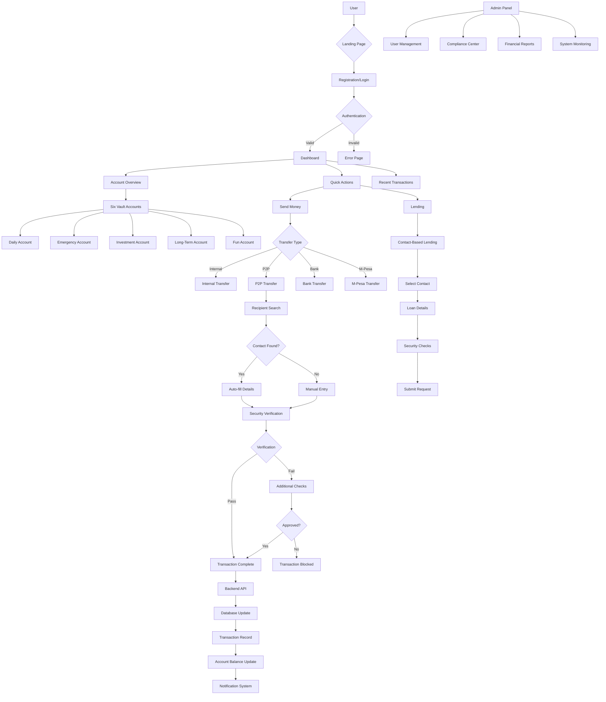
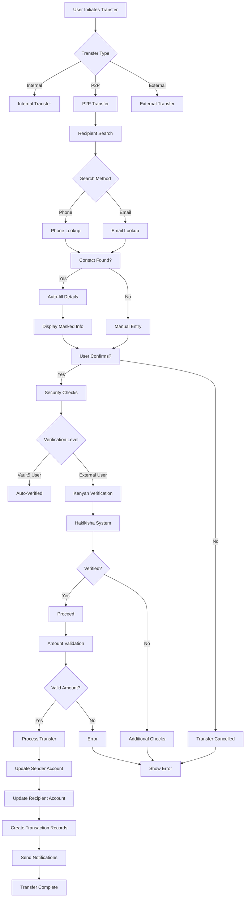
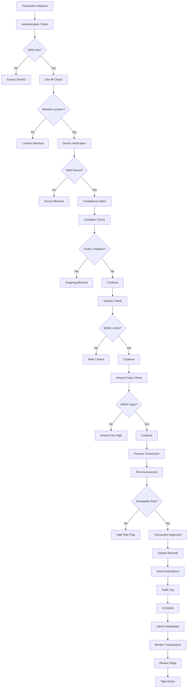
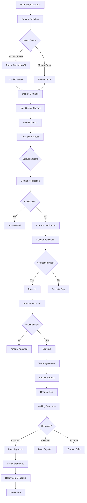
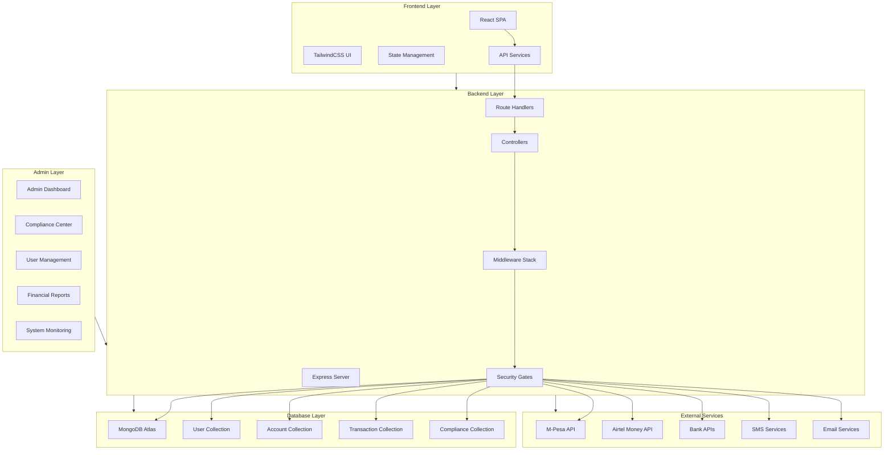
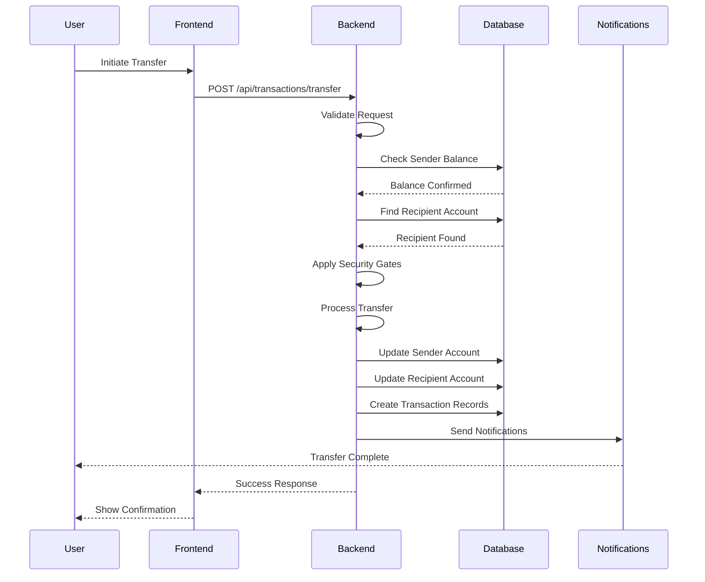
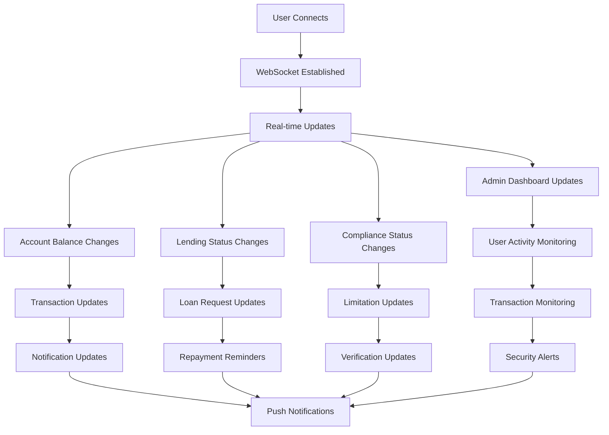
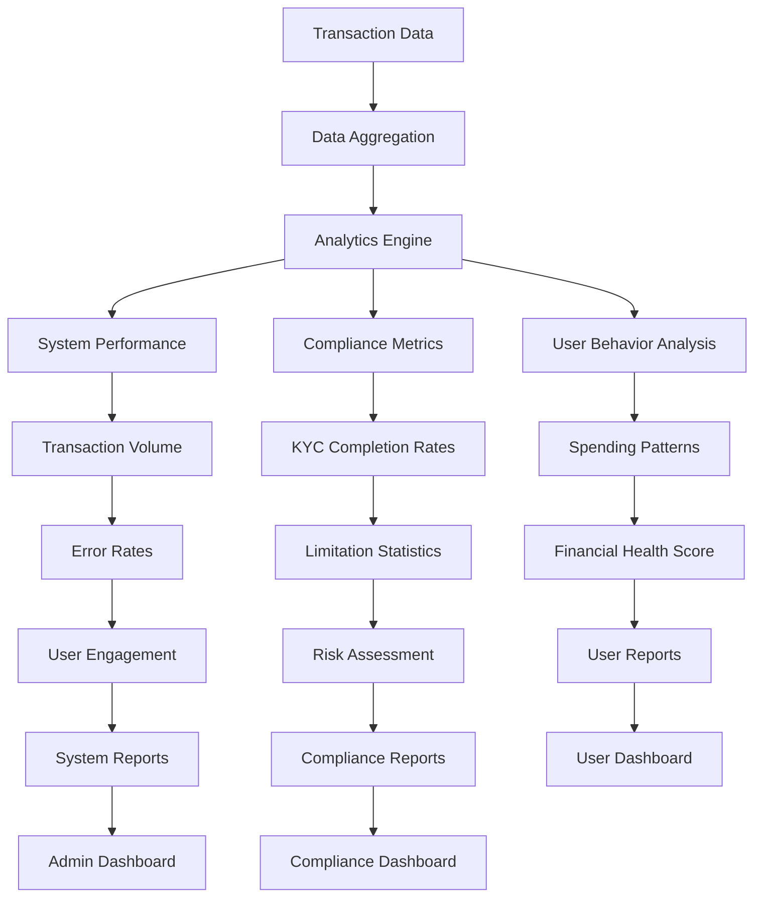

# Vault5 System Flowchart

**Designed by Bryson OMullo** 📊

## Overview
This document provides comprehensive flowcharts for the Vault5 EMI-Style Financial Freedom Platform, showing the complete user journey, transaction flows, and system architecture.

---

## 🏦 **Main System Architecture**

---

## 💰 **Money Transfer Flow**

---

## 🔐 **Security & Compliance Flow**

---

## 📱 **Contact-Based Lending Flow**

---

## 🏗️ **System Components Architecture**

---

## 📊 **Transaction Processing Flow**

---

## 🔄 **Real-Time Updates Flow**

---

## 📈 **Analytics & Reporting Flow**

---

## 🎯 **Key Features Integration**

| Feature | Flow Integration | Security Level |
|---------|------------------|----------------|
| **P2P Transfers** | Money Transfer Flow | High |
| **Contact Lending** | Lending Flow | High |
| **Recipient Verification** | Security Flow | Maximum |
| **Account Allocation** | Transaction Processing | Medium |
| **Compliance Gates** | Security Flow | Maximum |
| **Real-time Updates** | Updates Flow | Low |

---

## 📝 **Document Information**

**Created by**: Bryson OMullo
**Last Updated**: 2025-09-21
**Version**: 2.1.0 EMI
**Purpose**: Complete system documentation and flow visualization

---

## 🔗 **Related Documentation**

- [README.md](../README.md) - Main project documentation
- [ARCHITECTURE.md](ARCHITECTURE.md) - System architecture details
- [API.md](API.md) - API endpoint documentation
- [ROADMAP.md](../ROADMAP.md) - Development roadmap

---

**© 2025 Bryson OMullo - Vault5 EMI-Style Financial Freedom Platform**