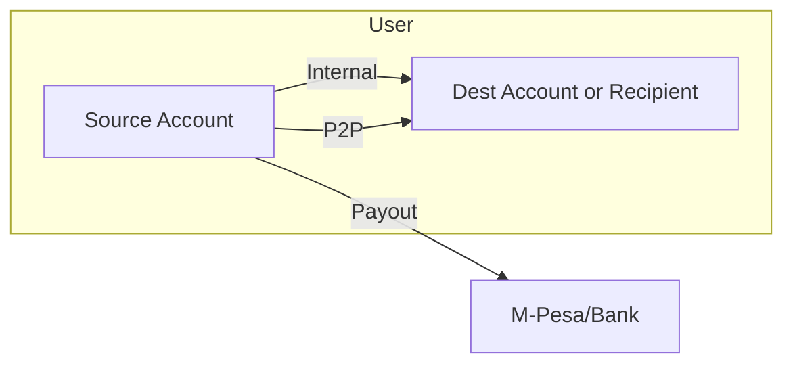
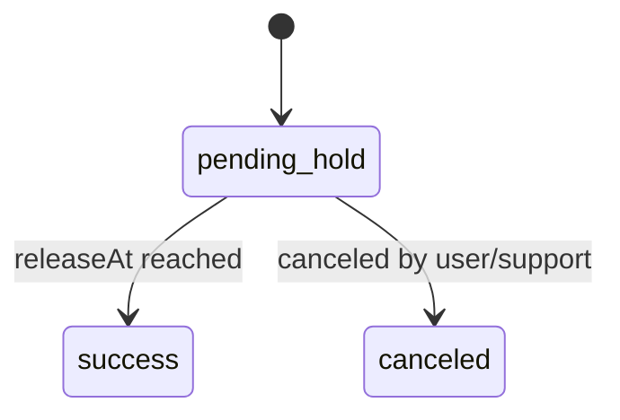
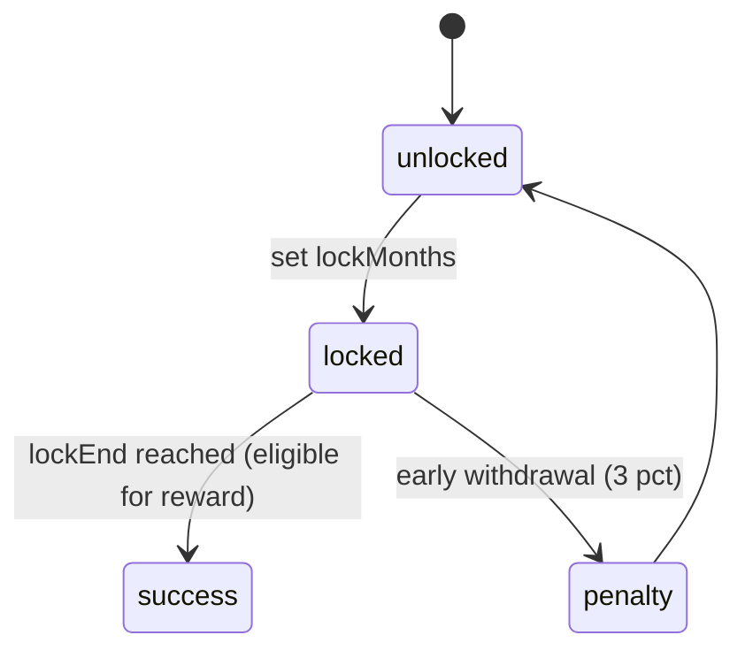

# Transfers, P2P, and Payouts API (Transactional Wallet)

Purpose
- Define transactional flows for Vault5 as a PayPal/M-Pesa style wallet with disciplined savings.
- Flows:
  - Internal Transfer: move funds between a user’s own accounts.
  - P2P Transfer: send funds to another Vault5 user (phone primary, email secondary).
  - Payouts: send funds externally (M-Pesa, Bank).
- All flows respect the accounts discipline rules in [ACCOUNTS_RULES.md](vault5/docs/ACCOUNTS_RULES.md) and pass compliance gates in [compliance.js](vault5/backend/middleware/compliance.js:1).

Account Model Rules Summary (defaults)
- Daily: unrestricted; AI alert if daily outflow exceeds 20 percent of balance.
- Fun: unlimited spend; no internal transfers out; month-end sweep to Long-Term.
- Emergency: external-only; 24h delay; max 2 withdrawals/month; AI confirmation prompt.
- Long-Term: optional lock 3/6/12 months; 3 percent early withdrawal penalty; reward at term completion.
- Investments: 90-day lock; min withdrawal 50 KES; external-only.
- Cross-account: Savings → Daily fee 1 percent (Emergency/Long-Term/Investments to Daily). Daily → Savings free.

Glossary
- Savings accounts: Emergency, Long-Term, Investments (Fun is not treated as savings for the fee rule).
- Internal transfer: transfer between accounts owned by the same user.
- P2P transfer: transfer to another user; received into recipient’s Daily account by default (or Wallet equivalent).

Security and Compliance (applies to all endpoints)
- Gates:
  - geoGate, ipDenyGate, deviceGate, limitationGate/limitationGateOutgoing, capsGate, velocityGate in [compliance.js](vault5/backend/middleware/compliance.js:1)
- Auth:
  - All endpoints require [protect](vault5/backend/middleware/auth.js:1) and JWT.
- Rate Limit:
  - Use [rateLimit.js](vault5/backend/middleware/rateLimit.js:1) with sensible per-route settings.

Data Model (PaymentIntent extensions)
- [PaymentIntent](vault5/backend/models/PaymentIntent.js:1) fields (additions for transfers/payouts):
  - kind: "deposit" | "internal" | "p2p" | "payout"
  - sourceAccountId: ObjectId
  - destAccountId: ObjectId (internal) or null
  - counterparty: { type: "user" | "external", phone?: string, email?: string, userId?: ObjectId, bankRef?: object }
  - feeAmount: number (computed fee)
  - penaltyAmount: number (computed penalty)
  - netAmount: number (amount - fee - penalty)
  - delayReleaseAt: Date (Emergency hold)
  - ruleMeta: object (explain enforced rules: reason codes, limits)
- Idempotency:
  - Clients may send Idempotency-Key header; backend should upsert by (user, key) to prevent duplicates (to be implemented).

Mermaid Overview


Endpoints

1) POST /api/transfers/internal
- Purpose: Move funds between user’s own accounts.
- Request:
```json
{
  "sourceAccountId": "65fa...abc",
  "destAccountId": "65fa...def",
  "amount": 2500,
  "memo": "Rebalance from Daily to Long-Term"
}
```
- Rules:
  - Fun → any internal: blocked (noInternalOut).
  - Emergency/Investments → internal: blocked (external-only).
  - Long-Term → internal: allowed only if not locked; if locked, apply 3% penalty or block per policy.
  - Savings → Daily: apply 1% fee (Emergency/Long-Term/Investments to Daily).
  - Daily → Savings: free.
- Response (success):
```json
{
  "success": true,
  "data": {
    "intentId": "pi_65fa...",
    "status": "success",
    "kind": "internal",
    "sourceAccountId": "65fa...abc",
    "destAccountId": "65fa...def",
    "amount": 2500,
    "feeAmount": 25,
    "penaltyAmount": 0,
    "netAmount": 2475,
    "ruleMeta": { "fee": "savings_to_daily_1pct" }
  },
  "message": "Internal transfer completed"
}
```
- Errors:
  - 400 INVALID_ACCOUNT, 400 INVALID_AMOUNT
  - 403 RULE_BLOCKED (e.g., fun_no_internal_out, emergency_external_only, investments_external_only, longterm_locked)
  - 423 ACCOUNT_LIMITED (limitation gate)
- Implementation: [transfersController.internal()](vault5/backend/controllers/transfersController.js:1)

2) POST /api/transfers/p2p
- Purpose: Send funds to another Vault user.
- Recipient Lookup (priority):
  - phone (primary), then email (secondary).
- Request:
```json
{
  "sourceAccountId": "65fa...abc",
  "recipient": { "phone": "2547XXXXXXXX", "email": "optional@example.com" },
  "amount": 1500,
  "memo": "Rent split"
}
```
- Rules:
  - Allowed source accounts: Daily, Fun. From Savings is blocked by default.
  - Apply Fun rule: Fun → P2P allowed; still no internal-out restriction applies only to internal transfers.
  - Compliance: velocity and caps for outgoing.
- Recipient Deposit:
  - Credited into recipient’s Daily account by default (or Wallet flag if present).
- Response (success):
```json
{
  "success": true,
  "data": {
    "intentId": "pi_65fb...",
    "status": "success",
    "kind": "p2p",
    "sourceAccountId": "65fa...abc",
    "recipient": { "userId": "65aa...", "phone": "2547XXXXXXXX" },
    "amount": 1500,
    "feeAmount": 0,
    "penaltyAmount": 0,
    "netAmount": 1500
  },
  "message": "P2P transfer completed"
}
```
- Errors:
  - 404 RECIPIENT_NOT_FOUND
  - 403 RULE_BLOCKED (savings_p2p_blocked)
  - 423 ACCOUNT_LIMITED
- Implementation: [transfersController.p2p()](vault5/backend/controllers/transfersController.js:1)

3) POST /api/payouts/mpesa
- Purpose: External payout to M-Pesa (user phone or specified MSISDN).
- Request:
```json
{
  "sourceAccountId": "65fa...abc",
  "phone": "2547XXXXXXXX",
  "amount": 2000,
  "memo": "Cash out"
}
```
- Rules:
  - Emergency: external-only allowed, enforced 24h delay (status pending_hold, delayReleaseAt=now+24h). Max 2 per month.
  - Investments: allowed only if >90 days since last deposit and amount >= 50.
  - Long-Term: if locked and before lockEnd, apply 3% penalty or block per policy; if unlocked, allowed.
  - Fun/Daily: allowed (subject to compliance).
- Response (delayed):
```json
{
  "success": true,
  "data": {
    "intentId": "pi_65fc...",
    "status": "pending_hold",
    "kind": "payout",
    "delayReleaseAt": "2025-09-22T10:00:00.000Z",
    "amount": 2000,
    "feeAmount": 0,
    "penaltyAmount": 0,
    "netAmount": 2000,
    "ruleMeta": { "hold": "emergency_24h_delay" }
  },
  "message": "Payout queued; will release after hold period"
}
```
- Response (immediate where applicable):
```json
{
  "success": true,
  "data": {
    "intentId": "pi_65fd...",
    "status": "success",
    "kind": "payout",
    "amount": 2000
  },
  "message": "Payout processed"
}
```
- Implementation: [payoutsController.mpesa()](vault5/backend/controllers/payoutsController.js:1)

4) POST /api/payouts/bank
- Purpose: External payout to bank account.
- Request:
```json
{
  "sourceAccountId": "65fa...abc",
  "bank": { "name": "KCB", "accountName": "John Doe", "accountNumber": "1234567890", "bankCode": "01" },
  "amount": 5000,
  "memo": "Tuition"
}
```
- Rules:
  - Same as M-Pesa regarding account rules (Emergency delay, Long-Term penalty, Investments lock).
- Response: same shape as mpesa payout.
- Implementation: [payoutsController.bank()](vault5/backend/controllers/payoutsController.js:1)

Statements

1) GET /api/statements
- Filters:
  - dateFrom, dateTo (ISO), accountId, type (deposit|internal|p2p|payout|income|expense), direction (in|out), provider (mpesa|airtel|bank|simulation), counterparty (phone/email), minAmount, maxAmount, search (description/memo), page, limit
- Response:
```json
{
  "success": true,
  "data": [
    {
      "date": "2025-09-20T10:00:00Z",
      "type": "payout",
      "account": { "_id": "65fa...", "type": "Emergency" },
      "amount": -2000,
      "fee": 0,
      "penalty": 0,
      "net": -2000,
      "description": "Payout to M-Pesa",
      "provider": "mpesa",
      "counterparty": { "phone": "2547XXXXXXXX" },
      "reference": "pi_65fc..."
    }
  ],
  "pagination": { "page": 1, "limit": 20, "total": 54, "pages": 3 },
  "totals": { "in": 120000, "out": 45000, "net": 75000 }
}
```
- Implementation: [statementsController.list()](vault5/backend/controllers/statementsController.js:1)

2) GET /api/statements/export
- Query: same as /api/statements + format=pdf|xlsx
- Response:
  - application/pdf or application/vnd.openxmlformats-officedocument.spreadsheetml.sheet
- Implementation: [statementsController.export()](vault5/backend/controllers/statementsController.js:1)
- Libraries:
  - PDF: pdfkit
  - Excel: exceljs

Fees and Penalties Calculation
- Savings → Daily fee: fee = round(amount * 0.01, 2). Charged on transfer; credited net to Daily.
- Long-Term early withdrawal penalty: if locked and before lockEnd, penalty = round(amount * 0.03, 2). Deduct from amount; credit net.
- Fun month-end sweep: no fee; entire remaining Fun balance moves to Long-Term.

Limits and Velocity
- Emergency monthly withdrawals: track intents kind=payout where source is Emergency during current month; if count >= 2 then block with RULE_BLOCKED: emergency_monthly_limit.
- Velocity: use [velocityGate](vault5/backend/middleware/compliance.js:229) for outgoing requests.
- Caps: use [capsGate](vault5/backend/middleware/compliance.js:178) for amounts within KYC tier limits.

AI Prompts
- Daily overspend: AI insight event and notification; shown in Dashboard Insights and possibly toast/banner.
- Emergency payout: AI confirm gate: prompt user reason; store metadata ruleMeta.emergencyReason; allow proceed after explicit confirmation unless admin lock present.
- Long-Term early withdrawal: AI warning about penalty and goal progress impact.

State Machines

Emergency Payout Hold


Long-Term Lock


Fun Month-End Sweep


Error Codes
- INVALID_ACCOUNT: account not found or not owned
- INVALID_AMOUNT: zero/negative amount or below minimum
- RULE_BLOCKED: rule prevented the action (reason in ruleMeta)
- RECIPIENT_NOT_FOUND: P2P recipient not found
- ACCOUNT_LIMITED: compliance limitation (423)
- VELOCITY_LIMIT: too many actions too quickly (429)
- CAP_EXCEEDED: tier limit exceeded (429)
- PROVIDER_ERROR: external provider error

Controllers and Routes (to be implemented)
- Transfers:
  - [transfersController.internal()](vault5/backend/controllers/transfersController.js:1)
  - [transfersController.p2p()](vault5/backend/controllers/transfersController.js:1)
  - routes: [transfers.js](vault5/backend/routes/transfers.js:1)
- Payouts:
  - [payoutsController.mpesa()](vault5/backend/controllers/payoutsController.js:1)
  - [payoutsController.bank()](vault5/backend/controllers/payoutsController.js:1)
  - routes: [payouts.js](vault5/backend/routes/payouts.js:1)
- Statements:
  - [statementsController.list()](vault5/backend/controllers/statementsController.js:1)
  - [statementsController.export()](vault5/backend/controllers/statementsController.js:1)
  - routes: [statements.js](vault5/backend/routes/statements.js:1)

Frontend Integration (to be implemented)
- Accounts Center page:
  - 5 cards (Daily, Fun, Emergency, Long-Term, Investments) with rule badges and actions:
    - Internal Transfer (source account context)
    - Send to Vault User (P2P)
    - Payout (M-Pesa, Bank)
- Modals:
  - Internal Transfer: source/dest/amount; show computed fee/penalty; confirm dialog.
  - P2P: recipient phone (primary) or email; amount; memo; confirmation.
  - Payout: destination (M-Pesa phone or bank details); show delays/fees/penalties as applicable.
- Statements page:
  - Filters and results table; export buttons (PDF, Excel).
- Navigation:
  - Remove accounts grid from Dashboard; add “Vault Accounts” button to Accounts Center.

Dev Notes
- Use existing [paymentsController](vault5/backend/controllers/paymentsController.js:1) patterns for intents and status transitions.
- Delayed payouts processed by a release job; during dev use a short delay for testing.
- Idempotency header support recommended for transfers and p2p.
