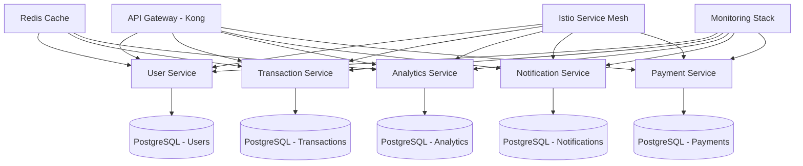

# Vault5 Microservices Migration Plan

## Current Monolith Analysis

### Architecture Overview
- **Backend**: Node.js/Express monolith with MongoDB
- **Frontend**: React SPA with TailwindCSS
- **Database**: Single MongoDB instance with shared schemas
- **Deployment**: Single server deployment

### Current Service Boundaries Identified

#### 1. User Service Domain
- **Models**: User, Account
- **Controllers**: authController, settingsController
- **Routes**: /api/auth, /api/settings
- **Responsibilities**: Authentication, user profiles, preferences, KYC

#### 2. Transaction Service Domain
- **Models**: Transaction
- **Controllers**: transactionsController, accountsController
- **Routes**: /api/transactions, /api/accounts
- **Responsibilities**: Income/expense tracking, allocation engine, categories

#### 3. Analytics Service Domain
- **Models**: FinancialScore, Goal, Milestone
- **Controllers**: reportsController, recommendationsController, goalsController
- **Routes**: /api/reports, /api/recommendations, /api/goals
- **Responsibilities**: Reports, forecasting, recommendations, goal tracking

#### 4. Notification Service Domain
- **Models**: Notification
- **Controllers**: notificationsController
- **Routes**: /api/notifications
- **Responsibilities**: Email notifications, push notifications, alerts

#### 5. Payment Service Domain
- **Models**: Investment, Loan, Lending
- **Controllers**: plaidController, lendingController, loansController, investmentsController
- **Routes**: /api/plaid, /api/lending, /api/loans, /api/investments
- **Responsibilities**: Payment integrations, loan processing, investment tracking

#### 6. Additional Services
- **Gamification**: Badge, gamificationController
- **Receipt Processing**: receiptController, receiptProcessor service

## Proposed Microservices Architecture

### Service Decomposition Strategy

### Service Boundaries

#### User Service (Port: 3001)
- **Responsibilities**:
  - User authentication and authorization
  - Profile management
  - Settings and preferences
  - KYC verification
- **Database**: PostgreSQL (users, profiles, settings)
- **APIs**: REST + GraphQL
- **Dependencies**: Redis (sessions), Notification Service (events)

#### Transaction Service (Port: 3002)
- **Responsibilities**:
  - Transaction recording and processing
  - Income allocation engine
  - Account management
  - Fraud detection
- **Database**: PostgreSQL (transactions, accounts, allocations)
- **APIs**: REST + Event-driven
- **Dependencies**: User Service (validation), Analytics Service (events)

#### Analytics Service (Port: 3003)
- **Responsibilities**:
  - Financial reporting and analytics
  - Forecasting and recommendations
  - Goal tracking and progress
  - Cash flow projections
- **Database**: PostgreSQL (reports, goals, analytics)
- **APIs**: REST + GraphQL
- **Dependencies**: Transaction Service (data), Redis (caching)

#### Notification Service (Port: 3004)
- **Responsibilities**:
  - Email notifications
  - Push notifications
  - Alert management
  - Communication templates
- **Database**: PostgreSQL (notifications, templates)
- **APIs**: REST + Message Queue
- **Dependencies**: User Service (preferences), All services (events)

#### Payment Service (Port: 3005)
- **Responsibilities**:
  - Payment gateway integrations
  - Loan processing and management
  - Investment tracking
  - Lending operations
- **Database**: PostgreSQL (payments, loans, investments)
- **APIs**: REST + Webhooks
- **Dependencies**: User Service (validation), Transaction Service (recording)

### Infrastructure Components

#### API Gateway (Kong)
- **Routing**: Service discovery and load balancing
- **Security**: Authentication, rate limiting, CORS
- **Monitoring**: Request tracking and analytics
- **Plugins**: JWT validation, request transformation

#### Service Discovery
- **Technology**: Consul or Kubernetes DNS
- **Registration**: Automatic service registration
- **Health Checks**: Service health monitoring

#### Database per Service
- **Technology**: PostgreSQL with Citus for sharding
- **Migration**: MongoDB to PostgreSQL data migration
- **Sharding**: User-based horizontal partitioning
- **Backup**: Automated backups and point-in-time recovery

#### Caching Layer (Redis)
- **Session Storage**: User sessions and tokens
- **Data Caching**: Frequently accessed data
- **Rate Limiting**: API rate limit counters
- **Pub/Sub**: Inter-service communication

#### Service Mesh (Istio)
- **Traffic Management**: Load balancing, circuit breaking
- **Security**: mTLS, authorization policies
- **Observability**: Distributed tracing, metrics
- **Resilience**: Retry policies, timeouts

#### Monitoring Stack
- **Metrics**: Prometheus + Grafana
- **Logging**: ELK Stack (Elasticsearch, Logstash, Kibana)
- **Tracing**: Jaeger or Zipkin
- **Alerting**: AlertManager with notification channels

### Migration Strategy

#### Phase 1: Foundation (Week 1-2)
1. Set up Kubernetes cluster
2. Configure PostgreSQL with Citus
3. Deploy Redis cluster
4. Set up monitoring stack

#### Phase 2: Service Extraction (Week 3-6)
1. Extract User Service
2. Extract Transaction Service
3. Deploy API Gateway
4. Implement service mesh

#### Phase 3: Advanced Services (Week 7-10)
1. Extract Analytics Service
2. Extract Notification Service
3. Extract Payment Service
4. Implement cross-service communication

#### Phase 4: Optimization (Week 11-12)
1. Configure sharding and scaling
2. Implement advanced caching
3. Set up CI/CD pipelines
4. Performance testing and optimization

### Zero Downtime Migration

#### Database Migration Strategy
1. **Dual Write**: Write to both MongoDB and PostgreSQL
2. **Data Synchronization**: Real-time sync using Change Data Capture
3. **Gradual Cutover**: Service-by-service migration
4. **Rollback Plan**: Ability to revert to monolith

#### Service Deployment Strategy
1. **Blue-Green Deployment**: Deploy new services alongside old
2. **Canary Releases**: Gradual traffic shifting
3. **Feature Flags**: Toggle between old and new implementations
4. **Health Checks**: Automated rollback on failures

### Security Considerations

#### Authentication & Authorization
- JWT tokens with refresh mechanism
- Role-based access control (RBAC)
- API key management for service-to-service communication

#### Data Protection
- End-to-end encryption for sensitive data
- PCI DSS compliance for payment data
- GDPR compliance for user data

#### Network Security
- Service mesh mTLS encryption
- Network policies and segmentation
- API gateway security plugins

### Performance Optimization

#### Caching Strategy
- Redis for session and user data
- Application-level caching for computed results
- CDN for static assets

#### Database Optimization
- PostgreSQL indexing and query optimization
- Read replicas for analytics workloads
- Connection pooling with PgBouncer

#### Service Optimization
- Horizontal pod autoscaling
- Circuit breakers and bulkheads
- Async processing for heavy operations

### Monitoring & Observability

#### Metrics Collection
- Service performance metrics
- Database query performance
- Cache hit/miss ratios
- Error rates and latency

#### Logging Strategy
- Structured logging with correlation IDs
- Centralized log aggregation
- Log retention and archival policies

#### Alerting Rules
- Service health alerts
- Performance degradation alerts
- Security incident alerts
- Business metric alerts

### Risk Assessment & Mitigation

#### Technical Risks
- **Data Loss**: Comprehensive backup and recovery procedures
- **Service Failures**: Circuit breakers and graceful degradation
- **Performance Issues**: Load testing and capacity planning

#### Operational Risks
- **Deployment Failures**: Automated rollback procedures
- **Configuration Errors**: Infrastructure as Code and validation
- **Security Breaches**: Regular security audits and penetration testing

#### Business Risks
- **Downtime**: Zero-downtime deployment strategy
- **Data Inconsistencies**: Data validation and reconciliation
- **User Experience**: Feature parity and performance benchmarks

### Success Metrics

#### Technical Metrics
- Service response times < 200ms
- 99.9% uptime SLA
- < 1% error rate
- Successful migration with zero data loss

#### Business Metrics
- Maintained user engagement during migration
- Improved system scalability
- Reduced operational costs
- Faster feature development cycles

### Timeline & Resources

#### Timeline
- **Week 1-2**: Infrastructure setup and foundation
- **Week 3-6**: Core service extraction and deployment
- **Week 7-10**: Advanced services and integration
- **Week 11-12**: Testing, optimization, and go-live

#### Team Requirements
- **DevOps Engineer**: Infrastructure and deployment
- **Backend Engineers (3)**: Service development and migration
- **Database Administrator**: Data migration and optimization
- **QA Engineer**: Testing and validation
- **Security Engineer**: Security implementation and compliance

### Next Steps

1. Infrastructure provisioning and setup
2. Database migration planning and execution
3. Service extraction and deployment
4. Testing and validation
5. Production deployment and monitoring

This migration plan provides a comprehensive roadmap for transforming Vault5 from a monolith to a scalable microservices architecture while maintaining zero downtime and ensuring data integrity.